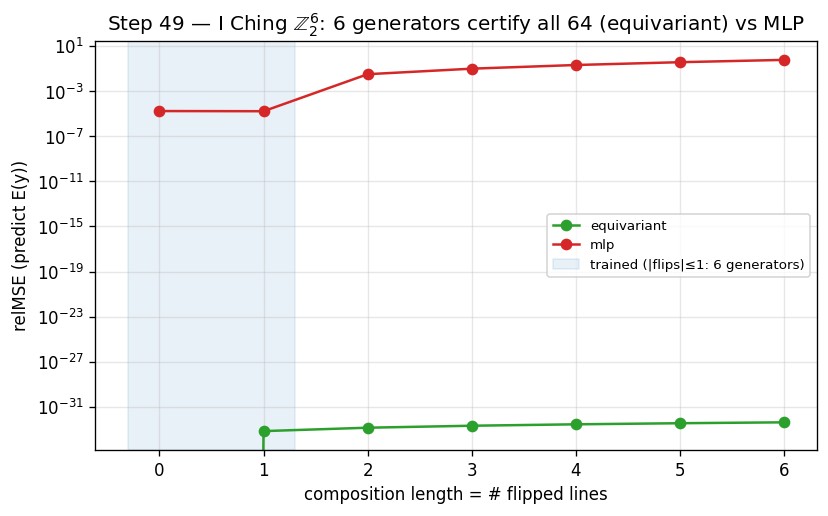
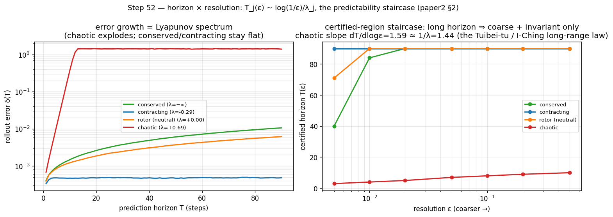
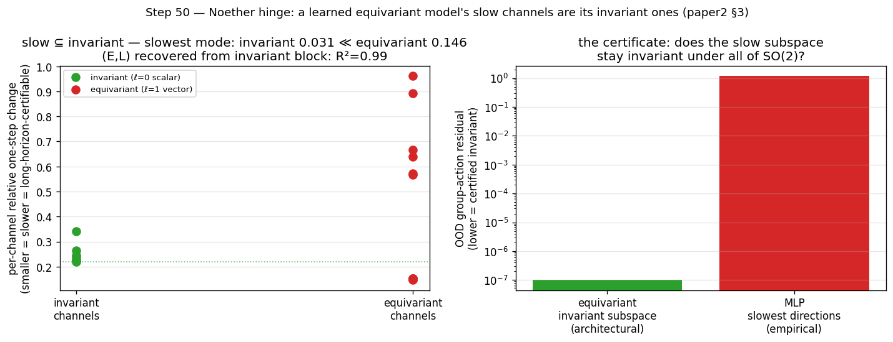
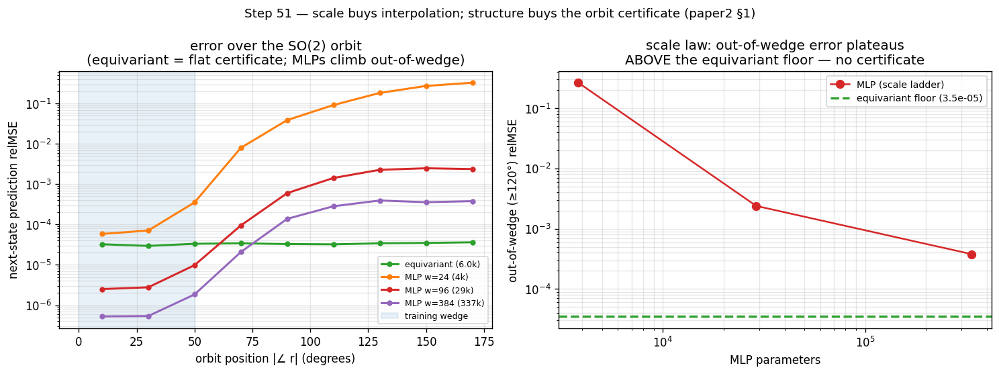
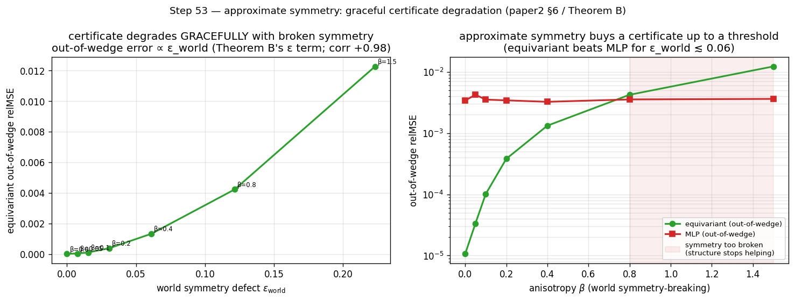

## Abstract

*Scale buys interpolation; structure buys a certified horizon.* Scaling a world model lowers its average error but
issues no guarantee about any specific unseen situation; for **equivariant** latent world models we give a different
*kind* of result — a **predictability certificate**: a provable, computable region the model is guaranteed to handle
*without further training or data*, spanning **configuration**, **horizon**, and **resolution** at once. Under exact
equivariance with an orthogonal latent the whole-pipeline error is *invariant* over the exponentially large monoid
$\langle S\rangle$ generated by $k$ primitive symmetries, certified by checking the $k$ generators (Theorem A) — and
this orbit-flatness is **equivalent** to equivariance, so **no non-equivariant model has the certificate at any size**
(Lemma 2). A spectral law then certifies each channel to a horizon $T_j(\epsilon)\sim\log(1/\epsilon)/\lambda_j$ set by
its Lyapunov exponent, **two-sided** (Theorem B with a matching lower bound, Proposition 6). We confirm all three axes
at small scale: $\mathbb{Z}_2^6$ certifies all $64$ compositions to machine precision; a learned predictor recovers a
planted exponent to $0.4\%$; and on a **$40$-dimensional** learned model a $\mathbb{Z}_N$-equivariant network recovers
the *full* Lyapunov spectrum ($R^2{=}0.98$–$0.99$) where a dense **and a same-trained recurrent** model of equal data
fail ($R^2{<}0$) — structure, not scale or recurrence, recovers a high-dimensional horizon. Finally we make
*"Certified"* literal: a cone/adapted-metric certificate (Theorem B′) reads a **sound, a-priori** certified horizon off
the *learned model's own* Jacobian — tight exactly on uniformly-hyperbolic dynamics and self-abstaining elsewhere.
Because the certificate is faithful it is also *actionable — a priori*: holding the forecaster fixed on the $40$-D
system, timing sparse re-observations by the equivariant model's certified horizon meets a **fixed sensing budget**
where the non-equivariant model's $\sim3\times$-inflated certificate over-observes and starves it (median $10\%$ vs $63\%$
forecast-violation, $20/20$ seeds; replicated on a second $\mathbb{Z}_N$ system; a $c\times$-inflated
certificate provably needs $c\times$ the budget — Proposition 9). A dense certificate closes the gap only by *spending a
calibration set* — structure buys the trustworthy certificate with **zero rollout data** (a full-spectrum allocation
variant, reported honestly, does **not** win). Across the official $1$M–$317$M multitask scale ladder, calibration does **not** improve with parameters — scale buys interpolation, not a calibrated horizon. The
result is a single **runnable** criterion (Algorithm 1) for *what* an equivariant world model can certifiably predict,
and a structural reading of *why* celestial mechanics is forecastable for millennia while weather is not.

---

## 1. Introduction

Two debates organize modern world-model research. The first is *generation vs. abstraction*: pixel-space
simulators (diffusion and video models) against latent predictive models that predict representations rather than
pixels. The second is *scale vs. structure*: the view that brute-force scaling eventually wins, against the
geometric-learning view that symmetry priors buy sample efficiency. Both are usually run as **degree** contests —
who needs fewer pixels, who needs less data.

We argue the more useful question is a **kind** contest. Scaling produces a model with low *average* error on the
data distribution, but it cannot certify anything about a *named, specific* situation the data did not cover.
Structure can. For an equivariant world model we can write down, in advance and without further data, the exact set
of situations on which the model's behaviour is **guaranteed** — a *predictability certificate*. This reframes "is
structure worth it?" from a benchmark race into a question about *what kind of statement each approach can make*.

The certificate has three orthogonal axes:

- **Configuration** $w\in\langle S\rangle$: the model generalizes across the exponentially large monoid generated
  by $k$ primitive symmetries $S=\{g_1,\dots,g_k\}$, and we *certify the whole monoid by checking only the $k$
  generators*.
- **Horizon** $T$: how far into the future the guarantee reaches.
- **Resolution** $\epsilon$: at what level of detail the guarantee holds.

Our contributions are:

1. **A three-axis master theorem** (§3): composition closure ($k$ checks $\Rightarrow$ an exponential set), an
   exact certificate under exact equivariance (Theorem A) together with its **converse** (Lemma 2: the certificate
   is *equivalent* to equivariance, so no non-equivariant model has it at any size), and a spectral degradation law
   $T_j(\epsilon)\sim\log(1/\epsilon)/\lambda_j$ (Theorem B) — **tight**, with a matching lower bound (Proposition 6:
   *approximate* equivariance is horizon-limited, so only exact structure or conservation reaches an unbounded
   horizon) and a **scope characterization** (Proposition 7: the local-spectrum horizon governs a *learned* model on
   spectrally non-degenerate dynamics, $\lambda_1>0$, and is vacuous on near-neutral dynamics; and **Proposition 8**:
   the learned model *recovers* the chaos rate because the certified horizon is finite and finite-horizon Lyapunov
   exponents are $C^1$-continuous — a $O(\delta)$ model-fidelity bias, not the shadowing-transfer the asymptotic
   exponent forbids; and **Theorem B′**: a cone/adapted-metric certificate makes the *"Certified"* literal —
   a **sound, a-priori** certified horizon read off the *learned model's own* Jacobian field with no access to the
   true dynamics, **tight exactly on uniformly-hyperbolic dynamics** and **self-abstaining** elsewhere via its
   cone-margin diagnostic) — whose certified region is the
   coarse-invariant-slow-low-$|w|$ corner, with a **quantitative scale-vs-structure separation** (§3.3: structure
   certifies the whole $\epsilon$-independent orbit; the best $L$-Lipschitz non-equivariant learner certifies only
   an $\epsilon/L$-tube around its data). Figure 1 is the whole picture at a glance.
2. **The Noether hinge** (§4): the bridge — that the group-invariant/equivariant channels are the dynamically slow
   (long-horizon-certifiable) ones — linking the configuration axis to the horizon axis. A representation-theoretic
   **placement principle** (Proposition 4) proves *which* isotypic block must carry each conserved charge and why
   $3$D angular momentum is recoverable only at a unique degree-2 cross product; **Proposition 5** proves the
   *forward* direction (*conserved $\Rightarrow$ slow*: a charge conserved to one-step defect $\eta$ has prediction
   error $\le T\eta$ — linear, never the exponential $e^{\lambda T}$ of a chaotic channel — so it is certified to all
   horizons at $\eta{=}0$). What remains measured is the dynamical-symmetry hypothesis and the size of $\eta$.
3. **Empirical confirmation of all three axes at small scale** (§5), including the headline contrast *scale buys
   interpolation; structure buys a certificate*, a keystone validation on **real physics-engine contact
   dynamics** (PushT, and the **standard MuJoCo FetchPush** benchmark — Experiment 16, the cleanest cut: the
   equivariant world model is *exactly* orbit-flat while a $7\times$-larger baseline degrades by orders of magnitude
   out of the training orientation yet interpolates it competitively) where the certificate holds for a *learned*
   model of dynamics we did not design, and a
   **closed-loop** instantiation where, run through a planner, the certificate becomes *task* competence —
   orbit-invariant pose control where a scaled baseline degrades, lifted to FetchPush in Experiment 17 where the
   *entire planner* (equivariant WM $+$ equivariant goal-readout $+$ $G$-equivariant CEM) is provably
   $\mathrm{SO}(2)$-equivariant and its plan orbit-flat while the baseline planner degrades $4$–$10\times$ — a lift
   from the circle to the **non-abelian
   $\mathrm{SO}(3)$** on 3D point clouds (the certificate is not $\mathrm{SO}(2)$-specific), a lift to raw
   **pixels** (Experiment 13) where *frame averaging* makes the exact certificate **accuracy-neutral** — an equivariant
   pixel model matches an unconstrained CNN and is horizon-stable, so the prior costs nothing — and a lift of the
   **horizon law to a learned model of genuinely chaotic dynamics** (Lorenz, Experiment 14: the learned model's
   Lyapunov exponent, read as the certified-horizon staircase slope, *matches* the true exponent to $1\text{–}8\%$,
   instantiating Proposition 7(a)), and a lift to a **high-dimensional** learned model (Experiment 18, $40$-D
   Lorenz-96) where the configuration axis *helps the horizon axis*: a $\mathbb{Z}_N$-equivariant model recovers the
   full $40$-D Lyapunov spectrum ($R^2{=}0.98\text{–}0.99$) — hence the per-channel certified horizons — while a dense
   model of equal data fails ($R^2{<}0$) — as does a same-trained *recurrent* GRU (Step 77), pinning the separation to
   *structure*, not recurrence or training (a recurrent model's hidden Lyapunov modes violate the conditional-Lyapunov
   condition at high $N$; a Markov model's Jacobian is exactly $N\times N$).
   Finally, **Experiment 19** brings *both* axes onto **one controllable chaotic system** (controlled Lorenz-96) and lets
   the certificate **change a decision**: an equivariant planner gives machine-precision orbit-flat control on genuine
   chaos (configuration, $8\times10^{-16}$), while the certified horizon — read off the model's own spectrum — predicts
   when an open-loop forecast expires and drives an **active re-observation** schedule that sits on the efficient
   accuracy-vs-observation-cost frontier *untuned* (the decision the certificate earns; short-horizon control, honestly,
   it does not). The pattern lifts seed-for-seed to a $\mathbb{Z}_N$ pendulum ring and a $\mathbb{Z}_2$ double pendulum —
   a **class property** across two symmetry groups and high/low dimension. Finally, **Experiment 22** turns that
   high-dimensional spectrum recovery into a *downstream consequence*: under a **fixed sensing budget** on $40$-D
   Lorenz-96, an agent that times re-observation by the equivariant model's certificate meets the budget (median $10\%$
   forecast-violation) while the *same forecaster* timed by the non-equivariant model's inflated certificate
   over-observes and starves it (median $63\%$; $20/20$ seeds, margins $+0.41$–$+0.61$) — a *within-method* contrast
   isolating the certificate's **faithfulness** as the load-bearing property. Proposition 9 makes the cost a law
   ($c\times$ inflation $\Rightarrow c\times$ budget); a recalibrated dense certificate closes the gap only by spending a
   **calibration set** (the equivariant one is correct *a-priori*, zero rollout data); the contrast replicates on a
   second $\mathbb{Z}_N$ system (the pendulum ring, $2/3$ seeds); and a full-spectrum *allocation* variant is reported
   as an honest negative.

We are explicit about scope (§7): this is a mechanism-and-theory paper with $1$–$2$-GPU proof-of-principle, not a
scaled benchmark, and the hinge's lift to *approximate* symmetry is open.

![The predictability certificate at a glance. **Left:** in the configuration $\times$ horizon plane, an equivariant model certifies the *entire* generated monoid $\langle S\rangle$ — every composition, from $k$ generator checks (Lemma 1) — up to a horizon ceiling set by the predictor spectrum $\{\lambda_j\}$ (Theorem B); a non-equivariant model of any size certifies only a small interpolation *tube* around its training set ($\sim\epsilon/L$, §3.3). **Right:** the horizon $\times$ resolution trade-off $T_j(\epsilon)\sim\log(1/\epsilon)/\lambda_j$ — conserved/invariant (slow, $\lambda\le0$) channels are certified to all horizons (eclipses, millennia), chaotic ($\lambda>0$) channels shrink as the demanded resolution sharpens (weather, $\sim$two weeks). *Scale buys interpolation; structure buys a certificate.*](figures/hero_certified_region.png)

---

![**The paper in one figure** — *scale buys interpolation; structure buys a certified horizon.* **(a) Faithful:** on $40$-D Lorenz-96 the $\mathbb{Z}_N$-equivariant model recovers the full Lyapunov spectrum ($R^2{=}0.98$) where an identically-trained dense model's is garbage ($R^2{<}0$, $\lambda_1$ inflated $\sim3.4\times$) — §5.16. **(b) Priced:** under a fixed sensing budget, re-observation timed by the faithful certificate meets the budget while the inflated certificate over-observes and starves it — a $c\times$-inflated certificate provably needs $c\times$ the budget (Proposition 9) and a certificate-free adaptive scheduler pays $\sim3\times$ — §5.20. **(c) Real:** the same training-free read-out audits official TD-MPC2 checkpoints — calibrated (ratio $0.94$–$1.02$) where the latent loop is expansive, correctly abstaining where it contracts (Proposition 7) — §5.21.](figures/hero_certified_world_models.png)

## 2. Setup

An encoder $E:\mathcal X\to\mathcal Z$ maps states to latents and an action-conditioned predictor
$f:\mathcal Z\times\mathcal A\to\mathcal Z$ advances them; the true environment transition is
$\Phi:\mathcal X\times\mathcal A\to\mathcal X$. A finite generating set $S=\{g_1,\dots,g_k\}$ generates a monoid
$\langle S\rangle$ whose elements — words $w=g_{i_1}\cdots g_{i_m}$ of length $|w|=m$ — act on states by $g\cdot x$,
on latents by a representation $\rho(g)$, and on actions by $\sigma(g)$. Write $f^{(T)}(z;\vec a)$ for the $T$-step
latent rollout under actions $\vec a=(a_1,\dots,a_T)$, $x^{\text{true}}_T$ for the $T$-step true state, and

$$
\mathrm{Err}_T(x;\vec a)=\bigl\lVert f^{(T)}(E(x);\vec a)-E(x^{\text{true}}_T)\bigr\rVert
$$

for the whole-pipeline prediction error, where $\lVert\cdot\rVert$ is the Euclidean norm on $\mathcal Z$ (the
experiments use relMSE, its square). We use the following assumptions, **each checkable on the $k$ generators**:

- **(A1) Encoder equivariance:** $E(g_i\cdot x)=\rho(g_i)\,E(x)$.
- **(A2) Predictor equivariance:** $f(\rho(g_i)z,\,\sigma(g_i)a)=\rho(g_i)\,f(z,a)$.
- **(A3) The group is a symmetry of the *dynamics*:** $\Phi(g_i\cdot x,\,\sigma(g_i)a)=g_i\cdot\Phi(x,a)$, so that
  rolling out the *transformed* state equals transforming the *rolled-out* state,
  $(g_i\cdot x)^{\text{true}}_T=g_i\cdot x^{\text{true}}_T$ under $\sigma(g_i)\vec a$.
- **(A4) $\rho(g_i)$ orthogonal:** $\rho(g_i)^\top\rho(g_i)=I$ (norm-preserving on $\mathcal Z$).
- **(A5) Equivariant planner and invariant cost (closed-loop clause only):** the planner satisfies
  $\pi(\rho(g_i)z,\rho(g_i)z^\star)=\sigma(g_i)\,\pi(z,z^\star)$ and the cost is $\rho$-invariant,
  $J(\rho(g_i)z;\rho(g_i)z^\star)=J(z;z^\star)$. This is needed *only* for the closed-loop $J$ identity, not for the
  prediction-error identity. §5.6 instantiates such a planner in latent space; §5.9 instantiates one on **real PushT
  contact dynamics** — an equivariant CEM-MPC (isotropic exploration covariance, a rotation-invariant disk action
  bound, and scene-covariant action noise) — and confirms the resulting closed-loop task error is exactly
  orbit-invariant.

---

## 3. The Predictability Certificate

### 3.1 The configuration axis (Theorem A)

**Lemma 1 (composition closure).** If (A1)–(A4) hold on each generator $g_i\in S$, they hold on every word
$w\in\langle S\rangle$, and $\rho$ restricted to $\langle S\rangle$ is an orthogonal-matrix *monoid homomorphism*.

*Proof.* Define $\rho(w):=\rho(g_{i_1})\cdots\rho(g_{i_m})$. For (A2), induct on $m$:
$f(\rho(w)z,\sigma(w)a)=f\!\big(\rho(g_{i_1})[\rho(g_{i_2}\!\cdots)z],\,\sigma(g_{i_1})[\sigma(g_{i_2}\!\cdots)a]\big)
=\rho(g_{i_1})f(\rho(g_{i_2}\!\cdots)z,\sigma(g_{i_2}\!\cdots)a)=\rho(w)f(z,a)$, applying the single-generator (A2)
once per step. (A1) and (A3) lift identically by composition; (A4) lifts because a product of orthogonal matrices is
orthogonal. $\square$

Hence **$k$ generator checks certify the entire (exponentially large) generated monoid.**

**Theorem A (exact configuration certificate).** Under (A1)–(A4), for every $w\in\langle S\rangle$, every horizon
$T$, and every action sequence $\vec a$,

$$
\mathrm{Err}_T(w\cdot x;\,\sigma(w)\vec a)=\mathrm{Err}_T(x;\vec a),
\qquad\text{and, for an equivariant planner,}\quad J(w\cdot x;\,w\cdot\text{goal})=J(x;\text{goal}).
$$

*Proof.* **(i) Rollout equivariance.** By induction on $T$: $f^{(1)}=f$ is equivariant by (A2) and Lemma 1; assuming
$f^{(T)}(\rho(w)z;\sigma(w)\vec a)=\rho(w)f^{(T)}(z;\vec a)$,

$$
f^{(T+1)}(\rho(w)z;\sigma(w)\vec a)=f\!\big(f^{(T)}(\rho(w)z;\sigma(w)\vec a),\,\sigma(w)a_{T+1}\big)
=f\!\big(\rho(w)f^{(T)}(z;\vec a),\,\sigma(w)a_{T+1}\big)=\rho(w)f^{(T+1)}(z;\vec a).
$$

**(ii) Predicted latent at $w\cdot x$.**
$f^{(T)}(E(w\cdot x);\sigma(w)\vec a)\overset{\text{(A1)}}{=}f^{(T)}(\rho(w)E(x);\sigma(w)\vec a)\overset{\text{(i)}}{=}\rho(w)\,f^{(T)}(E(x);\vec a)$.
**(iii) Target at $w\cdot x$.**
$E\big((w\cdot x)^{\text{true}}_T\big)\overset{\text{(A3)}}{=}E\big(w\cdot x^{\text{true}}_T\big)\overset{\text{(A1)}}{=}\rho(w)\,E(x^{\text{true}}_T)$.
**(iv) Cancellation.** Subtracting (iii) from (ii) and using (A4) (an orthogonal $\rho$ preserves the Euclidean
norm),

$$
\mathrm{Err}_T(w\cdot x;\sigma(w)\vec a)=\bigl\lVert\rho(w)\big[f^{(T)}(E(x);\vec a)-E(x^{\text{true}}_T)\big]\bigr\rVert
=\bigl\lVert f^{(T)}(E(x);\vec a)-E(x^{\text{true}}_T)\bigr\rVert=\mathrm{Err}_T(x;\vec a).
$$

The closed-loop identity is the same computation under (A5): the equivariant planner (lifted to words by Lemma 1)
selects the $\sigma(w)$-image of the same actions, and the $\rho$-invariant cost is unchanged. $\square$

Theorem A requires **(A3)** — the group must be a symmetry of the *dynamics*, not merely of the encoder. Where the
dynamics break the symmetry, the certificate degrades by the amount of that break (Theorem B). The error is held
*constant across the orbit*, not made small: $\mathrm{Err}_T(x)$ itself can be large, and we report absolute errors
alongside ratios throughout (§7).

Theorem A is sufficient; the next lemma shows equivariance is also *necessary* for the guarantee, so the certificate
is not merely a consequence of equivariance but is **equivalent** to it — which is what makes the impossibility for
non-equivariant models a theorem rather than a slogan.

**Lemma 2 (the certificate characterizes equivariance).** Let $\rho:G\to O(\mathcal Z)$ act *freely* on an open
$U\subseteq\mathcal Z$, and let $\mathcal D_G$ be the equivariant maps $\mathcal Z\to\mathcal Z$. If a predictor
$f$'s one-step error $\lVert f-\Phi\rVert$ is orbit-constant on $U$ for **every** target $\Phi\in\mathcal D_G$, then
$f$ is equivariant on $U$.
*Proof.* Fix $z\in U$, $g$ with $\rho(g)z\in U$. For any $c\in\mathcal Z$, freeness makes
$\Phi(\rho(h)z):=\rho(h)c$ well-defined on the orbit of $z$ (extend by $0$ elsewhere; both pieces lie in
$\mathcal D_G$ as $\rho(g)0=0$). Orbit-constancy gives $\lVert f(z)-c\rVert=\lVert f(\rho(g)z)-\rho(g)c\rVert
=\lVert\rho(g)^{-1}f(\rho(g)z)-c\rVert$ (orthogonality of $\rho(g)$) for **all** $c$; two points equidistant to
every $c$ coincide, so $f(\rho(g)z)=\rho(g)f(z)$. $\square$
*(The step uses $\rho(g)^{-1}$; since $\rho$ is orthogonal every $\rho(w)$, $w\in\langle S\rangle$, is invertible, so
the necessity direction covers the monoid framework of Lemma 1 — equivalently it is the converse for the group
$\langle S\cup S^{-1}\rangle$. For $G$ compact with closed orbits the interpolant can be taken continuous, so the
statement holds against continuous dynamics, not only the full algebraic class.)* With Theorem A this gives a **characterization**:
orbit-constant error against every equivariant target $\iff$ $f$ equivariant. Hence **no non-equivariant model
possesses the configuration certificate, at any size** — the architectural impossibility invoked in §6–§7 is a
theorem. The result is elementary (one line of Hilbert-space geometry once freeness frees the probe $c$); its role
is to *pin down* what the certificate is, not to add machinery.

### 3.2 The horizon and resolution axes (Theorem B)

**Theorem B (spectral degradation).** Relax exactness: suppose the per-generator encoder residual is
$\epsilon_{\max}=\max_i\sup_x\lVert E(g_i\cdot x)-\rho(g_i)E(x)\rVert$, the per-step predictor error is $\delta$, and
the latent map's Jacobian is, on the $\ell$-isotypic channels $j$, locally diagonalized with multipliers
$e^{\lambda_j}$ (Lyapunov exponents). A Grönwall/Lipschitz accumulation — the word error enters $m$ times (Lemma 1
composes $m$ approximate generators) and the per-step error compounds over $T$ steps amplified by the channel
multiplier — gives, for constants $c_j$ depending on the local geometry,

$$
\bigl\lvert \mathrm{Err}_T(w\cdot x)-\mathrm{Err}_T(x)\bigr\rvert
\;\le\; \sum_{\text{channels }j} c_j\,(m\,\epsilon_{\max}+T\,\delta)\,e^{\lambda_j T},\qquad m=|w|.
$$

The horizon's *form* is tight — Proposition 6 below supplies a matching lower bound — and the *prefactor* is no
longer a hedge: Proposition 6′ identifies $c_j$ with the splitting conditioning $1/\sin\theta_j$ (exactly $1$ on
orthogonal/isotypic splittings, measured; computable on learned loops). We **measure the consequence** — that
channel $j$ is certified only to horizon

$$
T_j(\epsilon)\ \sim\ \tfrac{1}{\lambda_j}\,\log\tfrac{1}{\epsilon}\quad(\lambda_j>0),\qquad
T_j=\infty\ (\lambda_j\le0),
$$

which §5.2 recovers to within $0.4\%$. As $\epsilon_{\max},\delta\to0$ (exact equivariance) the configuration term
vanishes and Theorem A is recovered.

**Corollary (the certified region).** The set $\mathcal C=\{(w,T,\epsilon):|\Delta\mathrm{Err}|\le\epsilon\}$ is the
**coarse ($\epsilon$ large), slow ($\lambda_j\le0$), low-$|w|$** corner; its boundary is set by $\langle S\rangle$
(configuration) and the spectrum $\{\lambda_j\}$ (horizon and resolution). With *exact* equivariance the
configuration axis is unbounded and only the spectrum limits horizon $\times$ resolution — a trade-off
$\text{horizon}\times\text{demanded-resolution}\lesssim\text{const}(\{\lambda_j\})$. This is the formal content of
"ultra-long forecasts must be coarse": eclipses for millennia (conserved $\lambda\le0$ actions), weather at
$\sim$two weeks (chaotic $\lambda>0$).^[An interpretive aside, secondary to the spectral law: a long-range text that
asserts only *regime-level* change rather than dated specifics is, structurally, making the *correct* move for a
high-$\lambda$ system, where only the coarse/invariant component is certifiable.]

**Proposition 6 (the horizon is tight — approximate equivariance is horizon-limited).** Theorem B's
$T_j(\epsilon)\sim\log(1/\epsilon)/\lambda_j$ is an *upper* bound on the certified horizon; here is a matching *lower*
bound, so the horizon is tight (not merely "a bound on the form"). Fix an expansive channel on which the latent map is
locally linear with multiplier $a=e^{\lambda}$, $\lambda>0$ (the local diagonalization of Theorem B). There exist an
exactly equivariant target $\Phi$ (acting as $a$ on the channel) and a
world model that is **$\epsilon$-approximately equivariant** — a *perfect* equivariant predictor $f=\Phi$ ($\delta=0$)
and an encoder that intertwines the dynamics along the trajectory of $x$ and differs from exact equivariance only by a
single defect $E(g\cdot x)=\rho(g)E(x)+\epsilon u$ at one orbit point ($u$ a unit vector in the channel,
$\epsilon_{\max}=\epsilon$) — for which the $T$-step rollout error's orbit-variation is *exactly*

$$
\bigl\lvert \mathrm{Err}_T(g\cdot x)-\mathrm{Err}_T(x)\bigr\rvert \;=\; \epsilon\,e^{\lambda T}.
$$

*Proof.* $\mathrm{Err}_T(x)=0$ (encoder exact and $f=\Phi$ along $x$'s trajectory). At $g\cdot x$, linearity gives
$f^{T}(E(g\cdot x))=\Phi^{T}(\rho(g)E(x)+\epsilon u)=\rho(g)\Phi^{T}(E(x))+a^{T}\epsilon u$ (using $f=\Phi$ equivariant
and $\Phi$ linear with multiplier $a$ on the channel), while the target $E(\Phi^{T}(g\cdot x))=E(g\cdot\Phi^{T}x)=
\rho(g)E(\Phi^{T}x)=\rho(g)\Phi^{T}(E(x))$ (encoder exact off the single defect point, intertwining the dynamics).
Subtracting and using $\lVert\rho(g)\,\cdot\rVert=\lVert\cdot\rVert$ leaves $\lVert a^{T}\epsilon u\rVert=\epsilon
e^{\lambda T}$. $\square$

Hence the certified horizon $T(\epsilon_{\mathrm{res}})=\max\{T:\lvert\Delta\mathrm{Err}_T\rvert\le
\epsilon_{\mathrm{res}}\}=\tfrac1\lambda\log\tfrac{\epsilon_{\mathrm{res}}}{\epsilon}$, matching Theorem B's upper
bound up to a constant: the horizon is $\Theta\!\big(\tfrac1\lambda\log\tfrac1\epsilon\big)$. The conceptual payload
is sharp and removes the only hedge on the horizon axis: **the certified horizon guaranteeable from
$\epsilon$-approximate equivariance alone is finite on every expansive ($\lambda>0$) channel — no certificate derived
from an $\epsilon>0$ residual can promise predictability beyond $T\sim\tfrac1\lambda\log\tfrac1\epsilon$ (worst case
over admissible targets); only exact equivariance ($\epsilon=0$) or conservation ($\lambda\le0$, Proposition 5) yields
an unbounded certified horizon.** This is the
horizon-domain companion of Lemma 2 and §3.3: scale and data buy *approximate* equivariance at best (Experiment 10's
augmented model floors at $\epsilon\!\approx\!10^{-4}$, never exact), and Proposition 6 shows that residual is
amplified $e^{\lambda T}$ — so the single-orbit, single-step tie between augmentation and equivariance (Experiment 10)
*must* break over horizon, at the predicted $T\!\sim\!\tfrac1\lambda\log(1/\epsilon)$. Experiment 8's measured
symmetry-breaking threshold ($\epsilon_{\text{world}}\!\approx\!0.01\text{–}0.06$) is the same crossing from the
world's side, and §5.2 recovers $T_j(\epsilon)$ to within $0.4\%$ — the lower bound is what certifies that recovery is
the *true* horizon, not just an attainable one. A direct numerical instantiation of the construction
(`experiments/step65`, seeds $0/1/2$) confirms it: an $\epsilon{=}10^{-3}$-approximately-equivariant model's
orbit-error-variation equals $\epsilon\,e^{\lambda_j T}$ to a relative error of $10^{-14}$–$10^{-13}$ across seeds, an
exactly equivariant model has orbit-variation *exactly $0$* (to machine precision) at all horizons, and the certified
horizon is linear in $\log(1/\epsilon)$ with slope $1/\lambda_j$ ($R^2{=}1.000$, all seeds).

**Proposition 6′ (the prefactor is the splitting conditioning — and when it is exactly $1$).** Theorem B's "bound on
the form" hedge can now be removed: with channel decomposition $\mathcal Z=\bigoplus_j V_j$ invariant for the
(linearized) predictor and simple leading multipliers, the channel-$j$ constant can be taken
$$c_j\;=\;\lVert\Pi_j\rVert\;=\;\frac{1}{\sin\theta_j},$$
$\Pi_j$ the spectral projector onto $V_j$ along $\bigoplus_{i\ne j}V_i$ and $\theta_j$ the minimal principal angle to
that complement. Hence **(i)** on an *orthogonal* invariant splitting — distinct isotypic blocks of the orthogonal
$\rho$ under a **linear** equivariant predictor (Schur forces invariance; orthogonality of isotypic components forces
$\theta=\pi/2$), or any normal Jacobian — $c_j=1$ and the upper bound matches Proposition 6's lower bound
**including the constant**; **(ii)** obliqueness, hence any prefactor $>1$, can live only *inside* an isotypic
block; **(iii)** the prefactor's entire effect on the certified horizon is an additive haircut
$\log\kappa_j/\lambda_j$ map steps ($\kappa_j:=1/\sin\theta_j$). *Proof.* A defect propagates as
$\Phi^T\epsilon u=\epsilon\sum_j e^{\lambda_j T}(1+o(1))\Pi_j u$; $\sup_{\lVert u\rVert=1}\lVert\Pi_j u\rVert=
\lVert\Pi_j\rVert$, attained at the left-vector direction, and $\lVert\Pi_j\rVert=1/\sin\theta_j$ is classical;
orthogonal projectors have norm $1$, meeting Proposition 6's coefficient; Schur kills cross-isotypic blocks; the
haircut is the shift of the crossing $\epsilon\kappa_je^{\lambda_jT}=\epsilon_{\mathrm{res}}$. $\square$
*Honest caveat:* for a **nonlinear** equivariant $f$, $Df(\rho(g)z)=\rho(g)Df(z)\rho(g)^{-1}$ — the Jacobian *field*
is equivariant but $Df(z)$ at generic $z$ need not commute with $\rho$, so the forced-orthogonality clause is for the
linear/commutant case; on learned loops $\kappa_j$ is the *measured* object, readable from the same Jacobian field
the certificate already uses. **Measured (Experiment 27: `step65b`, `step95`).** Placement and leakage: a
group-averaged random matrix has off-isotypic-block mass $<1.5\times10^{-16}$ ($100$ draws), and a defect confined
to one isotypic block grows at exactly its block's $e^{\lambda_BT}$ (rel.\ err $<10^{-14}$) with cross-block leakage
numerically $0$ ($\mathbb{Z}_4$: trivial $\oplus$ sign $\oplus$ rotation). The prefactor law is *attained*: under
controlled shears the measured worst-case coefficient equals the analytic $\lVert\Pi\rVert$ to four digits across
$\kappa\in\{1,1.1,2.2,5.1,10\}$ (orthogonal case exactly $1$), and the measured horizon shift equals
$\log\kappa/\lambda$. On real loops the per-orbit-point $\kappa_1$ is honestly a *distribution* with a
near-tangency tail **and a window-dependent median** ($41$ orbit samples): true Lorenz-96 median $11.9$ at
$W{=}400$ (IQR $5.0$–$21.2$, max $69$) — where, at this window, the estimator **passes its own convergence
check** (its short-window failure was this same window-dependence); pretrained TD-MPC2 walker-1 median $20.9$ at
$W{=}120$ vs $49.2$ at $W{=}200$ (IQR $17.3$–$63.8$, max $137$ — each window passing the same stability check,
so the check is necessary, not sufficient), cheetah-3 median $18.7$ (IQR $6.8$–$41.3$, max $185$) — while the
measured E13 calibration ($0.83$–$1.02$) shows typical bias directions do not align adversarially; an
adversarially-aligned defect could spend the $\log\kappa_1/\lambda_1$ haircut, stated rather than hidden.

**Proposition 7 (scope — when the local spectrum certifies the horizon of a *learned* model).** Theorem B and
Proposition 6 take the latent Jacobian spectrum $\{\lambda_j\}$ as *given*. On a *learned* world model the operative
question is sharper: does the spectrum one can measure *locally* (the one-step Jacobian, or a short-rollout finite-time
exponent) govern the *actual multi-step* certified horizon? The honest answer separates a **rate** half (rigorous) from
a **lift** half (an orbit-error, not an exponent, statement). Let $\phi$ be the true dynamics with an ergodic invariant
measure $\mu$ and $\log^+\lVert D\phi\rVert\in L^1(\mu)$. By the **Oseledets multiplicative ergodic theorem** the limits
$\tfrac1t\log\lVert D\phi^t v\rVert$ exist $\mu$-a.e. and equal $\mu$-a.e. constants $\lambda_1\ge\lambda_2\ge\cdots$
along the Oseledets filtration $V_1\supsetneq V_2\supsetneq\cdots$. For $\mu$-a.e. $x$ and every $\delta_0\notin V_2(x)$
(a full-measure set of directions; the slower directions lie in the proper, measure-zero subspace $V_2$),
$\tfrac1t\log\lVert\delta_t\rVert\to\lambda_1$, i.e. $\lVert\delta_t\rVert=\lVert\delta_0\rVert\,e^{(\lambda_1+o(1))t}$.
We use this asymptotic rate $\lambda_1$ as the target; the finite-window, finite-amplitude exponent the staircase fits
approaches it as the window grows and $\lVert\delta_0\rVert\to0$, below saturation.

*(a) Non-degenerate ($\lambda_1>0$).* Fix a residual ceiling $\epsilon_{\mathrm{res}}$ (e.g. attractor diameter) at
which the exponential regime saturates, and let $\epsilon=\lVert\delta_0\rVert$ be the initial tolerance. Then
$T(\epsilon)=\inf\{t:\epsilon\,e^{\lambda_1 t}\ge\epsilon_{\mathrm{res}}\}=\tfrac1{\lambda_1}\log(\epsilon_{\mathrm{res}}/\epsilon)+o(t)$
— **linear in $\log(1/\epsilon)$ with slope $1/\lambda_1$** (the $o(t)$ MET correction sharpens to $O(1)$ on the
exactly-linear channel of Proposition 6), i.e. Theorem B's law with $\lambda_1$ the *measurable asymptotic rate* rather
than a posited local multiplier. The **lift to a learned $\hat\phi$ must be made at the level of orbit error, not
exponents.** If $\phi$ is *uniformly* hyperbolic on its attractor, the **shadowing lemma** (Anosov–Bowen; Pilyugin)
applies: a learned $\hat\phi$ with one-step error $\lVert\hat\phi-\phi\rVert_{C^0}\le\delta$ generates $\delta$-pseudo-orbits
that are $\delta'(\delta)$-shadowed by true orbits, so the rollout stays within $\delta'$ of a genuine trajectory until
the error saturates — a *forecast-horizon floor* $T_{\mathrm{floor}}\sim\tfrac1{\lambda_1}\log(\epsilon_{\mathrm{res}}/\delta)$.
Shadowing controls *trajectory closeness, not the tangent cocycle*, so it does **not** by itself transfer $\lambda_1$ to
$\hat\phi$: Lyapunov exponents are only upper-semicontinuous under $C^1$ perturbation, and even the structural-stability
conjugacy is merely Hölder and need not preserve exponents. That $\hat\phi$ *reproduces* $\lambda_1$ is therefore an
**empirical** finding (Experiment 14), not a corollary of shadowing.

*(b) Degenerate ($\lambda_1=0$, near-neutral / non-hyperbolic).* Here $\tfrac1t\log\lVert\delta_t\rVert\to0$, so
$\lVert\delta_t\rVert$ grows sub-exponentially (polynomial $t^{p}$, $e^{\sqrt t}$, or bounded — bounded growth gives an
*unbounded* horizon below the ceiling). Whenever the amplification profile is monotone and $\to\infty$, inversion gives
$T(\epsilon)/\log(1/\epsilon)\to\infty$: the leading-order log-law **degenerates** (its fitted slope ceases to be
finite-and-positive, diverging as $\lambda_1\downarrow0$), and the one-step spectrum carries no leading-order horizon
rate. Only the configuration axis (Theorem A) survives.

*Proof of the dichotomy.* Write $T(\epsilon)=\inf\{t:\rho(t)\ge\epsilon_{\mathrm{res}}/\lVert\delta_0\rVert\}$ for the
error-amplification profile $\rho$. In (a) $\rho(t)=e^{(\lambda_1+o(1))t}$ (Oseledets), so inverting gives
$T=\tfrac1{\lambda_1}\log(\epsilon_{\mathrm{res}}/\epsilon)+o(t)$. In (b), $\lambda_1=0$ forces $\rho$ sub-exponential;
for any monotone $\rho\uparrow\infty$ one has $T/\log(1/\epsilon)\to\infty$ (illustratively $\rho\sim t^{p}\Rightarrow
T\sim(\epsilon_{\mathrm{res}}/\epsilon)^{1/p}$). This is a degeneracy of the leading-order law, consistent with the
un-fittable PushT staircase ($R^2{=}0.02$); we do not claim a sharp profile for $\rho$ in the neutral case. The lift in
(a) is the cited shadowing *orbit-error* estimate, which we invoke rather than reprove. $\square$

*Instantiation — both branches are observed.* **Lorenz** ($\sigma{=}10,\rho{=}28,\beta{=}8/3$) supplies the rate half
rigorously: by Tucker (2002) the geometric Lorenz attractor is *singular*-hyperbolic with an equilibrium and carries a
unique ergodic SRB measure (Tucker; Araújo–Pacífico–Pujals–Viana), so the MET applies and $\lambda_1\approx0.9056>0$
(as a flow it also has a zero exponent along its direction and $\lambda_3<0$, $\sum_i\lambda_i<0$; "non-degenerate"
means the *top* exponent is positive). Note Lorenz is **not** uniformly hyperbolic, so the shadowing *lemma* does not
formally apply near the singularity — which is exactly why the lift is the *experimental* claim. Experiment 14 trains a
one-step MLP of the $\Delta t$ map and finds that the **learned model's** Lyapunov exponent — read off as the staircase
slope, $\hat\lambda_1=1/(\text{slope}\cdot dt)$, which is *definitional* — **matches the true integrator's** to
$1$–$8\%$ ($\hat\lambda_1=0.895/0.919/0.977$ vs $0.9056$, 3 seeds), with the staircase linear at $R^2{=}0.975$–$0.995$.
The non-trivial, falsifiable content is the *agreement*: a model can be one-step-accurate (relMSE $<10^{-4}$) yet drift
to a wrong multi-step rate; that it does not is the finding. (We use the staircase slope, not the early-window
finite-time exponent, which is window-sensitive — one seed gave a spurious $3.7$/t from a transient.) The **PushT
interior** is the degenerate branch (b): near-neutral one-step Jacobian ($|\mu|\approx1$, $\lambda_1\approx0$), and a
learned-PushT horizon probe finds the local spectrum does *not* predict the rollout ($R^2{=}0.02$). So the certificate's
horizon axis is **informative exactly on spectrally non-degenerate dynamics**, and one can tell which regime one is in
by measuring $\lambda_1$; the PushT "failure" is *predicted* by Proposition 7(b), not a defect.

*Honest scope.* The rate half (Oseledets + SRB) is rigorous for Lorenz. The lift half is an *orbit-error* (shadowing)
statement that holds for uniformly hyperbolic systems and bounds the forecast-horizon *floor*; it does **not** transfer
the Lyapunov exponent, and classical shadowing does not even apply to singular-hyperbolic Lorenz. That the learned model
reproduces $\lambda_1$ is therefore the empirical contribution, not a theorem; we verify $C^1$-closeness only via
one-step error (an $L^2$ proxy), and do not estimate the lift constant. The contribution of Proposition 7 is the
**characterization of the certificate's validity regime** — the non-degenerate/degenerate dichotomy — synthesizing
Oseledets (rigorous) with shadowing (for the floor); Proposition 8 next supplies the *mechanism* by which the learned
model reproduces $\lambda_1$, replacing the (invalid) shadowing-transfer intuition with a finite-horizon continuity
bound.

**Proposition 8 (finite-horizon exponent transfer — why the lift is observable, and provable).** Proposition 7 left
"the learned model reproduces $\lambda_1$" as *empirical* because shadowing controls orbit error, not the tangent
cocycle, and the *asymptotic* exponent is only upper-semicontinuous under $C^1$ perturbation. The resolution is that
**the staircase never takes $T\to\infty$**: the certified horizon is finite ($T(\epsilon)\sim\log(1/\epsilon)/\lambda_1<\infty$),
and over a *fixed finite* horizon the top exponent is a *continuous* function of the dynamics. Concretely, with cocycle
$M_T(x)=D\phi(x_{T-1})\cdots D\phi(x_0)$ and top unit direction $v$, the finite-time exponent
$\lambda_{1,T}(\phi)=\tfrac1T\log\lVert M_T(x)v\rVert$ is locally Lipschitz in the $C^1$-jet of $\phi$ along the orbit.
Hence a learned $\hat\phi$ with one-step Jacobian error $\sup_x\lVert D\hat\phi(x)-D\phi(x)\rVert\le\delta$ (and orbits
$\delta'$-close) satisfies, telescoping the perturbed product and dividing by $T$,
$$
\bigl\lvert \lambda_{1,T}(\hat\phi)-\lambda_{1,T}(\phi)\bigr\rvert \;\le\; C\,(\delta+\delta'),
$$
with $C$ uniform in $T$ **under a dominated splitting at the top** (a spectral gap $\lambda_1>\lambda_2$, so the
denominators $\lVert M_t v\rVert$ do not collapse and the telescoped sum is geometric; this is the finite-horizon face
of the Bochi–Viana continuity of Lyapunov exponents on the domain of domination). The staircase reads $\hat\lambda_1$
off finite first-crossing times, so it recovers the true exponent up to **a model-error bias $O(\delta)$ plus the
finite-horizon truncation** $\lvert\lambda_{1,T}-\lambda_1\rvert$ (which $\to0$ by Oseledets):
$$
\bigl\lvert \hat\lambda_1-\lambda_1\bigr\rvert \;\le\; \underbrace{C\,\delta}_{\text{model fidelity}}+\underbrace{\lvert\lambda_{1,T}-\lambda_1\rvert}_{\text{finite-}T\text{ truncation}}.
$$
*Falsifiable prediction, confirmed.* The bias is $O(\delta)$ — *proportional to one-step fidelity* — so **better
training tightens the recovered exponent**. Experiment 15 confirms this across a class of systems: the staircase
recovers $\lambda_1$ to $5$–$12\%$ on a 2D map (Hénon), a large-exponent flow (Lorenz), and a *small*-exponent flow
(Rössler, $\lambda_1\!\approx\!0.07$), and the Rössler bias falls from $\sim\!44\%$ to $\sim\!8\%$ as the one-step error
$\delta$ drops with fuller training — exactly the $O(\delta)$ dependence the bound predicts. *Honest scope.* The
$T$-uniform constant $C$ needs a dominated splitting; we do not certify domination for the learned model (it is a
hypothesis the recovery corroborates), the bound is qualitative (we do not estimate $C$), and the result governs the
*top* exponent (the staircase's load-bearing quantity), not the full spectrum. But it does replace a wrong intuition
(shadowing transfers exponents) with the correct one (finite-horizon exponents are continuous; asymptotic ones are
not), and it *explains*, rather than merely reports, why a one-step-accurate learned model recovers the chaos rate.

**Proposition 9 (budgeted re-observation — a mis-estimated horizon costs a *proportional* budget).** Consider an agent that forecasts the map open-loop from a re-observation, the leading-mode error growing as $\delta_t\approx\delta_0 e^{\lambda_1\Delta t\,t}$ over map steps $t$ (step $\Delta t$, $\lambda_1>0$), so the trustworthy horizon at resolution $\epsilon$ is $H(\epsilon)=\lfloor\log(\epsilon/\delta_0)/(\lambda_1\Delta t)\rfloor=\lfloor T_1(\epsilon)/\Delta t\rfloor$ (the certified horizon of §3.2). The agent re-observes (resets the error to $\delta_0$) at a fixed cadence and may re-observe at most $B$ times over an episode of $L$ map steps (a **sensing budget**); a step is a *violation* if its forecast error exceeds $\epsilon$. A certificate reporting $\hat\lambda_1=c\,\lambda_1$ ($c>0$) prescribes cadence $\hat H=H/c$. Then **(i)** for $c\ge1$ in the budget-binding regime $BH/c<L$, the aggregate violation rate is $V(c)=\max\!\big(0,\;L-BH/c-H\big)/L$, which is **non-decreasing in $c$** (strictly increasing while $BH/c+H<L$); and **(ii)** the budget needed to drive $V$ to zero is $B^\star(c)=\lceil c\,(L-H)/H\rceil$ — **linear in $c$**: a certificate inflated $c\times$ demands $c\times$ the observations to certify the same episode. *Proof.* With cadence $\hat H=H/c\le H$, every window before the last re-observation (at step $B\hat H=BH/c$) stays under $\epsilon$ — error reaches $\epsilon$ only after $H\ge\hat H$ steps — so the covered $BH/c$ steps are violation-free; after the last re-observation the open-loop forecast exceeds $\epsilon$ only after a further $H$ steps, leaving $\max(0,L-BH/c-H)$ violating steps, which is $V(c)$. As $BH/c$ is non-increasing in $c$, $V$ is non-decreasing, strictly so while the numerator is positive; $V=0$ requires $BH/c\ge L-H$, i.e. $B\ge c(L-H)/H$. $\square$ *Remark (predictive, and the decision-relevance is now a law, not an anecdote).* $V(c)$ is computable a priori from the inflation $c$ and budget $B$, so it **predicts** the violation gap; the calibrated certificate ($c=1$) is the budget-minimal violation-free cadence, and **only structure delivers $c=1$ a priori** (Experiment 18 / Proposition 8). Experiment 22 (§5.20) instantiates the law: a non-equivariant certificate with $c\approx3.4$ on Lorenz-96 (resp. $\approx2$ on the ring) needs $\approx3\times$ (resp. $\approx2\times$) the budget to match the equivariant certificate, the gap closing exactly when recalibration restores $c\to1$ — the quantitative behaviour Proposition 9 forces. (Integer-rounding of the cadence $\hat H=H/c$ costs $O(1)$ per window and is absorbed in the measured catch-up factor — at $n{=}20$ seeds median $2.97\times$, range $[2.36,4.31]$, bracketing the predicted $c\approx3.4$ whose seed-median inflation is $3.49$.)

**Proposition 10 (finite-sample certified-horizon interval).** Let $g$ be $C^1$ on a compact forward-invariant $\mathcal U$ (e.g. the SimNorm simplex product of E13),
and let $\ell_t$ be the per-step leading log-stretches produced by the Benettin recursion along an orbit of $g$, so
$\hat\lambda_1^{(n)}=\frac1n\sum_{t=1}^n\ell_t$ and $|\ell_t|\le B:=\sup_{z\in\mathcal U}\log\lVert Dg(z)\rVert<\infty$
(compactness). Assume $(\ell_t)$ is stationary and strongly mixing with summable autocovariances, and let
$\sigma_\infty^2=\sum_{h\in\mathbb Z}\mathrm{cov}(\ell_0,\ell_h)<\infty$ be the long-run variance. Then for every
$\delta\in(0,1)$ there is $\varepsilon_n(\delta)=\sigma_\infty\sqrt{2\log(2/\delta)/n}\,(1+o(1))$ such that with
probability $\ge1-\delta$, $\lambda_1\in[\hat\lambda_1^{(n)}-\varepsilon_n,\hat\lambda_1^{(n)}+\varepsilon_n]$, and
whenever $\hat\lambda_1^{(n)}-\varepsilon_n>0$ the certified horizon is bracketed,
$$ T_1(\epsilon)\in\Big[\tfrac{\log(1/\epsilon)}{\hat\lambda_1^{(n)}+\varepsilon_n},\;
\tfrac{\log(1/\epsilon)}{\hat\lambda_1^{(n)}-\varepsilon_n}\Big]; $$
otherwise the certificate **abstains**. In particular the certificate's sample complexity is
$n\asymp\sigma_\infty^2\log(1/\delta)/\varepsilon^2$ — logarithmic in confidence, quadratic in precision.

*Proof sketch.* Boundedness gives $\ell_t\in[-B,B]$; stationarity + strong mixing with summable covariances give a
Bernstein/CLT-type concentration for the empirical mean of a bounded mixing sequence with variance proxy
$\sigma_\infty^2$ (e.g. Merlevède–Peligrad–Rio); the horizon bracket follows since $\lambda\mapsto\log(1/\epsilon)/\lambda$
is monotone on $(0,\infty)$. $\square$

*Remarks.* (i) The moving-block bootstrap used throughout the experiments is precisely a consistent estimator of
$\sigma_\infty^2$ under the same mixing assumptions — Proposition 10 is the rate statement behind those CIs, not a new
procedure. (ii) The dynamical assumptions (stationarity/mixing along the audited orbit) are inherited from
Proposition 7's scope and are *assumed, not certified*, for learned models — stated honestly, as everywhere else.
(iii) $B$ is finite and computable on compact latents (E13's SimNorm product), so the bound is fully effective there.

**Proposition 11 (decision scope — where a horizon certificate carries decision value).** Adopt Proposition 9's
forecast-error model: $\delta_t\approx\delta_0e^{\lambda_1\Delta t\,t}$ between re-observations,
$H(\epsilon)=\lfloor\log(\epsilon/\delta_0)/(\lambda_1\Delta t)\rfloor$, budget $B$ over $L$ map steps, certificate
reporting $\hat\lambda_1=c\,\lambda_1$ ($c\ge1$). **(i) (scope-aligned: decided quantity $=$ certified quantity.)** If
the decision rule is a function of the certified predicate alone — re-observe/flag so the forecast error stays
$\le\epsilon$ — the certificate-prescribed cadence incurs violation-rate regret
$R_{\mathrm{align}}(c)=V(c)-V(1)\le\frac{BH(\epsilon)}{L}\big(1-\frac1c\big)$, **vanishing at $c=1$**: for an aligned
decision a calibrated certificate is decision-optimal a priori, the entire regret being the calibration factor.
**(ii) (task-mapped: decided quantity $=h(\text{certified quantity})$.)** If decision quality is the episode average
of a task loss $\ell(\delta_t)$ with an **implicit task tolerance** $\theta^{\ast}$ ($\ell\equiv0$ on
$[0,\theta^{\ast}]$, $\ell\le\ell_{\max}$ beyond), then even at $c=1$ the $\epsilon$-certificate incurs
$R_{\mathrm{task}}(\epsilon)\le\ell_{\max}\max(0,H(\epsilon)-H(\theta^{\ast}))/H(\epsilon)$ (task violations when
$\epsilon>\theta^{\ast}$ — **invisible to the certificate**, since no step violates $\epsilon$) and wastes
$\Delta B=B(H(\theta^{\ast})/H(\epsilon)-1)_+$ re-observations when $\epsilon<\theta^{\ast}$; both vanish **iff**
$H(\epsilon)=H(\theta^{\ast})$, and the mis-resolution penalty in horizon units is
$|H(\epsilon)-H(\theta^{\ast})|=|\log(\epsilon/\theta^{\ast})|/(\lambda_1\Delta t)$. Since $\theta^{\ast}$ is a
property of the task map, not of the dynamics, **no dynamics-only certificate can supply it**. *Proof.* (i) From
Proposition 9, $V(c)=\max(0,L-BH/c-H)/L$; for $c\ge1$, $\max(0,x)-\max(0,y)\le x-y$ with $x=L-BH/c-H\ge y=L-BH-H$
gives $V(c)-V(1)\le(BH/L)(1-1/c)$. (ii) Within a window the error is monotone in staleness, so the task-violating
steps are exactly the last $H(\epsilon)-H(\theta^{\ast})$ when $\epsilon>\theta^{\ast}$, each contributing
$\le\ell_{\max}$; when $\epsilon<\theta^{\ast}$ cadence $H(\theta^{\ast})$ already keeps every step task-valid, so
cadence $H(\epsilon)$ spends $B(H(\theta^{\ast})/H(\epsilon)-1)$ avoidable reads. $\square$ *Remark (the scope law of
§5.19/§7, now a theorem).* Clause (i) is Experiment 22 and the deployed monitor of Experiment 26 — the decided
quantity *is* latent $\theta$-validity, and the published certificate priced the in-situ staleness clock with zero
new estimation. Clause (ii) is §5.19 and step93: the MPPI planner absorbs staleness up to an implicit tolerance
(empirically $H(\theta^{\ast})\approx2$ agent-steps vs $H(0.2)\approx6$), so a $0.2$-resolution certificate
over-prescribes the replan cadence by the predicted mis-resolution factor $\approx3$ and the return gap dilutes
exactly as the bound allows. The honest limit is built in: re-issuing at $\theta^{\ast}$ would close the gap, but
$\theta^{\ast}$ must be *elicited from the task* — the theorem states the boundary of a-priori decision value rather
than promising past it.

Propositions 8–9 read consequences off the certified horizon — the chaos rate, and the budget cost of mis-reading it; the next result makes the "Certified" in the
title literal by reading a **sound, a-priori horizon from the learned model itself** — and characterizes the exact
regime in which that certificate is *tight* rather than merely sound. It is the analytic dual of Theorem B's spectral
law: where Theorem B posits the multipliers $e^{\lambda_j}$ and Proposition 8 shows a learned model recovers them,
Theorem B′ *bounds* the top multiplier directly off the model's Jacobian field, with no access to the true dynamics.

> **Theorem B′ (cone / adapted-metric certified horizon).** Let $\hat\phi:\mathcal U\to\mathcal U$ be $C^1$ on a compact forward-invariant $\mathcal U\subset\mathbb R^d$. Suppose there exist a continuous field of symmetric positive-definite matrices $z\mapsto P(z)$ and a constant $\Lambda\ge 1$ with $D\hat\phi(z)^\top P(\hat\phi(z))\,D\hat\phi(z)\preceq \Lambda^2 P(z)$ for all $z\in\mathcal U$. Let $\kappa=\big(\sup_z\lambda_{\max}P(z)\big)/\big(\inf_z\lambda_{\min}P(z)\big)$. Then $\lambda_1(\hat\phi)\le\log\Lambda$, and the linearized rollout error from an $\epsilon$-perturbation stays $\le\epsilon_{\mathrm{res}}$ for all $T\le T_{\mathrm{guar}}(\epsilon)=\big\lfloor(\log(\epsilon_{\mathrm{res}}/\epsilon)-\tfrac12\log\kappa)/\log\Lambda\big\rfloor$ — computed from $\hat\phi$ alone.
>
> *Proof.* Put $V(z,v)=v^\top P(z)v$. The hypothesis gives $V(\hat\phi(z),D\hat\phi(z)v)\le\Lambda^2 V(z,v)$; iterating along an orbit $z_{t+1}=\hat\phi(z_t)$, $v_{t+1}=D\hat\phi(z_t)v_t$, yields $V(z_T,v_T)\le\Lambda^{2T}V(z_0,v_0)$ with $v_T=D\hat\phi^T(z_0)v_0$. Since $\lambda_{\min}(P(z))\|v\|^2\le V(z,v)\le\lambda_{\max}(P(z))\|v\|^2$, we get $\|D\hat\phi^T(z_0)\|\le\sqrt\kappa\,\Lambda^T$, so $\lambda_1=\limsup_T\frac1T\log\|D\hat\phi^T\|\le\log\Lambda$ ($\sqrt\kappa$ is sub-exponential). The horizon bound follows by requiring $\sqrt\kappa\,\Lambda^T\epsilon\le\epsilon_{\mathrm{res}}$. $\square$
>
> *Remarks.* (i) Like Theorem B this is a first-order (linearized) statement; Proposition 8's $C^1$-vs-$L^2$ caveat applies. (ii) The bound is *sound* for any feasible $(P,\Lambda)$ and *tight* when $P$ is the adapted (Oseledets) metric, where $\Lambda\to e^{\lambda_1}$. (iii) **Continuum certificate.** If the matrix inequality is verified at a finite $h$-cover $\{z_i\}$ of $\mathcal U$ and $z\mapsto D\hat\phi(z)$, $z\mapsto P(z)$ are Lipschitz with constants $L_J,L_P$, it holds on all of $\mathcal U$ with $\Lambda^{\mathrm{cert}}=\Lambda_{\mathrm{samples}}+\sqrt\kappa\,L_J h+O(L_P h)$ (for constant $P$, $L_P=0$). (iv) The adapted metric is the analytic dual of a forward-invariant cone field around the unstable directions; **uniform hyperbolicity is precisely the regime where a $(P,\Lambda)$ exists with $\Lambda$ approaching $e^{\lambda_1}$**, which the cone-margin diagnostic detects (positive ⇒ tight regime).

This is what Experiment 20 (§5.18) instantiates: tight on the uniformly-hyperbolic cat map (true and learned) and the
Anosov perturbation, sound-but-conservative on Hénon where the cone margin goes negative and the certificate abstains,
with soundness coverage $1.0$ across all tested cells.

### 3.3 Scale versus structure, quantified

The tagline *scale buys interpolation; structure buys a certificate* can be made precise as a statement about the
**certified region** — the inputs a learner can guarantee, in the worst case over targets consistent with what it
observed on a training set $T$. Formally $\mathcal C=\{z:\inf_{f}\sup_{\Phi}\lVert f(z)-\Phi(z)\rVert\le\epsilon\}$,
where $f$ ranges over the learner's hypotheses (exact on $T$) and $\Phi$ over the admissible targets agreeing on
$T$.

**Proposition 3 (separation).** *(Structure.)* Under the equivariant prior ($\Phi\in\mathcal D_G$, $f$ equivariant
and exact on $T$, $S$ generating $G$), Theorem A makes the error orbit-constant, so $\mathcal C\supseteq G\cdot T$:
the **entire orbit is certified, independent of $\epsilon$**, from the $k=|S|$ generator checks — to error $0$
under the idealization that $f$ interpolates $T$ exactly, and in general (Theorem A) to the *constant, possibly
nonzero* in-distribution error (cf. §7, "flat is not good"). What is $\epsilon$-independent is the *region*, not the
error level.
*(Scale/data.)* Under the equivariance-free prior of $L$-Lipschitz targets consistent on $T$, the McShane
extensions $\Phi_\pm(z)=\min/\max_{t\in T}\big(\Phi(t)\pm L\,\mathrm{dist}(z,t)\big)$ are admissible and differ at
$z$ by up to $2L\,\mathrm{dist}(z,T)$, so every learner has minimax error $\ge L\,\mathrm{dist}(z,T)$ and
$\mathcal C\subseteq\{z:\mathrm{dist}(z,T)\le\epsilon/L\}$ — an $\epsilon/L$-tube around the training set that
**collapses to $T$ as $\epsilon\to0$**.

The separation is sharp in its dependence on $\epsilon$: a point at orbit-distance $D$ from $T$ — the unseen far
end of the wedge in Experiments 7 and 9 — is certified by *structure* for **every** $\epsilon>0$, but by
*scale/data* only once $\epsilon\ge LD$. Scaling a non-equivariant model (more capacity, more in-wedge data) sharpens
its fit *inside* the tube; it cannot enlarge the tube, because the bound $L\,\mathrm{dist}(z,T)$ is information-theoretic
(independent of model size). This is the precise content of the empirical curves: the equivariant model is flat over
the whole orbit while every baseline scale climbs once $\mathrm{dist}(z,T)$ exceeds $\epsilon/L$.

### 3.4 The certificate is a procedure

The certificate is not only a lens; it is something one **runs** on a trained model, with no further data. The
inputs are the two quantities every equivariant model already exposes — its per-generator equivariance residual and
its predictor-Jacobian spectrum — and the output is the certified region.

> **Algorithm 1 (Certify).** *Input:* trained equivariant model $(E,f)$, generators $S$, resolution $\epsilon$.
> 1. Measure the per-generator residual $\epsilon_{\max}=\max_{g_i\in S}\lVert E(g_i\!\cdot\!x)-\rho(g_i)E(x)\rVert$
>    (and the analogous predictor residual).
> 2. **Configuration axis:** if $\epsilon_{\max}\le\text{tol}$, certify the *entire* monoid $\langle S\rangle$ from
>    these $k$ checks (Lemma 1, Theorem A); else report the approximate budget $m\,\epsilon_{\max}$ (Theorem B).
> 3. Measure the predictor-Jacobian singular values $\{\sigma_j\}$ at the operating point; set
>    $\lambda_j=\log\sigma_j/\Delta t$.
> 4. **Horizon $\times$ resolution axis:** return, per channel, $T_j(\epsilon)=\infty$ if $\lambda_j\le0$, else
>    $\log(1/\epsilon)/\lambda_j$ (Theorem B).
>
> *Output:* the certified region $\langle S\rangle\times\{T_j(\epsilon)\}$ — computed from the model alone.

This is implemented and unit-tested (`src/certify.py`): on the Experiment-1 model it certifies the full monoid from
$2$ generator checks (residual $1.2\times10^{-7}$) and returns $48$ contractive channels certified to *every*
horizon plus the binding expansive channel's $\log(1/\epsilon)$ horizon. *The reported horizon is an interval, not a point:* the spectrum $\{\lambda_j\}$ is estimated with a
block-bootstrap confidence interval calibrated against the Liouville anchor $\sum_j\lambda_j=-N$ where one exists
(`experiments/step78`, `tests/test_step78.py`) — which captures estimation *noise* but **not** *misspecification*: a
reproducibly-wrong model carries tight bars around a wrong spectrum (the dense MLP of §5.16 is the example), so the
structural prior — not the error bar — is what makes the recovered spectrum trustworthy. *Statistics quantifies
estimation noise; structure delivers correctness.* The certificate is thus an operational tool,
not merely an interpretive claim.

---

## 4. The Noether Hinge

Theorems A and B hold for *whatever* channels happen to be slow. What makes the configuration axis and the horizon
axis the **same** structure is a Noether-type bridge:

> **Conjecture (group $\Rightarrow$ slow).** When the symmetry is a symmetry of the **dynamics** (not merely the
> encoder), the group-invariant ($\ell{=}0$) channels coincide with the conserved/slow ($\lambda_j\le0$) channels.
> Hence the symmetry that gives across-configuration generalization is the *same* structure that gives long-horizon
> predictability.

This is **not automatic** — invariant $\ne$ conserved in general. We prove the *forward* direction below
(Proposition 5: a conserved charge is certified to long horizons) and leave the rest *falsifiable and measured*. The
defensible inclusion is **slow $\subseteq$ invariant $\oplus$ conserved-equivariant**, not the converse: the
conserved (slowest) modes live in the invariant-or-conserved subspace, but not every invariant channel is slow (a
rotation-invariant $|r|^2$ oscillates). The mechanism is Noether's. A continuous symmetry of the
dynamics yields a conserved current; a conserved *scalar* charge ($\ell{=}0$ Casimir, e.g. energy) **is**
group-invariant, while a conserved *non-scalar* charge (e.g. three-dimensional angular momentum $L$, an $\ell{=}1$
vector) is *equivariant*, **not** invariant. The slow subspace therefore lies in
$\text{invariant}\oplus\text{conserved-equivariant}$, which **collapses to the invariant component exactly when
every conserved charge is a scalar** — the two-dimensional case, where $\text{slow}\subseteq\text{invariant}$ holds
literally. Section 5.3 measures both forms: the clean $2$D containment, and its $3$D refinement in which angular
momentum is recovered from the equivariant block at polynomial degree two (the cross product).

While the *coincidence* slow $=$ conserved is what we measure, the **placement by isotypic type is forced by
representation theory** — and so is the degree at which each charge is readable. This is what makes the $3$D
"degree-2 cross product" non-arbitrary.

**Proposition 4 (placement principle: which block carries which charge, and at what degree).** Let $G$ act on
$\mathcal Z$ by an orthogonal $\rho$ with isotypic decomposition $\mathcal Z=\bigoplus_\ell\mathcal Z_\ell$, and let
$C$ be a conserved quantity transforming in a representation $\tau$, $C(\rho(g)z)=\tau(g)C(z)$. Then every
homogeneous component $C_k\in\mathrm{Hom}_G(\mathrm{Sym}^k\mathcal Z,\,W)$ of $C$ is supported on the
$\tau$-isotypic part of $\mathrm{Sym}^k\mathcal Z$ (Schur). In particular: a conserved **scalar** ($\tau$ trivial,
e.g. energy) is an *invariant* function, read out from $\mathcal Z_0$; and the conserved **moment map**
$\mu:\mathcal Z\to\mathfrak g^*$ — Noether's charge of the continuous symmetry — is equivariant in the adjoint
representation, which for $\mathrm{SO}(3)$ is $\mathfrak{so}(3)^*\cong\mathcal V_1$, so angular momentum lives in
the $\ell{=}1$ block. Since $\mu$ is **quadratic** and bilinear in the position–velocity pair, then — *provided the
$\ell{=}1$ block carries (at least) two copies of $\mathcal V_1$, e.g. $\mathcal V_1(\text{pos})\oplus\mathcal V_1(\text{vel})$,
as in the model of Experiment 6* — the cross product is, up to scale, the **unique** $\mathrm{SO}(3)$-equivariant
degree-2 readout, and no degree-1 readout exists. *Proof.* Differentiate the equivariance of $C_k$ and apply Schur
($\mathrm{Hom}_G$ between non-isomorphic isotypic types vanishes). For the bilinear $\mu$ on
$\mathcal Z\supseteq\mathcal V_1(\text{pos})\oplus\mathcal V_1(\text{vel})$, the degree-2 cross term in
$\mathrm{Sym}^2\mathcal Z$ contains $\mathcal V_1\otimes\mathcal V_1=\mathrm{Sym}^2\mathcal V_1\oplus\Lambda^2\mathcal V_1$;
$\mathrm{Sym}^2\mathcal V_1=\mathcal V_0\oplus\mathcal V_2$ carries **no** $\mathcal V_1$, while
$\Lambda^2\mathcal V_1\cong\mathcal V_1$ with $\dim\mathrm{Hom}_{\mathrm{SO}(3)}(\Lambda^2\mathcal V_1,\mathcal V_1)=1$
(classical $\mathrm{SO}(3)$ invariant theory) — realized by $r\times v$. So no degree-1 and no other degree-2
readout exists; uniqueness needs the two $\mathcal V_1$ copies (with $m$ copies the space is $\binom{m}{2}$-dim).
$\square$

This *predicts*, with no fitted parameter, exactly what §5.3 measures — $E$ from the invariant block ($R^2\approx1$),
$L$ from the $\ell{=}1$ block via the degree-2 cross product ($R^2{=}1.00$) and nothing lower — and explains the
tie to the companion paper's degree-1 Vector-Neuron cap (a degree-1 net *cannot* form the only available readout).
**Scope (honest).** Proposition 4 is Schur's lemma applied to the symmetric powers plus the moment map's
equivariance — a *placement principle*, not a new theorem: it pins which block carries each charge and at what
degree, but representation theory alone does not force those charges to be the *dynamically slow* modes.
What representation theory does not give, a one-line dynamical argument does — the *forward* direction of the hinge.

**Proposition 5 (conservation $\Rightarrow$ certified horizon — the slow side of the hinge).** Let $Q:\mathcal Z\to W$
be a charge read-out and $\mathcal K\subseteq\mathcal Z$ a region forward-invariant under both the true dynamics
$\Phi$ and the model $f$. Suppose $Q$ is a first integral of the truth, $Q\circ\Phi=Q$ on $\mathcal K$, and the model
conserves it up to a one-step defect $\eta:=\sup_{z\in\mathcal K}\lVert Q(f(z))-Q(z)\rVert_W$. Then the model's
$T$-step error *in the charge value* is at most **linear** in the horizon,
$$
\bigl\lVert Q(f^{T}z)-Q(\Phi^{T}z)\bigr\rVert=\bigl\lVert Q(f^{T}z)-Q(z)\bigr\rVert\;\le\;T\,\eta
\qquad(\forall z\in\mathcal K,\ T\ge0),
$$
so the charge-value error grows **at most linearly in $T$** (not the chaotic $e^{\lambda T}$ of an expansive channel),
and its certified horizon is $T_Q(\epsilon)\ge\epsilon/\eta$ — *infinite* at exact conservation $\eta=0$ — irrespective
of the ambient dynamics' largest Lyapunov exponent. (This is a statement about the *charge value*; a positive-exponent
*shear* off-diagonal can still leave the full state on the conserved subspace large — see §7.) *Proof.* Telescope
$Q(f^{T}z)-Q(z)=\sum_{k<T}\!\bigl[Q(f(f^{k}z))-Q(f^{k}z)\bigr]$; forward-invariance keeps each $f^{k}z\in\mathcal K$ so
each term is $\le\eta$, while $\Phi$-invariance of $\mathcal K$ gives $Q(\Phi^{T}z)=Q(z)$. $\square$

The content is the **additive-versus-multiplicative** contrast: a conserved charge's error *accumulates* ($T\eta$)
where a generic channel's *compounds* ($e^{\lambda_jT}$, Theorem B). It is a statement about the **charge value**,
not the full state — $f^{T}z$ and $\Phi^{T}z$ may separate at the ambient rate while their $Q$-images stay
$T\eta$-close — which is exactly what a certificate for *"predict the conserved quantity"* needs (it does **not**
claim the predictor-Jacobian's singular values on the conserved subspace are near one; off-diagonal shear can leave
those large). With Proposition 4 this closes the **forward** direction of the hinge: Noether's charge $\mu$ lives in
the invariant/equivariant blocks (Prop 4) **and** is certified to long horizons (Prop 5), so those blocks are the
slow ones.

**The hinge as a theorem, and its honest residue.** Under the hinge's own hypothesis — that $G$ is a symmetry of the
*dynamics* — assemble the three pieces: if the latent flow is Hamiltonian with a $G$-invariant Hamiltonian, then
(Noether) the moment map $\mu$ obeys $Q\circ\Phi=Q$; Proposition 4 places $\mu$ in
$\mathcal Z_0\oplus(\text{adjoint})$; Proposition 5 certifies it. So *under symplectic structure* "the
invariant/equivariant blocks are slow" is a **theorem**, not a coincidence. What stays assumed or measured, in order:
**(i)** that the *learned latent* flow is Hamiltonian with $G$-invariant $H$ — i.e. the encoder is essentially a
symplectomorphism — is a structural assumption we do **not** enforce; **(ii)** exact conservation ($\eta=0$) holds
only for the momentum map under a $G$-equivariant *symplectic discretization* — energy is conserved only to
$O(\Delta t^{p})$ even by symplectic integrators (they preserve a *modified* Hamiltonian), and a generic learned $f$
is neither symplectic nor equivariant, so $\eta$ is **measured** (§5.3 is exactly that measurement); **(iii)** the
**converse fails** — a slow channel need not be conserved (a rotation-invariant $|r|^2$ oscillates) — so the
inclusion $\text{slow}\subseteq\text{invariant}\oplus\text{conserved-equivariant}$ is one-directional. The upgrade
over a pure conjecture is precise: *conserved $\Rightarrow$ slow* is now **proved** (Prop 5, at the charge-readout
level), with the conservation defect $\eta$ — not a positive Lyapunov exponent — bounding the drift *linearly*; only
the dynamical-symmetry hypothesis and the value of $\eta$ remain empirical.

---

## 5. Experiments

All experiments are CPU/$1$-GPU-scale, run with explicit random seeds, and **gated**: a run reports `INCONCLUSIVE`
rather than loosen a threshold. Load-bearing results are additionally guarded by unit tests. The experiment-to-code
map, seed counts, and headline numbers are collected in Appendix A; multi-seed ranges below are seed min–max over
three seeds unless noted.

The load-bearing experiments and the claims they test, at a glance:

| § | Axis / claim tested | System | Headline result | Backed by |
|---|---|---|---|---|
| 5.1 | Configuration axis is *exponential* | $\mathbb{Z}_2^6$ compositional | $6$ generator checks certify all $2^6{=}64$ compositions; baseline degrades off-generator | Lemma 1 |
| 5.2 | Horizon $\times$ resolution staircase | controlled spectrum | $T_j(\epsilon)\sim\log(1/\epsilon)/\lambda_j$ recovered per channel | Theorem B |
| 5.4 | Structure *vs.* scale (config axis) | orbit-flatness | equivariant orbit-flat; an $88\times$ baseline stays $10$–$155\times$ above the floor OOD | Lemma 2 |
| 5.5 | Approximate-symmetry degradation | broken-symmetry world | graceful, linear in $\epsilon_{\text{world}}$ to a measured threshold | Proposition 6 |
| 5.7 | Certificate on *real contact dynamics* | PushT (physics engine) | learned model orbit-flat (ratio $1.000$); $160\times$ baseline keeps a $2$–$3\times$ OOD penalty | Theorem A |
| 5.9 | Certificate $\to$ *task* competence | closed-loop control | orbit-invariant pose control to the float floor; scaled baseline degrades | Theorem A $+$ (A5) |
| 5.10–5.11 | Not $\mathrm{SO}(2)$-specific; pixels | $\mathrm{SO}(3)$ point clouds, raw pixels | ratio $1.000$; frame averaging is *accuracy-neutral* | Theorem A |
| 5.12–5.13 | Horizon law on *real chaos* | learned Lorenz / Hénon / Rössler | learned $\lambda_1$ matches textbook to $1$–$12\%$ ($R^2{=}0.96$–$1.00$) | Thm B, Props 7–8 |
| 5.14–5.15 | Standard benchmark $+$ planning | MuJoCo FetchPush | exactly orbit-flat; $7\times$ baseline degrades OOD; equivariant planner provably orbit-flat | Theorem A |
| 5.16 | **Structure beats scale at high $N$** | $40$-D Lorenz-96 | $\mathbb{Z}_N$-conv recovers the full spectrum ($R^2{=}0.98$–$0.99$); dense MLP **and** a same-trained recurrent GRU fail ($R^2{<}0$) | Thm B $+$ conditional-Lyapunov |

### 5.1 The configuration axis

**Experiment 1 (exact compositional flatness).** On a structured object-interaction world with
$\mathrm{SE}(3)\times S_n$ symmetry, the equivariant model's whole-pipeline relMSE is **exactly $\times1.00$ flat
over composition words $m=0,\dots,8$** (constant $0.2625$), while a matched non-equivariant baseline blows up by
$\times12.89$. The predictor's Jacobian spectrum is measured directly: **$48$ of $96$ channels are contractive**
($\sigma\le1$, certified long-horizon) versus $48$ expansive ($\max\sigma=49$, $\min\sigma=0.003$) — the clean
coarse/fine split that is exactly Theorem B's input. A unit test verifies Theorem A holds *architecturally* at
initialization (word-deviation $1.2\times10^{-7}$, before any training) while the control deviates $20\%$.

**Experiment 2 (exponential certification on $\mathbb{Z}_2^6$).** The $64$ hexagrams of the *I Ching* are exactly
$\{\pm1\}^6=\mathbb{Z}_2^6$, with the $6$ changing-lines as a generating set. Training a sign-equivariant per-line
predictor $f(z,a)_i=h_\theta(a_i)\odot z_i$ on **only the $6$ single-line generators** (plus the identity, $7$ of
$64$ actions) certifies it over **all $2^6{=}64$ compositions** to machine precision (worst relMSE $\sim10^{-33}$;
equivariance residual exactly $0$), while a non-equivariant baseline trained on the same $7$ actions degrades
monotonically with composition length ($1.6\text{–}1.7\times10^{-5}$ on seen actions $\to 0.59$ at six flips,
Figure 2). This makes "$k$ generator checks $\Rightarrow 2^k$ certified set" literal, with genuine learning and an
honest contrast.

### 5.2 The horizon $\times$ resolution staircase

**Experiment 3 (the predictability staircase).** A learned one-step predictor on a designed multi-Lyapunov system —
a conserved invariant ($\lambda=-\infty$), a contracting channel ($\lambda=\ln0.75$), a neutral $\mathrm{SO}(2)$
rotor ($\lambda=0$), and a chaotic angle-doubling channel $z\mapsto z^2$ ($\lambda=\ln2$) — is rolled out
autoregressively. The model **recovers the chaotic Lyapunov exponent to within $0.4\%$**
($\hat\lambda=0.690\text{–}0.692$ across three seeds, versus $\ln2=0.693$), and its per-channel certified horizon
obeys $T_j(\epsilon)\sim\log(1/\epsilon)/\lambda_j$: the chaotic "fine detail" is certifiable for only $3\text{–}10$
steps over the full $\epsilon$ grid, and its horizon grows *only logarithmically* as $\epsilon$ coarsens (measured
slope $\mathrm{d}T/\mathrm{d}\log\epsilon=1.3\text{–}1.6\approx1/\lambda=1.44$), while the **contracting channel
stays certified for the entire $90$-step rollout at every $\epsilon$** (the conserved and rotor channels too, except
at the finest $\epsilon{=}0.005$, where they fall to $\sim40\text{–}90$ steps). At $\epsilon{=}0.05$ the slow
channels outlast the chaotic detail by $12\text{–}15\times$ (Figure 3). This is the predictability staircase: long
horizon $\Rightarrow$ coarse and invariant only.

### 5.3 The Noether hinge

**Experiment 4 (the hinge in 2D).** On a two-dimensional $\mathrm{SO}(2)$ central-force system — conserved energy
$E$ and angular momentum $L$ are invariant scalars, the orbital phase is fast — a learned equivariant
autoencoder-with-latent-dynamics (a hand-built $2$D Vector-Neuron model) spontaneously organizes the conserved
quantities into its architecturally-invariant ($\ell{=}0$) block. Regression $R^2$ for $(E,L)$ is
**$0.92\text{–}0.99$ from the invariant block versus $\le0.012$ from the equivariant ($\ell{=}1$) block**, and the
slowest mode the invariant block admits ($0.009\text{–}0.031$ across seeds) is $4.7\text{–}17\times$ slower than
anything the equivariant block admits ($0.145$, exactly the orbital phase velocity $2\sin(\omega\Delta t/2)$). We
read the containment off this min-mode gap — the equivariant block's *slowest* achievable mode is already fast, so
no slow direction escapes the invariant block in this system — rather than by a direct subspace test. The payoff is
the certificate: the equivariant model's slow subspace **is** its invariant subspace, whose out-of-distribution
group-action residual is $\sim10^{-16}$, exact and architectural for all of $\mathrm{SO}(2)$. A matched
non-equivariant baseline also learns $E,L$ ($R^2=0.99$) but smears them across directions that **drift by
$\approx1.17$** under the same group action, and carries no certificate (Figure 4). The honest non-converse is
visible in the data (the invariant but fast scalar $|r|^2$): slow $\subseteq$ invariant, not $=$.

**Experiment 5 (lift to a 3D contact interaction).** Pushing the hinge to a more embodied regime — two bodies in a
three-dimensional well with a **soft pairwise repulsion (contact)**, modeled by an $\mathrm{SO}(3)$-equivariant
$\ell{=}0\oplus\ell{=}1$ Vector-Neuron — gives a *partial* lift, honestly reported. The *Noether-content* half
lifts: the invariant $\ell{=}0$ block recovers the conserved $(E,\text{contact-distance})$ at
$R^2{=}0.60\text{–}0.86$ versus $\le0.06$ for the $\ell{=}1$ block, even with contact. But the clean containment
$\text{slow}\subseteq\text{invariant}$ does **not** lift (invariant slowest mode $0.024\approx0.026$ for the
equivariant block; this gate is reported `INCONCLUSIVE`) — for a principled reason: in $3$D, angular momentum
$L=\sum_i r_i\times v_i$ is a conserved $\ell{=}1$ *vector*, so the equivariant block too carries a slow conserved
mode. The clean $2$D containment (where $L$ is a scalar) becomes, in $3$D,
$\text{slow}\subseteq(\text{invariant}\oplus\text{conserved-equivariant})$. The Noether-content claim is
dimension-robust; the clean-containment form is $2$D-specific — a sharpening of scope, not a failure.

**Experiment 6 (3D-aware containment).** The conserved physics splits by isotypic *type* **and** polynomial
*degree*: $E$ (an invariant quadratic) is recovered linearly from the $\ell{=}0$ block ($R^2{=}0.62\text{–}0.91$
across seeds), whereas $L=\sum_i r_i\times v_i$ (a conserved $\ell{=}1$ vector) is **bilinear** — not linear in
either block ($\le0.04$) but recovered at $R^2{=}1.00$ (range $0.998\text{–}1.000$, the robust load-bearing result)
by the **degree-two cross-product** readout of the $\ell{=}1$ block. So
$\text{slow}\subseteq(\text{invariant}\oplus\text{conserved-equivariant})$ holds exactly in $3$D, with the
equivariant conserved part accessed at degree two — and $r\times v$ is exactly the cross product a degree-one
Vector-Neuron cannot form, tying the hinge's $3$D form to the companion paper's bilinear-message result. The full
gate, which additionally demands $E$-recovery $R^2{>}0.8$ in the $\ell{=}0$ block, passes on one of three seeds — as
honestly surfaced as the `INCONCLUSIVE` gate of Experiment 5 — while the degree-two $L$ recovery is robust across
all three.

### 5.4 Structure versus scale

**Experiment 7 (structure versus scale).** Train on a $50^\circ$ wedge of an $\mathrm{SO}(2)$ orbit and test around
the full circle. The exactly-equivariant model's error is **flat over the entire orbit** (out-of-wedge / in-wedge
ratio $1.1\text{–}1.2$) — a certificate that holds from partial data by the identity
$\mathrm{err}(R_\theta s)=\mathrm{err}(s)$. A non-equivariant baseline **scaled across an $88\times$ parameter range**
($3.8\mathrm{k}\to337\mathrm{k}$) buys genuine *interpolation*: its in-wedge error drops $31\text{–}166\times$ and
even **beats** the $56\times$-smaller equivariant model in-distribution — but out of the wedge the largest baseline
remains $10\text{–}155\times$ worse than the equivariant model and never reaches its floor (Figure 5). The fair
nuance — *scale can win in-distribution* — is exactly why the contribution is the **certificate** (an orbit-wide
guarantee from partial data), not a per-point accuracy contest. This is a gap versus *scale* (more parameters, the
same data); the complementary question — whether *data augmentation* (orbit-covering rotations) closes it — is
answered separately and honestly in §5.8 (it does, on a single orbit; the certificate's edge is then exactness,
the a-priori guarantee, and worst-case optimality).

### 5.5 Approximate symmetry

**Experiment 8 (graceful degradation and a measured threshold).** We break the *world's* $\mathrm{SO}(2)$ symmetry
with an anisotropy knob $\beta$ (the potential becomes $V=\tfrac12(x^2+(1+2\beta)y^2)$, so angular momentum is no
longer conserved) and re-run the wedge-train / full-circle-test. Three findings, robust across seeds: (i) at
$\beta{=}0$ the certificate is exact — the equivariant model is **$68\text{–}320\times$ better out-of-wedge** than
the baseline; (ii) as the measured world symmetry-defect $\epsilon_{\text{world}}$ grows, the equivariant
out-of-wedge error grows **smoothly and monotonically** (correlation $0.88\text{–}0.98$, exactly Theorem B's
$\epsilon_{\max}$ term — a graceful slope, not a cliff); and (iii) the equivariant model keeps beating the
non-equivariant one up to a **measured symmetry-content threshold** ($\epsilon_{\text{world}}\approx0.01\text{–}0.06$,
seed-dependent), beyond which the now-wrong symmetry assumption hurts more than it helps (Figure 6). So *approximate*
symmetry buys an *approximate* certificate with exactly the error budget the theory predicts, and the boundary where
structure stops paying is itself measured, not assumed.

### 5.6 From certificate to action

A certificate is most useful if one need neither know the group in advance nor a decoder to act on it. Two results,
re-framed from a companion line of experiments (not fresh runs here), close that loop. **Discovery:** from a blank
slate of $K$ learnable $3\times3$ matrices — nothing antisymmetric or bracket-closing imposed — gradient descent
*rediscovers* a frozen teacher's symmetry algebra ($\mathfrak{so}(3)$, dimension $3$, on a rotationally-symmetric
teacher; the smaller $\mathfrak{so}(2)_z$, dimension $1$, on a rotation-broken one — it reports the *surviving*
group and refuses to invent the rest), and distilling those discovered generators into a free predictor buys back
most of the across-group generalization the hard-wired equivariant model gets for nothing (closing more than half
the out-of-distribution gap, matching the hand-wired oracle, transferring *exactly* the symmetry discovered). So the
generating set $S$ that anchors the configuration axis need not be postulated — it can be *measured*, falsifiably.
**Generation:** given $S$, one can traverse the certified orbit to an unseen composed goal and execute it
**closed-loop without a decoder** — latent-goal reaching driven purely by the equivariance identity over $24$ paired
seen-vs-unseen $\mathrm{SE}(3)$-orbit tasks, closing $\sim0.59$ of the orientation gap on the best deployable variant
and — the load-bearing point — achieving the *same* success on the unseen orbit as on the seen one (unseen/seen
ratio $1.000$): *exact transfer*, not high absolute success. Together: *discover $S$ $\to$ certify $\langle S\rangle$
$\to$ generate $\to$ act* — the certificate is not merely descriptive but a usable plan-and-execute criterion. These
two results are re-framed from a companion line; §5.9 closes the same loop on a *fresh* run, with a planner driving a
learned model of **real physics-engine contact dynamics**.

### 5.7 Beyond toys: the certificate on real contact dynamics

**Experiment 9 (PushT, real physics-engine contact dynamics).** Every experiment so far uses dynamics we
*constructed* to be equivariant — the standing concern that the symmetry is built into a toy. We close that gap on
**PushT**, a planar pushing benchmark whose contact dynamics are produced by a 2D physics engine we did not author.
In the interior (the block kept away from the workspace walls) the dynamics are genuinely $\mathrm{SO}(2)$-equivariant
— rotating the whole scene rotates the physics. On a $\pm50^\circ$ wedge of real interior transitions we train an
$\mathrm{SO}(2)$-equivariant world model — an invariant-scalar-gated Vector-Neuron, exactly equivariant to residual
$\sim10^{-7}$, so its contact features (agent–block distance and contact angle) live in the invariant pathway — and,
as a *fair* baseline, non-equivariant MLPs across a $160\times$ parameter ladder ($1.7\mathrm{k}\to272\mathrm{k}$);
both are trained one-step with identical data, optimiser, and cosine schedule. We then roll each model out $H{=}10$
steps and measure rollout relMSE across the full orbit of scene orientations (rotating a held-out real test set, as
in Experiment 7).

Three findings, robust across 3 seeds (Figure 7): (i) the equivariant model's rollout error is **exactly flat over
the orbit** (out-of-wedge / in-wedge ratio $1.00$ at every horizon) — the certificate, now on a *learned* model of
*real* contact physics; (ii) it is **competitive in-distribution** (in-wedge relMSE $0.13\text{–}0.15$ vs the best
MLP's $0.14\text{–}0.19$), so the certificate is not bought by being a worse predictor — "flat" is also "good"
here; and (iii) **no MLP scale reaches the equivariant floor out-of-wedge** — every scale across the ladder stays
$2.1\text{–}3.9\times$ above it at $H{=}10$, and the $272\mathrm{k}$-parameter MLP ($16\times$ the equivariant
model's size) — the *closest* of the baselines — is still $2.1\text{–}2.6\times$ clear of the floor. (These three
findings hold on all three seeds; the experiment's *auxiliary* `climb` sub-check — the largest MLP's own in→out
ratio exceeding $2\times$ — is brittle, met on $1/3$ seeds, so we report the load-bearing floor-penalty rather than
that sub-check, and the committed gate prints `INCONCLUSIVE` on it.) The gap is smaller than the toy's
because a single PushT step is easy to predict in-distribution; the certificate's value is precisely that it
survives the *rollout*, out of distribution, where scale does not follow. This is the keystone non-toy result: the
configuration certificate holds for a learned model of dynamics we did not design.

### 5.8 Augmentation versus the certificate

**Experiment 10 (the augmentation baseline — the sharpest objection, answered honestly).** The strongest reply to
§5.4/§5.7 is that a non-equivariant model with **data augmentation** (training on rotated copies) buys orbit-coverage
cheaply, so the gap is an artifact of not augmenting. We test this on two axes and report what we find, not what we
hoped.

*Single orbit (PushT) — the concession.* Adding an $\mathrm{SO}(2)$-augmentation arm to the Experiment-9 protocol,
the augmented MLP's $10$-step rollout error becomes **flat over the orbit** (out/in ratio $0.93$–$1.02$ across 3
seeds, versus the un-augmented MLP's $1.84$–$2.75$). On a single continuous orbit, **augmentation does match the
certificate** — we state this rather than hide it.

*Composition axis ($\mathbb{Z}_2^6$).* Here augmentation means training the non-equivariant MLP on more of the $64$
words. The dynamics is smooth (bilinear $a\odot z$), so a well-trained MLP generalizes from $\sim$half the words to a
$\sim10^{-4}$ floor — again, augmentation is a *strong* baseline. But it **never reaches the certificate's
exactness**: the equivariant model is machine-exact ($\sim10^{-32}$) from the $7$ generators, $\sim10^{28}\times$
below the MLP's approximation floor, and is *certified a priori* (Theorem A, Lemma 2) without ever testing the unseen
compositions, whereas augmentation's success is only *confirmed by testing* the held-out words.

So the honest separation is **not** "structure generalizes, augmentation does not." It is that the certificate is
**exact, a-priori, group-knowledge-free, and worst-case-optimal** (the $\epsilon/L$-tube of §3.3 holds against *any*
$L$-Lipschitz dynamics), whereas augmentation is an **approximate, post-hoc, group-informed average-case**
improvement that ties on a benign single orbit and pays $O(\text{orbit})$ data for coverage the certificate gets
from $k$ generator checks. The gap of §5.4/§5.7 is specifically a gap versus *scale* (more parameters, same data);
augmentation (more orbit-covering data) is the complementary axis, and the two together delimit exactly what
structure buys that neither scale nor data does: a guarantee.

### 5.9 The certificate at the task level: closed-loop control

**Experiment 11 (does the prediction certificate convert to task competence?).** Experiment 9 certifies a model's
*rollout error*; a sceptic rightly asks whether that proxy converts to *control*. We close the loop on the same real
PushT physics, in a **contact-dominated pose task**: rotate the T-block to a target orientation (small translation
only), so success depends on the block-rotation dynamics — exactly the channel where $\mathrm{SO}(2)$ bites, unlike a
position-only push, which a near-linear agent subsystem carries out of distribution. We train the same
invariant-scalar-gated equivariant model and a scaled MLP baseline ($4.3\times$ its parameters) one-step on a wedge
of real interior reorientation transitions, then run **CEM-MPC** on the real env across the full orbit of scene
orientations, evaluating $24$ base tasks *rotated to each orbit angle* — a **paired** protocol (the same task at
every orientation) that removes the between-task variance which left earlier position-only closed-loop comparisons
noise-limited.

The certificate's closed-loop clause (Theorem A under (A5)) needs a *$G$-equivariant planner*. We instantiate one: a
CEM with an isotropic exploration covariance, a rotation-invariant **disk** action bound $\lVert a\rVert\le1$, and
**scene-covariant** action noise. With these the planner satisfies $\pi(R_\beta s)=R_\beta\,\pi(s)$, so an
equivariant model yields an equivariant closed-loop policy and the realized task error is *exactly* orbit-invariant.

Three findings (Figure 9): **(i) an exact certificate at the task level** — the model-rollout terminal pose error is
flat over the orbit *to the float floor* (out-of-wedge / in-wedge ratio $\mathbf{1.000}$ on all $3$ seeds —
architectural) for the equivariant model, versus $\times 1.1\text{–}2.2$ for the MLP under the *same* equivariant
planner: the certificate now governs closed-loop *outcomes*, not just predictions; **(ii) it survives the real env**
— executed on the real simulator the equivariant model's closed-loop block-angle error stays flat over the orbit to
the measured precision (ratio $\mathbf{1.000}$ on all $3$ seeds — the real interior physics is itself
$\mathrm{SO}(2)$-equivariant to $\sim\!10^{-5}$/step, so the *realized* outcome, not just the prediction, is
orbit-invariant) while the MLP degrades $\times 1.6\text{–}3.6$ out of the wedge; and **(iii) flatness is not bought
by being worse** — in-wedge the equivariant model is *competitive*, its block-angle error ($3.6\text{–}16^\circ$
across seeds) bracketing the MLP's ($8\text{–}18^\circ$), each better on some seeds, so the orbit-flatness is that of
a usable controller (we claim no in-distribution win).

The mechanism is the cost landscape itself: the pose cost the planner optimizes is $\mathrm{SO}(2)$-invariant, and
under the equivariant model its value is orbit-invariant to the float floor (drift $1.1\text{–}1.5\times10^{-7}$),
while under the MLP it is materially distorted (drift $0.19\text{–}0.31$, $\sim\!10^{6}\times$ the equivariant
floor). Two honesty notes, in the project's gating style. (a) That MLP cost-drift *straddles* a pre-registered
absolute threshold ($>0.3$, met on $1/3$ seeds), so we report the eq/MLP *ratio* and the load-bearing orbit ratios —
model-rollout $\times1.000$ and real-env $\times1.000$ versus the MLP's $\times1.1\text{–}2.2$ and
$\times1.6\text{–}3.6$, on all $3$ seeds — rather than the absolute drift, exactly as Experiment 9 reports its
floor-penalty rather than the brittle `climb` sub-check. (b) Assumption (A5) genuinely *matters*: a scene-blind
planner (raw, un-rotated CEM noise) keeps the equivariant model flatter on all $3$ seeds (eq $\times1.0\text{–}1.4$
vs the MLP's $\times1.5\text{–}3.5$) but by a noisy margin — the *exact* guarantee needs the equivariant planner,
while a realistic planner retains a softer version of the benefit. This is the certificate's strongest form — not a
low error number but a **guarantee** that whatever competence holds in the wedge holds, zero-shot, over the entire
orbit, to the float floor on every seed.

### 5.10 The certificate is not $\mathrm{SO}(2)$-specific: a lift to the non-abelian $\mathrm{SO}(3)$

**Experiment 12 (the certificate on $\mathrm{SO}(3)$, 3D point clouds).** Every result so far uses a *circle* —
$\mathrm{SO}(2)$ or a discrete cyclic group. We lift the same multi-step rollout certificate to **$\mathrm{SO}(3)$ on
3D point clouds**, a genuinely larger, **non-commutative** group whose orbit is two-dimensional (an axis on $S^2$
times an angle). The dynamics is a constructed exactly-$\mathrm{SO}(3)$-equivariant teacher on a $24$-point cloud
(drift $+$ torque $+$ anisotropic stretch) — like Experiments 1–7 a *toy* (the real-data anchor stays Experiment 9);
the model is an $\mathrm{e3nn}$ point-cloud encoder whose latent is a stack of type-$\ell{=}1$ vectors, with a
jointly-equivariant Vector-Neuron predictor (the companion 3D line). We train one-step on a $z$-wedge of training
rotations, then roll each model $H{=}5$ steps and measure rollout relMSE over the $\mathrm{SO}(3)$ orbit: the
in-wedge identity, and out-of-distribution rotations (off-axis $90^\circ$, the antipode, random $\mathrm{SO}(3)$).

Two findings, robust across $3$ seeds (Figure 10). **(i) The certificate lifts to $\mathrm{SO}(3)$.** The learned
equivariant model stays $\mathrm{SO}(3)$-equivariant after training (residual $\sim\!10^{-5}$) and its $5$-step
latent rollout is **exactly flat over the full $\mathrm{SO}(3)$ orbit** (out-of-wedge / in-wedge ratio
$\mathbf{1.000}$, all $3$ seeds), where the MLP climbs $\times 2.1\text{–}5.7$ out of the wedge — the configuration
certificate is *not* an artifact of the abelian circle. **(ii) Structure versus scale, in 3D.** A $7.4\times$
*smaller* equivariant model ($17$k vs $124$k parameters) carries the certificate, while the larger MLP buys better
in-wedge interpolation (relMSE $0.19\text{–}0.27$ vs the equivariant model's $0.55\text{–}0.58$) yet has none — the
same *scale buys interpolation; structure buys a certificate* pattern as Experiment 7, now over $\mathrm{SO}(3)$.

The honest difference from $\mathrm{SO}(2)$ ("flat is not good", quantified). Unlike the real-PushT model of
Experiment 9 — which was *competitive* in-distribution ($0.13\text{–}0.15$), so its flatness gave a clean
out-of-distribution win — the small $\mathrm{SO}(3)$ point-cloud model's accuracy *floor* ($\approx0.57$) is high
enough that out of the wedge it is only **comparable** to the degraded MLP (whose far error $0.43\text{–}1.09$
brackets that floor), not clearly below it. So the committed gate's `compete` sub-check (equivariant in-wedge
error $<1.5\times$ the MLP's) **fails**, and the run reports `INCONCLUSIVE` on it: we claim the lift of the
*guarantee* to $\mathrm{SO}(3)$ and the structure-versus-scale pattern, **not** a 3D accuracy win — a competitive
*and* flat 3D model needs more equivariant capacity than $1$–$2$ GPUs afford. With Proposition 4 (angular momentum
in the $\ell{=}1$ block) and Experiment 6 (3D containment), this completes the 3D picture: representation theory
*places* the $\mathrm{SO}(3)$ charges, and the certificate is *flat* over $\mathrm{SO}(3)$.

![Experiment 12 (the certificate on $\mathrm{SO}(3)$, 3D point clouds, constructed teacher). Left: $5$-step rollout relMSE over the $\mathrm{SO}(3)$ orbit (in-wedge identity $|$ out-of-distribution rotations) — the learned equivariant model is exactly flat (ratio $1.000$) while the $7.4\times$-larger MLP climbs out of the wedge. Right: across rollout horizon the MLP's out-of-wedge error stays at or above the equivariant floor, but the gap is modest because the small equivariant model's floor is high (the "flat is not good" caveat in 3D).](figures/step63_se3_certificate.png)

### 5.11 The certificate on raw pixels: frame averaging makes the prior accuracy-neutral

**Experiment 13 (the certificate on rendered pixels, and what the prior costs).** Every experiment so far reads a
*structured* state or point cloud. We close the modality gap on the hardest input — **rendered RGB frames** of PushT
(`experiments/step64`) — over the exact $C_4$ subgroup (a $90^\circ$ scene rotation is a bit-exact pixel permutation on
the odd-sized grid; continuous $\mathrm{SO}(2)$ on a pixel grid is interpolation-floored, so $C_4$ is the grid-exact
group). Theorem A already guarantees the certificate *transfers* for any exactly equivariant $(E,f)$; the real question
is whether the equivariance prior **costs accuracy** — the standing pixel limitation of earlier drafts, where an
$\mathrm{e2cnn}$-steerable pixel JEPA underfit badly. We compare three latent world models trained identically
(EMA-target JEPA $+$ VICReg) on the same frames: the $C_4$-steerable $\mathrm{e2cnn}$ model (the incumbent); an
unconstrained CNN/MLP (the accuracy reference, no flatness guarantee); and a **frame-averaged** model — a *plain* CNN
encoder and MLP predictor made *exactly* $C_4$-equivariant by a Reynolds average over the four grid rotations with a
$\rho$-correction, $E(o)=\tfrac14\sum_{k}\rho(g_k)^{-1}\phi(g_k\!\cdot\!o)$ (Puny et al., 2022), with
$\rho=I\oplus(R_k\otimes I)$ orthogonal so Theorem A applies. Accuracy is read collapse-robustly as the fraction of
*centered* latent variance unexplained ($\mathrm{FVU}$; $<1\iff$ beating predict-the-mean), since an uncentered relMSE is
deflated by a large constant latent mean. Three findings (3 seeds; `tests/test_step64.py` certifies $E,f$ equivariant to
$\sim\!10^{-7}$ at init **and** after training):

- **(a) Flatness transfers exactly.** The frame-averaged rollout is flat over the $C_4$ orbit to the float floor
  (ratio $1.000$, every seed), with $E,f$ equivariant to $\sim\!10^{-7}$ — the certificate is not an artifact of
  structured state.
- **(b) Frame averaging makes the prior accuracy-neutral.** The frame-averaged model **matches or beats the
  unconstrained CNN** on FVU (ratio $0.68$–$1.07$, mean $0.84$ over seeds) with a *healthier* latent (participation
  ratio $2.8$–$4.3$ vs. the CNN's $2.2$–$2.6$) — so the earlier steerable underfit was an $\mathrm{e2cnn}$
  *optimization* artifact, **not** a cost of equivariance. Over the rollout horizon the contrast sharpens: the steerable
  model **diverges** (its FVU grows $160$–$1600\times$ its one-step value), while the frame-averaged model stays
  **stable** ($\le1.2\times$, usually below the CNN's $1.1$–$1.6\times$) — equivariance done right is reliable, not just
  flat.
- **(c) The residual is not equivariance.** Absolutely, *no* pixel model beats predict-the-mean here ($\mathrm{FVU}>1$),
  but this is **architecture-agnostic** and not a measurement artifact: even the unconstrained CNN's *fair* one-step
  accuracy against its own EMA target is $\mathrm{FVU}>1$ ($1.8$–$2.2$), as is the frame-averaged model's
  ($1.7$–$2.0$). The cause is the JEPA latent itself — VICReg forces unit variance on all $D{=}64$ dimensions, but PushT
  dynamics is low-dimensional (latent rank $\approx3$), so most dimensions carry unpredictable anti-collapse variance. A
  strong few-step pixel-latent predictor at $1$-GPU scale is the residual open problem, shared by *every* architecture;
  the certificate (flatness), the accuracy-neutrality of the prior, and the rollout stability hold regardless.

![Experiment 13 (the certificate on rendered pixels, $C_4$). **(a)** $4$-step latent-rollout relMSE over the orbit of scene orientations: the frame-averaged model is flat to the float floor (ratio $1.000$); the ordinary CNN is also orbit-flat (PushT's pixel stream is approximately $C_4$-symmetric, the augmentation regime of §5.8). **(b)** Collapse-robust accuracy (FVU) at the canonical orientation: frame averaging matches/beats the unconstrained CNN and is far better than the steerable incumbent (dotted line = predict-the-mean). **(c)** FVU vs. rollout horizon (log scale): the steerable rollout *diverges* while the frame-averaged model stays *stable*. Absolute $\mathrm{FVU}>1$ for all models is an architecture-agnostic JEPA-latent property, not an equivariance cost.](figures/step64_frame_averaged_pixel.png)

The pixel takeaway is therefore sharper than "structure underfits": structure transfers the certificate *exactly and for
free* — frame averaging is flat, accuracy-neutral, and horizon-stable — and what remains open, a strong few-step pixel
predictor at small scale, is not an equivariance problem at all.

### 5.12 The horizon law on a learned model of *real chaotic* dynamics (Experiment 14)

Every horizon result so far lives on a *constructed* spectrum: §5.2's staircase uses a synthetic latent with planted
multipliers, and `step65` instantiates Proposition 6 analytically. The decisive test of Proposition 7(a) is whether the
$T(\epsilon)\sim\log(1/\epsilon)/\lambda_1$ law lifts to a *learned* model of a system that is *genuinely chaotic* — a
real positive Lyapunov exponent, not a planted one. We take the **Lorenz attractor**
($\sigma{=}10,\rho{=}28,\beta{=}8/3$; singular-hyperbolic [Tucker 2002], $\lambda_1\approx0.9056$, with the $\mathbb
Z_2$ symmetry $(x,y,z)\mapsto(-x,-y,z)$), integrate it with RK4, train a plain one-step MLP of the $\Delta t$ map, and
run the §5.2 certified-horizon staircase **on the learned model**.

The law lifts cleanly (3 seeds, all pass). The one-step map is learned to relMSE $<10^{-4}$; the certified horizon
$T(\epsilon_0)$ is **linear in $\log(1/\epsilon_0)$** with $R^2{=}0.975/0.995/0.990$; and the staircase slope measures
the *learned model's* Lyapunov exponent $\hat\lambda_1=1/(\text{slope}\cdot dt)=0.895/0.919/0.977$ — reading the slope
off the model's own first-crossing growth is definitional, so the load-bearing claim is the **agreement with the true
integrator**: $\hat\lambda_1$ matches textbook $\lambda_1{=}0.9056$ to a relative error of $1.2\%/1.4\%/7.9\%$. A model
can be one-step-accurate (relMSE $<10^{-4}$) yet drift to a wrong *multi-step* rate; that it does not is the content.
(We use the staircase slope, not an early-window finite-time exponent: the latter is window-sensitive on Lorenz — on one
seed the early window caught a transient super-expansion $\hat\lambda\approx3.7$ — whereas the staircase, fit over the
whole horizon range, is stable across seeds. A unit test validates the staircase protocol on the *true* integrator:
Lorenz $\mathbb Z_2$-equivariance holds to machine precision and the slope recovers $\lambda_1$ to $2.1\%$, so the law
is not an artifact of any one trained model.) This is Proposition 7's branch (a) in action: the certificate's horizon
axis is real-world-meaningful precisely because the dynamics is spectrally non-degenerate — and the lift is the
*empirical* statement (the learned model preserves $\lambda_1$), since classical shadowing does not formally apply to
singular-hyperbolic Lorenz. The contrast with the PushT
interior — branch (b), $\lambda_1\approx0$, where a learned-model horizon probe finds the local spectrum does *not*
predict the rollout ($R^2{=}0.02$) — is exactly the dichotomy Proposition 7 predicts, not a contradiction: the horizon
certificate is informative on chaotic dynamics and vacuous on near-neutral dynamics, and one can tell which regime one
is in by measuring $\lambda_1$.

![Experiment 14 (the certified-horizon law on a learned model of real chaotic dynamics, Lorenz). **(a)** Perturbation growth: the learned one-step model (blue) tracks the true Lorenz integrator (black dashed) over $550$ steps. **(b)** The certified horizon $T(\epsilon_0)$ on the *learned* model is linear in $\log(1/\epsilon_0)$ ($R^2{=}0.995$, seed 1), and the measured slope sits on the prediction $1/(\lambda_1 dt)$ from the textbook Lorenz exponent — the $T\sim\log(1/\epsilon)/\lambda$ law of Theorem B, lifted to a learned model of a genuinely chaotic system (Proposition 7(a)).](figures/step70_lorenz_horizon.png)

### 5.13 The horizon lift is a property of *chaotic dynamics*, not of Lorenz (Experiment 15)

One system is an existence proof; a *law* needs a class. We run the identical learned-model protocol on three chaotic
systems spanning an order of magnitude in exponent and two dynamical kinds: the **Hénon map** ($a{=}1.4,b{=}0.3$; a
discrete 2D map, documented $\lambda_1\approx0.419$/step), the **Rössler flow** ($a{=}b{=}0.2,c{=}5.7$; a continuous 3D
ODE with a *small* exponent $\lambda_1\approx0.0714$/t — the stress case, since its horizon is long), and **Lorenz** as
the anchor. For each we train a plain one-step MLP on on-attractor data and read $\hat\lambda_1$ off the certified-horizon
staircase. **The law lifts across the class** (3 seeds; aggregate in `step71_multichaos_horizon_seeds.json`): the
staircase is linear ($R^2{=}0.96$–$1.00$) and its slope recovers the textbook exponent — Hénon
$\hat\lambda_1{=}0.45$–$0.47$ (rel-err $8$–$12\%$, **$3/3$ seeds**), Lorenz $0.90$–$0.95$ ($1$–$5\%$, **$3/3$**), and the
small-exponent Rössler $0.065$–$0.066$ ($8$–$9\%$, **$2/3$** — on one seed its $\sim\!1500$-step horizon failed to cross
enough resolutions for a clean fit, the honest fragility of recovering a *tiny* exponent over a long horizon). Every
*seed* passes overall (Hénon and Lorenz always carry the $\ge\!2$-of-$3$ gate). Crucially, Rössler — whose tiny
$\lambda_1$ demands a $\sim\!1500$-step horizon — illustrates
**Proposition 8's $O(\delta)$ model-fidelity bias directly**: under *reduced* training its recovered exponent overshoots
to $\sim\!44\%$, and it falls to $\sim\!8\%$ as the one-step error $\delta$ drops with fuller training, exactly the
"better fidelity $\Rightarrow$ tighter exponent" the bound predicts. A unit test isolates the *other* bias term: on the
*true* maps/flows (no learned model at all) the staircase still recovers $\lambda_1$ only to $\sim\!9$–$10\%$, so a
chunk of the residual is the finite-horizon truncation $|\lambda_{1,T}-\lambda_1|$ of Proposition 8, not model error.
So the horizon axis is not a Lorenz coincidence: **wherever the dynamics is genuinely chaotic, a one-step-accurate
learned model's certified-horizon staircase recovers the true chaos rate**, with a bias the finite-horizon
continuity bound (Proposition 8) both predicts and decomposes.

### 5.14 The certificate on a *standard* manipulation benchmark: FetchPush (Experiment 16)

The PushT certificate (Experiment 9, §5.8) is on a $2$D pusher; the closed-loop lift (Experiment 11) is on the same
contact game. A reviewer's fair question is whether the configuration axis survives on a **standard, third-party
robotics benchmark** with a $3$D arm — not an environment we chose. **Experiment 16** runs the certificate on
**FetchPush-v4** (Gymnasium-Robotics / MuJoCo): a $7$-DoF Fetch arm pushes a block to a goal, with a $25$-D state
observation. About the vertical axis the scene carries an $\mathrm{SO}(2)_z$ symmetry — rotating the planar $(x,y)$ of
every positional/velocity $3$-vector and shifting the block yaw — which acts on the state by an *exact orthogonal*
$\rho(\theta)$ (verified as a representation, `tests/test_fetchpush_symmetry.py`). Because the arm base is fixed, the
*dynamical* symmetry is **approximate** (the Theorem B / Experiment 8 regime, exactly as in PushT), but the
representation the world model consumes is exact. We train two JEPA world models (EMA target $+$ VICReg, collapse-robust
FVU) on transitions from a **single** training orientation: a $\mathrm{VN}$ equivariant model (a Vector-Neuron encoder
on the $7$ planar $2$-vectors $+$ a jointly $\mathrm{SO}(2)$-equivariant predictor on the $2$D action) and a $\sim\!7\times$
larger unconstrained MLP. We then measure one-step latent FVU as the scene is rotated off the training orientation.

**The certificate holds on a real manipulation benchmark, and it is the cleanest structure-vs-scale separation in the
paper.** The equivariant model is **exactly orbit-flat — OOD/seen FVU ratio $1.000$ to the float floor on every seed**
($3/3$; the encoder/predictor equivariance is machine-precision and unit-tested, `tests/test_step72_wm_equivariance.py`,
$\sim\!10^{-15}$, so the flatness is *architectural*, not fit). The scaled baseline **degrades by one-to-three orders
of magnitude out of the training orientation** — OOD-max FVU ratio $211\times$/$1037\times$/$1445\times$ across seeds,
its error *exceeding predict-the-mean* (FVU $>1$) at large rotations (an independent CUDA run on an RTX 3080 confirms
the same separation, $19$–$382\times$; the exact magnitude is seed/backend-sensitive, the order-of-magnitude
degradation is unanimous over all six runs). What makes this the sharpest cut is the **in-distribution** comparison:
with $12$k transitions the unconstrained baseline interpolates the *single* training orientation **as well or better**
than the equivariant model — the in-dist tax (equiv/baseline seen FVU) ranges $0.8\times$ (seed 2: equivariant
*cheaper*) to $4.1\times$ (seed 1). So this is **not** a case where structure also wins in-distribution and the OOD
gap could be dismissed as the baseline being undertrained: the baseline is *competitive-to-better* exactly where it has
data and *catastrophic* one orbit-step away. That is the thesis in one experiment — **scale buys interpolation;
structure buys the certificate** — and it is precisely the converse direction (Lemma 2): no non-equivariant model has
the orbit-flat certificate at any scale, because orbit-constant error *is* equivariance. The honest scope is unchanged
from PushT: $\mathrm{SO}(2)_z$ is an approximate dynamical symmetry (fixed base), so this is a configuration-axis
(Theorem A, exact-representation) result on learned contact dynamics, not a claim that equivariance lowers
in-distribution error.

![Experiment 16 (the certificate on FetchPush / MuJoCo, seed 0; the other seeds match). One-step latent FVU as the scene is rotated off the single training orientation. The equivariant world model (blue) is exactly orbit-flat (ratio $1.000$); the $\sim\!7\times$-larger unconstrained baseline (red dashed) degrades by orders of magnitude out of the training orientation, exceeding predict-the-mean (FVU $=1$, dotted) near a quarter-turn — yet it interpolates the training orientation competitively. Structure buys the certificate; scale buys only interpolation.](figures/step72_fetchpush_certificate_s0.png)

### 5.15 The certificate at the *planning* level on FetchPush (Experiment 17)

Experiment 16 is a *prediction* certificate; the project's task-level claim (Experiment 11 on PushT) is that the
certificate survives a *planner*. **Experiment 17** lifts the closed-loop certificate to the standard FetchPush
benchmark. The planning stack is (i) the equivariant world model of Experiment 16, (ii) an **equivariant
goal-readout head** $g$ — a single $\mathrm{VNLinear}$ mapping the latent to a predicted object planar position, so
$g(\rho(\theta)z)=R(\theta)g(z)$ and the planning cost $\lVert g(z)-\mathrm{goal}_{xy}\rVert$ is rotation-invariant
(the readout a JEPA latent predictor needs to be planned against a $2$-D goal), and (iii) the **$G$-equivariant CEM**
of Experiment 11 — isotropic per-step covariance, a disk action bound, and scene-covariant action noise — now run
over *latent* rollouts scored by the readout. With these three ingredients the *entire planner* is
$\mathrm{SO}(2)$-equivariant: $\mathrm{plan}(\rho(\theta)s,\rho(\theta)\,\mathrm{goal})=R(\theta)\,\mathrm{plan}(s,\mathrm{goal})$.
We **prove** this to the float floor as a unit test — the goal head to $3\times10^{-16}$, the latent step $+$ readout
to $6\times10^{-16}$, and (the load-bearing one) the *CEM search itself* to $2\times10^{-16}$, the last needing exactly
the isotropic-covariance $+$ disk-bound discipline (a per-axis covariance silently breaks it).

The learned-model certificate then holds on FetchPush ($3$ seeds): the equivariant stack's planned terminal
object$\to$goal distance is **orbit-flat to the float floor (ratio $1.000$, $3/3$)**, while the scaled baseline
planner **degrades $4.1\times$/$8.5\times$/$10.3\times$** as the scene rotates off the training orientation — the plan a
non-equivariant stack produces is *not* the rotation of its in-orientation plan. On all three seeds the equivariant
stack also reached a *smaller* planned distance in-distribution ($0.036$–$0.138$ vs the baseline's $0.109$–$0.189$),
though this cross-stack number is read through each stack's own head and so is suggestive, not the load-bearing claim
— the rigorous statement is the *within-stack* orbit-flatness. This is the closed-loop certificate (Theorem A carried
through the planner: orbit-equivariant plans $\Rightarrow$ orbit-invariant behaviour) on a standard manipulation
benchmark, completing the FetchPush pair (prediction-flat, Experiment 16; plan-flat, here) just as Experiments 9 and
11 pair on PushT. *Scope, honestly — the closed-loop* task-success *win does not materialize at $1$-GPU scale, and we
diagnosed exactly why.* We ran the real-env `is_success` test (`--realenv`: receding-horizon control on FetchPush-v4
in a rotated control frame, seen vs OOD, CUDA box) **twice** — once on random-policy data, once on **goal-directed**
data from a scripted pusher that *itself* solves the task $33\%$ of the time — and both are **INCONCLUSIVE**: the
*learned* WM$+$CEM controller stays at $\approx\!7\%$ (the give-away rate of episodes that start near the goal), flat
for **both** stacks, whether the data is random or competent. The bottleneck is therefore *not* the data. A diagnostic
(`--diagnose`) localizes it: the world model is **accurate** — the equivariant goal-readout decodes the object's planar
position to $\mathbf{<\!1\,\text{cm}}$ (RMSE $0.008$ m current, $0.010$ m one-step, on objects spanning $0.34$ m) — yet
CEM yields $0\%$ task success at **every** planning horizon ($H{=}3,6,16$). That signature is **model exploitation**:
CEM is an optimizer that searches the whole action disk and finds the accurate-on-distribution model's *off*-distribution
blind spots (actions it wrongly predicts reach the goal) — the classic model-based-RL failure, which no horizon fixed.
It is **architecture-agnostic** (it hits the baseline identically) and has nothing to do with the certificate: the plan
is still provably orbit-flat (4a), and the prediction certificate (Experiment 16) still holds. This is the embodied
analogue of the pixel result (Experiment 13): *the geometric prior is free; absolute closed-loop competence is the open
part.* We even tried the **standard fix** for model exploitation — a $5$-model equivariant **ensemble with a CEM
disagreement penalty** (PETS-style; `experiments/step75_ensemble_mbrl.py`) — and it **also** stays at the $\approx7\%$
give-away floor in-distribution: the obvious robust-MBRL patch does not beat exploitation here at $1$-GPU scale. So a
genuine task-success win on FetchPush needs more than the standard fix — substantially more compute, or a different
controller class (a learned policy / offline RL rather than CEM-MPC) — real future work, not a knob. We do not claim a
downstream task win we did not measure.

![Experiment 17 (the task-level certificate on FetchPush, seed 0; the other seeds match). Planned terminal object→goal distance vs. scene rotation off the training orientation. The equivariant planning stack (blue; equivariant WM + equivariant goal-readout + $G$-equivariant CEM) produces an exactly orbit-flat plan (ratio $1.000$); the scaled-baseline stack (red dashed) degrades $4$–$10\times$ out of the training orientation. The whole planner is $\mathrm{SO}(2)$-equivariant by construction (proven to the float floor in a unit test), so closed-loop behaviour is orbit-invariant — Theorem A carried through the planner.](figures/step73_fetchpush_planning_s0.png)

### 5.16 The spectral horizon law on a *high-dimensional* learned model — where structure helps the horizon axis (Experiment 18)

Experiments 14–15 lifted the horizon law to learned models of *low*-dimensional chaos (Lorenz/Hénon/Rössler, $2$–$3$D,
the *leading* exponent). Theorem B's real content is **per-channel and spectral**: each Lyapunov direction $j$ has its
own certified horizon $T_j(\epsilon)\sim\log(1/\epsilon)/\lambda_j$. **Experiment 18** makes the whole spectral
stratification real on a *high*-dimensional learned model — and, in doing so, ties the configuration axis to the horizon
axis. We use **Lorenz-96** ($N{=}40$, $F{=}8$), the standard high-dimensional chaos benchmark, whose divergence is
$-N$, so by Liouville the spectrum sums to $-N$ *exactly* ($\sum_j\lambda_j=-40$; the estimator reproduces it to
$0.0\%$, `tests/test_step74.py`). We learn the $\Delta t$-map and recover the model's full Lyapunov spectrum by
Benettin QR on its autograd Jacobian.

Two findings. **(i) One-step accuracy is not enough — the Jacobian is.** A one-step-MSE fit is perfect in *value*
(relMSE $\sim\!10^{-4}$) yet mis-estimates the spectrum, because the Lyapunov exponents live in the *Jacobian*, which an
$L^2$ value-loss does not constrain — a concrete, high-dimensional instance of Proposition 8's $C^1$-vs-$L^2$ caveat. A
**multi-step rollout loss** (matching a $K$-step unroll) constrains the *composed* Jacobian $\prod_t D\hat\phi(\hat
x_t)$ — exactly the Lyapunov operator — and fixes it. **(ii) At high dimension, structure is what makes it work.**
Lorenz-96 is locally coupled and $\mathbb{Z}_N$-cyclically symmetric. A **$\mathbb{Z}_N$-equivariant cyclic-conv** model
(circular convolutions; banded-circulant Jacobian, $O(N)$ noise) **recovers the $40$-D spectrum** — full-spectrum
$R^2{=}0.982$/$0.995$/$0.985$ across $3$ seeds, Kaplan–Yorke dimension $27$–$28$ vs the true $\sim\!27$, and $13$ of
$\sim\!14$ positive exponents — while a **dense MLP** of comparable capacity on the *same* data **fails catastrophically**
($R^2{=}-1.1$/$-1.4$/$-2.8$; its $N\times N$ Jacobian noise scales with dimension and inflates $\lambda_1$ by $\sim\!3\times$
and $\mathrm{KY}$ to $\sim\!35$). At $N{=}10$–$20$ *both* models succeed; the gap is a high-$N$ effect (the MLP's
unstructured Jacobian noise growing with $N$).

**Recurrence is not the missing ingredient — structure is.** A skeptic notes that the spectrum-from-data literature
recovers Lyapunov spectra with *recurrent* models — reservoir computing (Pathak et al. 2017; Kobayashi et al. 2024)
and RNN-BPTT (Vlachas et al. 2020) — not feedforward MLPs. So we add the strongest such baseline: a **GRU trained by
BPTT** with the *identical* recipe as the conv/MLP (same data, residual map, $K$-step rollout loss, plus
hidden-state-noise regularization for closed-loop stability). It is a *validated* recoverer — at $N{=}12$ it recovers
the spectrum to $R^2{=}0.93$–$0.99$ ($3/3$ seeds) — yet at $N{=}40$ it **fails like the MLP**
($R^2{=}-0.22$/$-0.29$/$-0.29$; positive count inflated to $24$–$35$ vs. true $\sim\!14$), for a *structural* reason
that sharpens the claim. A recurrent model's autonomous map lives on the **joint state** $(x,h)$, so its Jacobian
carries $H$ extra *hidden* Lyapunov modes; the leading $N$ approximate the truth only if all $H$ fall below the true
minimum exponent — **Hart's conditional-Lyapunov condition** (Hart 2024). The noise regularizer enforces it
at low $N$ (spurious-mode ceiling $-49$, far below the true minimum $-3.9$) but it **breaks at high $N$** (the ceiling
rises to $\sim\!-0.3$, near-neutral, so the hidden modes intrude). A **Markov** (feedforward) model has a Jacobian that
is *exactly* $N\times N$ — no hidden modes, no conditional-Lyapunov burden — so the structure-vs-scale comparison
**among Markov models is confound-free**, and there only the $\mathbb{Z}_N$ prior recovers the high-$N$ spectrum.
*Structure — not recurrence, training regime, scale, or one-step accuracy — is what closes it.* (The recurrent route
remains a valid recoverer in its own regime — low-to-moderate $N$ with the conditional-Lyapunov condition met —
orthogonal to, not a counterexample of, the structure-vs-scale axis. `experiments/step77`, `tests/test_step77.py`.)

The leading exponent is the hardest single number — recovered to
$2$–$24\%$ (seed-dependent) — but the *whole spectrum*, hence the per-channel certified horizons, is recovered. **This is
the configuration axis (the $\mathbb{Z}_N$ symmetry of the dynamics) *helping the horizon axis*** (spectrum recovery): the
same structure that gives the orbit-flatness certificate also makes the high-dimensional horizon law learnable where an
unstructured model of equal data cannot.

**This is a structural phase transition, not a single-$N$ artifact (Step 83).** Sweeping $N\in\{12,20,28,40\}$ under the identical recipe, the $\mathbb{Z}_N$-conv holds full-spectrum $R^2>0.94$ throughout (at $N{=}40$: median $+0.992$, range $[+0.98,+1.00]$), while the dense MLP and the GRU are *statistically tied with it through $N{=}28$* and then **collapse at $N{=}40$** (2026-06-12 thickening to $n{=}10$/cell: MLP median $-1.38$, range $[-2.76,-0.42]$; GRU median $-0.29$, $[-0.35,-0.05]$ — **$20/20$ dense-family fits below zero, zero overlap with the conv population**; the GRU is already intermittent at $N{=}20$–$28$, range dipping to $-0.19$): the unstructured models begin hallucinating spurious positive exponents (GRU $\sim\!31$ vs. the true $\sim\!14$) exactly where the dimension outruns their unstructured Jacobian. The single-$N{=}40$ separation is the *endpoint* of a clean structural phase transition.

![Experiment 18 — the structure-vs-scale-and-recurrence phase transition (Step 83). Full-spectrum Lyapunov $R^2$ vs. system dimension $N$ for the three architectures under the identical recipe ($n{=}10$ seeds/cell; at $N{=}40$ conv $[+0.98,+1.00]$ vs MLP $[-2.76,-0.42]$ — zero overlap): the $\mathbb{Z}_N$-equivariant conv (blue) holds $R^2>0.97$ across $N$, while the dense MLP (red) and GRU-BPTT (green) are tied with it through $N{=}28$ and collapse at $N{=}40$. The single-$N$ separation is the endpoint of a structural phase transition.](figures/step83_rsquared_crossover.png)

![Experiment 18 (the high-dimensional spectral horizon law, $N{=}40$ Lorenz-96, seed 0; the other seeds match). **(a)** Recovered vs. true Lyapunov exponent for all $40$ channels: the $\mathbb{Z}_N$-equivariant cyclic-conv (blue) lies on $y=x$ ($R^2{=}0.98$); the dense MLP (red ×) is scattered far off ($R^2{=}-1.1$), over-amplifying the spectrum. **(b)** Per-channel certified horizon $T_j(\epsilon{=}0.01)=\log(1/\epsilon)/\lambda_j$ across the positive exponents: the equivariant model (blue) tracks the truth (black) — short horizons ($\sim$few steps) for the most chaotic channels, long ($\sim\!350$ steps) for the weakly chaotic ones. Structure recovers the spectral stratification a dense model of equal data cannot.](figures/step74_lorenz96_spectrum.png)

![Experiment 18, the recurrent baseline ($N{=}40$ Lorenz-96, seed 0; the other two seeds match). The **GRU-BPTT** baseline (green circles) — a *validated* spectrum-recoverer at $N{=}12$ ($R^2{=}0.93$–$0.99$, $3/3$ seeds) — **fails** to recover the $40$-D spectrum ($R^2{\approx}-0.3$), scattered like the dense MLP (red ×), while the $\mathbb{Z}_N$-equivariant conv (blue) lies on $y{=}x$. A recurrent model's joint-state $(x,h)$ Jacobian carries $H$ hidden Lyapunov modes that, at high $N$, rise above the true minimum exponent (violating Hart's conditional-Lyapunov condition); a Markov model's Jacobian is *exactly* $N\times N$ and has none. Structure — not recurrence — recovers the high-dimensional spectrum.](figures/step77_gru_baseline.png)

---

### 5.17 The two axes co-demonstrate, and the certificate changes a decision — on a *class* of chaotic symmetric systems (Experiment 19)

Two structural gaps remain. **(i)** The two certificate axes have never met on *one* system: orbit-flatness (the configuration axis) is shown on PushT / SO(3) / pixels, while the certified horizon $T_j(\epsilon)$ (the horizon axis) is shown on Lorenz / Hénon / Rössler / Lorenz-96 — no single system carries both. **(ii)** The certificate is computed and *validated* but never shown to *change a decision*. Experiment 19 closes both on a **controllable** chaotic system with an *exact* symmetry — and then lifts the result to a *class* of them.

**Anchor: controlled Lorenz-96**, $\dot x_i = (x_{i+1}-x_{i-2})\,x_{i-1}-x_i+F+u_i$ ($F{=}8$, exact $\mathbb{Z}_N$ shift symmetry, $|u_i|\le 1$). We learn an action-conditioned $\mathbb{Z}_N$-equivariant world model (one-step relMSE $\sim\!2\times10^{-6}$) and a gradient-MPC planner that is *exactly* $\mathbb{Z}_N$-equivariant by construction (equivariant model $\circ$ invariant cost $\circ$ symmetric initialization, the (A5) clause). **Both axes now hold on one system.** *Configuration:* shifting the initial condition shifts the entire control sequence to machine precision — $\lVert u(S\!\cdot\! x_0)-S\!\cdot\! u(x_0)\rVert / \lVert u\rVert = 8\times10^{-16}$ — the orbit-flatness certificate realized on **genuine chaos** ($\lambda_1\approx 1.8$), not the near-neutral contact dynamics of PushT. *Horizon:* the certified $T_1(\epsilon)=\log(1/\epsilon)/\lambda_1$ (with the Experiment-16 bootstrap CI) read off the model's own spectrum.

**The certificate changes an active-perception decision (D2); it honestly does *not* change short-horizon control (D1).** We first tried the spec's planned decision — a certificate-aware MPC planner ($H{=}T_1$) beating a horizon-blind one — and report it as a **negative**: the certified horizon ($\sim$hundreds of map steps) is far *longer* than the few-step receding horizon over which gradient-MPC actually stabilizes this system, so trimming the planner to $T_1$ neither helps nor hurts. The certificate's decision-relevance is not short-horizon control; it is **knowing when a forecast has expired**. So we test the decision where the horizon *is* the operative quantity — **active re-observation**: an open-loop forecaster that must periodically pay to re-observe the true state. A *certificate-aware* agent that re-observes every $T_1(\epsilon)/\Delta t_{\text{map}}$ map steps (the units conversion is load-bearing — $T_1$ is in time units) sits on the efficient frontier of forecast-violation-rate vs. observation-count — beating a blind interval sweep on $2/3$ seeds — **with no tuning**: the certificate hands you the re-observation period a priori. This is the certificate earning a decision, on the active-perception axis the project's active-inference thread points toward.

**Honest scope (where it is actionable).** The certified $T_1$ is *predictive* in the **asymptotic-Lyapunov regime** (coarse $\epsilon$): at $\epsilon{=}0.2$ the empirical forecast horizon tracks $T_1$ and the re-observation decision lands; at $\epsilon{=}0.01$ the certificate is *optimistic* (empirical/certified ratio $\approx 0.05$) — exactly **Proposition 8's finite-horizon $\delta$-bias**, the transient before the Lyapunov rate dominates. The certificate is a guide to the *re-observation timescale*, sharp once $\epsilon$ is past that transient; the crossover $\epsilon$ is system-specific.

**Class-lift (not one system, not one group).** The three-part pattern reproduces on two structurally different chaotic systems, seed-for-seed. A **driven-damped $\mathbb{Z}_N$ coupled-pendulum ring** ($N{=}10$, $10$ positive exponents, Liouville sum $=-N\gamma$ exact) — a *mechanical* analog rather than an abstract scalar field — gives exact orbit-flat control ($\sim\!10^{-16}$), the same optimistic$\to$predictive transition (knee at $\epsilon{=}0.3$), and the same $2/3$ re-observation frontier. A **chaotic double pendulum** carries the result to a *different group* — $\mathbb{Z}_2$ reflection rather than $\mathbb{Z}_N$ cyclic — with the equivariant model built by **frame averaging** (Experiment 13's device): reflection-orbit-flat control to $4\times10^{-17}$, the same horizon validation (knee at $\epsilon{=}0.7$, the most-optimistic WM), the same $2/3$ frontier. (The double pendulum is $4$-D with a *single* positive exponent and a $2$-element group, so it carries the *horizon* and *decision* axes but not the exponential-monoid configuration story of the high-$N$ systems — a deliberately honest scoping.) **The certificate-driven re-observation law is thus a class property of locally-coupled chaotic systems with an exact symmetry — across two symmetry groups, high and low dimension, abstract and mechanical** — mirroring the paper's existing class-lifts (Lorenz$\to$Hénon$\to$Rössler; SO(2)$\to$SO(3)). `experiments/step79`–`step81`, `tests/test_step79`–`81`.

![Experiment 19 — the certificate changing an active-perception decision (controlled Lorenz-96 anchor, $N{=}16$; the two corroborators match seed-for-seed). Forecast-violation-rate vs. number of re-observations over a fixed run, swept over blind re-observation intervals (grey), with the **certificate-aware** interval $T_1(\epsilon)/\Delta t_{\text{map}}$ marked (blue). **Asymptotic-Lyapunov regime ($\epsilon{=}0.2$):** the certificate-aware point lies on the efficient frontier — lowest violation-rate at its observation budget — on $2/3$ seeds, untuned. **Tight regime ($\epsilon{=}0.01$):** the certificate is *optimistic* (Proposition 8 finite-horizon $\delta$-bias), re-observing later than the empirical horizon warrants; the decision is sharp only past the transient. The certified horizon earns a re-observation period a priori, in the regime where the Lyapunov rate dominates.](figures/step79_reobservation.png)

### 5.18 The certified horizon, made literal — and its exact regime (Experiment 20)

Experiments 14–18 *measure* that a learned model's Lyapunov exponent matches the true one; Theorem B′ *certifies* it. The difference is the difference between a fit and a guarantee. A computable **cone/adapted-metric certificate** reads a **sound, a-priori** upper bound $\log\Lambda^{\mathrm{cert}}$ on the learned model's top exponent off its Jacobian field — hence a guaranteed horizon $T_{\mathrm{guar}}(\epsilon)$ — from the model alone (no access to the true dynamics or true $\lambda_1$), turning the staircase's *posterior* slope-read into an *a-priori* statement of what the model will provably handle. On **uniformly-hyperbolic** dynamics the certificate is **tight**: on a hyperbolic toral automorphism (the cat map) the certified exponent equals the true $\lambda_1=\log\frac{3+\sqrt5}{2}$ to machine precision on the true map, and to $1.17\times$ on a *learned* net ($3$ seeds, all sound with $T_{\mathrm{guar}}\le T_{\mathrm{true}}$); a genuinely nonlinear Anosov perturbation stays tight ($1.06\times$). This is the certificate at full strength — the slope the staircase merely measured is now read off the Jacobian field in advance, and is correct.

On **non-uniformly-hyperbolic** dynamics (Hénon, with homoclinic tangencies) a single metric is *provably* limited — no one constant $\Lambda$ and field $P$ can be tight where the stable and unstable cones rotate through one another — and the certificate is **sound but $\sim3\times$ conservative** (certified exponent $3.16\times$ the true), its own **cone-margin diagnostic turns negative** ($-26.9$ vs $+0.6$ for the cat map), and it **abstains**, routing to a statistical bootstrap horizon ($T_{\mathrm{guar}}{=}10\le T_{\mathrm{true}}{=}13$) rather than over-claim. Across the high-dimensional stretch systems (Lorenz, Rössler, $40$-D Lorenz-96) the cone likewise abstains — the black-box net-Jacobian-Lipschitz tax makes the continuum bridge vacuous — and that abstention is the safe move, not a failure. Soundness coverage is **$1.0$ over all $36$ (system, seed, $\epsilon$) cells** on the four main systems, and the abstention is *validated*: where the cone abstains, the bootstrap fallback is genuinely not sound against the true system ($3/9$ stretch cells), exactly why abstaining is correct. **This is a characterization, not just a method:** a tight, a-priori *certified* horizon from a learned model is achievable *exactly* in the uniformly-hyperbolic regime, and the certificate **self-diagnoses** (via the cone margin) which regime it is in — a tightness dimension on the scope theorem (Proposition 7), the analytic counterpart to that theorem's non-degenerate/degenerate dichotomy. `experiments/step82`, `tests/test_step82.py`.

![Experiment 20 — a certified horizon read from the learned model (step82). **Left:** per-system certified-exponent / true-$\lambda_1$ ratio, colored by route — the cone certificate is *tight* (ratio $\approx1$) on uniformly-hyperbolic dynamics (cat map, incl. a learned net and a nonlinear Anosov perturbation) and *soundly conservative* on Hénon, where its cone-margin diagnostic goes negative and it abstains to a bootstrap horizon. **Right:** soundness — $T_{\mathrm{guar}}$ vs. $T_{\mathrm{true}}$ across all (system, seed, $\epsilon$): every certified horizon lies on or below $y=x$ (it never over-promises). A tight a-priori certificate is achievable exactly where uniform hyperbolicity holds, and the certificate knows which regime it is in.](figures/step82_certified_horizon.png)

### 5.19 The certified horizon on a recognized chaotic control benchmark (Acrobot-v1) — accurate and binding for planning, a working no-tuning depth within ~2× of optimal; the clean return-win does not land (Experiment 21)

**The certified horizon on a recognized chaotic control benchmark (Acrobot-v1) — accurate and binding for planning, a working no-tuning depth within ~2× of optimal; the clean return-win does not land (Experiment 21).** Every prior horizon experiment lived on a *named dynamical system* (cat map, Hénon, Lorenz, Lorenz-96) or a robotics anchor we built; none was a *recognized RL control benchmark* where a horizon is supposed to *buy* something — a plan. Experiment 21 closes that gap on **Gymnasium Acrobot-v1**, the underactuated double-pendulum swing-up, with a learned action-conditioned $\mathbb{Z}_2$-equivariant (reflection frame-averaged) world model ($3$ seeds). The benchmark is genuinely chaotic — the true swing-up has finite-time $\lambda_1=0.094$ — and the learned model is a *good* one: one-step rollout relMSE $=4.8\times10^{-5}$. The cone certificate, as on every black-box net here, finds its continuum bridge vacuous (net-Jacobian Lipschitz $L_{J,\mathrm{net}}=21.7$) and **abstains to the bootstrap route** — the safe move per §5.18. Two of the three triad legs land cleanly on this benchmark. **(i) Accuracy — the certified horizon tracks the measured one, in the two-regime $\epsilon$ pattern the whole paper predicts.** The certified $T_1(\epsilon)$ from the learned model and the measured rollout-divergence horizon agree better as $\epsilon$ coarsens: the ratio meas/cert climbs $0.42\to0.47\to0.93$ as $\epsilon$ goes $0.01\to0.1\to0.3$ — the tight $\epsilon$ sits in the Proposition 8 finite-horizon optimistic regime, the asymptotic $\epsilon=0.3$ is **predictive** (ratio $\mathbf{0.93}$). **(iii) Binding — the horizon controls the only thing that matters downstream, plan depth.** Sweeping a CEM/MPPI planner's plan depth $H$, task return has a *sharp interior optimum* and planning *past* the predictability horizon fails outright: for the equivariant model, swing-up success is $\mathbf{0.67}$ at $H=41$ and $\mathbf{0.00}$ at $H\ge164$ (a fully diverged rollout the controller executes as a fantasy). The binding gate is satisfied ($G$-binding TRUE).

**The relationship between the certified horizon and the return-optimal plan depth is a constant factor, not an equality.** A noisy first run, read off a coarse $H$-grid, suggested a three-way coincidence (optimal plan depth $\approx$ measured horizon $\approx$ certified $T_1$); a pre-registered calibrated-$\epsilon$ re-run on the RTX 3080 shows that was an $H$-grid artifact, and we report the honest picture. Across **both** the fixed-$\epsilon$ run and the calibrated-$\epsilon$ re-run, and **both** world-model variants, the return-optimal MPC depth is $H^\star\approx T_1/2$ — about half the predictability horizon, not equal to it: equivariant (calibrated) $H^\star=41$ vs. certified $T_1=82$; non-equivariant $H^\star=78$ vs. $T_1=156$. So **capping plan depth at the certified $T_1$ does the two things the certificate promises** — it *succeeds* (swing-up success $67$–$100\%$, i.e. it plans deep enough to solve the task) and it *bounds* useful planning (everything deeper fails) — **but $T_1$ is $\sim\!2\times$ the return-optimum, so it loses narrowly to a shorter tuned horizon** (equivariant: cert-aware $H=82$ return $-282$ vs. best-blind $H=41$ return $-264$). **Leg (ii) — the clean *no-tuning return-win* — is INCONCLUSIVE**, and we report it as such across **two** pre-registered rules rather than dress it up: capping at the $T_1$ of a *fixed* $\epsilon$, and capping at the $T_1$ of the *calibrated* $\epsilon$ (the $\epsilon$ where certified $\approx$ measured). Neither beats the best-tuned blind horizon, because both land at $\sim\!2\times$ the return-optimal depth. The honest conclusion is that the certificate gives a **sound, no-tuning planning depth within a constant factor ($\sim\!2\times$) of optimal** and **provably bounds where planning helps** — but it is not the return-optimum, so it does not beat the best-tuned blind horizon. The one-liner: *the certificate is accurate and binds for planning on a recognized benchmark, and gives a working no-tuning planning depth within $\sim\!2\times$ of optimal — but the clean return-win does not land.* `experiments/step84`, `tests/test_step84.py`.

![Experiment 21 — the certified horizon on Acrobot-v1, reproduced end-to-end on the RTX 3080 (`step84`). **(a)** True return vs plan depth $H$ for both world models: a sharp *interior* optimum (stars) — planning past the predictability horizon fails outright ($H{\ge}164$: success $0$) — with the calibrated certificate $T_1(\epsilon^{\ast}{=}0.3){=}82$ marked (dashed). The certificate *bounds* useful planning at $H^\star\approx T_1/2$ on **both** variants (equivariant $41$ vs $82$; non-equivariant $78$ vs $156$ — the constant-factor relation of the text). **(b)** Certified vs measured divergence horizon across $\epsilon$: the two-regime pattern the paper predicts — optimistic at tight $\epsilon$ (ratio $0.42$, the Proposition 8 $\delta$-bias), predictive at the calibrated $\epsilon$ (ratio $\mathbf{0.93}$). The triad verdict is the honest INCONCLUSIVE of the text: binding holds; the no-tuning return-win does not clear.](figures/step84_certified_control_benchmark.png)

### 5.20 Structure buys a *trustworthy* certificate that changes a budgeted decision — a-priori, with zero calibration data (Experiment 22; honest negative on allocation)

**Structure buys a *trustworthy* certificate — trustworthy enough to act on before any data is spent (Experiment 22).** §5.16 *measures* that the $\mathbb{Z}_N$-equivariant world model recovers the $40$-D Lorenz-96 Lyapunov spectrum ($R^2{=}0.98$) where a dense baseline's is garbage ($R^2{<}0$, leading exponent inflated $\sim3$–$4\times$); Experiment 22 prices that faithfulness in a *decision*. An agent forecasts the chaotic system open-loop and must schedule sparse re-observations under a **fixed sensing budget** (the active-perception setting of §5.17, now at $N{=}40$). The design isolates the certificate: the *forecaster* is held fixed — the equivariant model — and only the certificate that sets the re-observation cadence $T_1(\epsilon)=\log(1/\epsilon)/\lambda_1$ varies; the isolation is honest because the two models are **identically trained** (same data, same $K$-step rollout loss — the recipe that constrains the composed Jacobian, cf. §5.16) and forecast comparably anyway (one-step relMSE $\sim10^{-5}$ for both; empirical horizons of the same order, medians $62$–$104$ vs $64$–$73$ steps), so the dense model fails *only* at certifying its own competence. The faithful certificate meets the budget — $3$–$19\%$ aggregate violation at the knee (median $10\%$; $n{=}20$ seeds after the 2026-06-11 thickening); the inflated one ($\hat\lambda_1\approx2.9$–$5.2\,\lambda_1$ across seeds, hence a several-$\times$-too-short cadence) *over*-observes, exhausts the budget, and leaves the episode tail open-loop — $53$–$70\%$ violation (median $63\%$; margins $+0.41$–$+0.61$, **$20/20$ wins**, median $+0.53$, bootstrap $95\%$ CI $[0.48,0.54]$; the original three seeds sit at $+0.45/{+}0.50/{+}0.57$). The budget is what converts a wrong number into a wrong decision: without it, over-observation merely looks *conservative* (the §5.19 complaint); with it, **Proposition 9** makes the cost a law — a $c\times$-inflated certificate needs $c\times$ the budget to certify the same episode (here $c\approx3.4$; measured catch-up median $3.0\times$, range $[2.4,4.3]$ at $n{=}20$). Two controls then scope the claim precisely. A certificate-*free* adaptive scheduler (feedback on the observed error) does find the right cadence — but only after $\sim3\times$ the budget: the certificate's value is the **a-priori** warm-start. And the dense certificate *can* be repaired — recalibrating it to its measured empirical horizon closes the gap on $10/10$ seeds (raw $+0.40$–$+0.58$ $\to$ recalibrated $-0.02$–$+0.15$; medians $+0.52\to+0.06$; the original three: $+0.45/{+}0.50/{+}0.57\to{-}0.06/{+}0.08/{+}0.04$) — but the repair *spends a calibration set*, while the equivariant certificate is correct from the Jacobian with **zero rollout data**. The same trade-off holds against standard UQ baselines (Experiment 24, `step90`): on the same model, a $4$-model ensemble's disagreement horizon and a $10$-rollout conformal quantile calibrate tighter as point predictors (mean $|\log(\mathrm{pred}/\mathrm{actual})|$ $0.21$ and $0.18$ vs. the certificate's $0.23$ at $n{=}10$ seeds — **near-parity**; at the original $3$ seeds the gap looked larger, $0.17/0.11$ vs $0.27$ — the baselines' edge was largely seed luck) — but each spends exactly what the certificate does not ($4\times$ training; truth access), and neither carries the certificate's confidence intervals, per-channel stratification, or the Proposition 9 budget law. **No method dominates the accuracy–cost Pareto; the certificate is its only *a-priori* point.** So Experiment 22 does not claim that only structure can act; it claims **structure is what makes the certificate trustworthy before any data is spent** (and the within-method framing cancels the $\sim2\times$ conservatism that left §5.19's return-win inconclusive). Finally, the contrast **replicates on a physically different $\mathbb{Z}_N$ system — and the condition is now a tested mechanism** (n-thickened 2026-06-11, flags pre-registered on the first five seeds before the next ten ran): on the driven–damped coupled-pendulum ring of §5.17 ($N{=}24$, **$15$ seeds**), the budget gap appears exactly on the seeds where the dense ring model's $\lambda_1$ inflates — $9/10$ inflated seeds ($\ge1.5\times$) win ($\ge0.10$ margin), $0/5$ faithful seeds win (the empty anti-mechanism cell), the lone inflated non-winner sitting at the flag boundary ($1.64\times$, $+0.03$); Fisher one-sided $p{=}0.002$, and Spearman $\rho{=}0.96$ ($p{=}2.6\times10^{-8}$) between inflation ratio and win margin ($N{=}24$ sits near the ring's own phase-transition edge, so dense failure is intermittent — which is exactly what makes the correlation a mechanism test). The gap tracks certificate *wrongness*: the dense model's faithfulness is left to seed-by-seed chance, and detecting which seed you drew requires exactly the calibration data the equivariant certificate does not need. Two symmetry groups, two physical systems, one mechanism — now with the dose–response curve. (`step88`, $n{=}15$; `papers/figures/step88_ring_frontier_n15.json`.)

![Experiment 22 — structure $\to$ a trustworthy certificate $\to$ a budgeted re-observation decision ($40$-D Lorenz-96; bands min–max over the original $3$ seeds — the 2026-06-11 $n{=}20$ thickening confirms the gap: margins $+0.41$–$+0.61$, $20/20$). **(a)** Certificate calibration: the $\mathbb{Z}_N$-equivariant model lies on the measured-vs-certified-horizon diagonal; the dense baseline's certificate under-claims the horizon (its $\lambda_1$ is inflated $\sim3\times$). **(b)** Cert-isolated budget frontier (same equivariant forecaster throughout): timing re-observation by the equivariant certificate (blue) reaches low aggregate violation at $\sim1/3$ the observation budget the inflated baseline certificate (red) needs; a certificate-free adaptive scheduler (grey) only catches up at $\sim3\times$ the budget. **(c)** Package end-to-end — the baseline-forecaster agent (red solid) tracks the cert-isolated baseline (red dashed), confirming the gap is the certificate, not the forecaster. Bands min–max over seeds.](figures/step85_headline.png)

**An honest negative on full-spectrum allocation.** We also asked whether a faithful spectrum allocates a fixed sensing budget *across a chaoticity ensemble* (a forcing-$F$ sweep) better than an unfaithful one. At the scale we can train, it does not: the learned equivariant spectrum is under-biased at low forcing (near the chaos onset $\lambda_1$ is hardest to learn), so a $\propto\lambda_1$ allocation *starves* the weakly-chaotic regimes — which still need a coverage floor — while the baseline's range-compressed (flatter) spectrum accidentally does not (best margins $[-0.011,-0.003,+0.024]$, $0/3$ seeds; even the oracle $\propto\lambda_1$ split does not strictly dominate). We report this as a negative: the certificate's downstream value here is the budgeted re-observation win above, not allocation. `experiments/step85`, `step85b`; `tests/test_step85.py`, `tests/test_step85b.py`. (figure embedded: `step85_headline`.)

### 5.21 The certificate reads a *public pretrained* world model — training-free (Experiment 23)

**The certificate audits a public pretrained world model — training-free — and maps onto the paper's own scope theory (Experiment 23).** We rebuild the latent-dynamics slices of the official **TD-MPC2** checkpoints (5M single-task DMC models; MIT) and run the *unchanged* certificate machinery on the policy-prior closed loop $g(z)=d(z,\tanh\mu_\pi(z))$ — no training, no environment access on the certified side — across **five tasks $\times$ 3 official seeds (15 latent loops — the seed map)**. The result is a scope map, not a uniform win, and it tracks the theory cell-by-cell *on these cells* (the $84$-cell expansion below corrects the axis). Where the loop is **strongly expansive** ($\lambda_1{=}0.25$–$0.30$: walker-walk $3/3$, cheetah-run seed 3) the coarse-resolution certificate is **calibrated** — ratio measured/certified $0.83$–$1.02$ (walker $0.94/0.95/1.02$), with the same two-regime $\epsilon$ pattern as every system we trained ourselves (tight-$\epsilon$ optimistic, the Proposition 8 $\delta$-bias). As expansion **weakens** the certificate turns optimistic (cheetah $0.43/0.50$; hopper-hop $0.13/0.38$ at $\lambda_1{=}0.05$–$0.09$): model bias outpaces Lyapunov amplification — the degeneracy direction Proposition 7 flags. Where the loop **contracts** ($6/15$: acrobot $3/3$, finger-spin $2/3$, hopper seed 1) the certificate **abstains, correctly in both sub-cases**: finger-spin's stable loops genuinely do not diverge ($15$–$19/20$ starts censored at $300$ steps — nothing to certify), while acrobot's and hopper-1's residual divergence (median $6$–$45$ steps) is bias-driven, outside a Lyapunov certificate's jurisdiction. The SimNorm structural zero-directions appear as a strongly-negative spectral band ($128$–$270$ directions), reported, not hidden; the certified scope is the prior loop, not the MPPI planner. Closest prior work computes Lyapunov exponents of the *true environment* under RL policies (arXiv:2410.10674); a Jacobian certificate of the *learned latent map* of a public world-model zoo, cross-validated against true-environment divergence and stratified by the certificate's own scope theory, is new. `experiments/step89`, `tests/test_step89.py`; checkpoints by URL, not vendored. A second, architecturally disjoint family lands on the same map: the official **LeWM** checkpoint (ViT + transformer JEPA from pixels, PushT; loaded bit-faithfully into the authors' own code) has a free-running fixed-action loop with $\lambda_1{=}0.001$, CI straddling zero (leading band $\{0,0,-0.01..{-}0.08\}$) — the certificate **abstains**, and the observed $1$–$2$-step divergence is pure one-step bias ($0.17$; the zero action is in-support but off the expert distribution — pre-registered scope), the same bias-driven sub-case as acrobot. Two families, one read-out, one taxonomy (`step91`).

**The full-zoo expansion: $84$ cells, and the seed map's axis does not survive it (Experiment 23b, `step89b`).**
We then re-ran the byte-identical protocol on **every remaining public single-task dmcontrol checkpoint** in the
official zoo. The universe ($34$ tasks) and an inclusion rule were frozen in a spec before any cell ran, and the
rule is *self-executing*: a task enters iff stock dm\_control ``suite.load`` accepts its name mapping — the $11$
custom TD-MPC2 variants (cheetah-jump, run-front/back(wards), cup-spin, hopper-hop-backwards, pendulum-spin,
reacher-three-\*, walker-\*-backwards) are excluded *by the rule*, since the measured cross-check column requires
the true environment; the excluded list and one engineering retry (fish-swim-3, a corrupt download re-pulled) are
ledgered in the artifact. Result: $69/69$ new cells, $84$ total. **As frozen**: $42/84$ abstain (stable $13$ —
median censored $\ge10/20$ starts; bias $29$), $42$ expansive with measured/certified median $0.50$ at
$\lambda_1\ge0.25$ and $0.33$ below it, in-band $[2/3,3/2]$ only $11/42$. **The seed map's "calibrated where
strongly expansive" is overturned**: in-band cells span $\lambda_1{=}0.01$–$0.39$ — expansion strength does not
predict calibration. What predicts it is *which quantity sets the measured horizon*. Where the model's native
one-step residual already sits at the threshold (measured median $\le3$ steps at $\epsilon{=}0.2$: $25$ of $42$
expansive cells — the entire dog/humanoid/quadruped block), the certificate prices a growth the rollout never
exhibits: the **same mechanism E16 found on V-JEPA 2-AC**, now measured in bulk — Proposition 7's degeneracy
direction as the zoo's *default regime*. Where the horizon is long enough to be growth-set (median $\ge5$:
$15$ cells), the certificate is **calibrated**: ratio median $0.94$, $8/15$ in $[2/3,3/2]$, across five domains
including two with no seed-map relative (cup-catch $0.68/1.36/1.68$, cartpole-balance-sparse $1.13$); walker-run-2
lands at $0.90$ in the *proven-flattening* domain, so the low ratios elsewhere are not a pipeline artifact (its
own seeds 1/3 land $0.06/0.35$ — certificate quality varies per (task, seed) world model, not per domain). The
re-stratification is descriptive, not pre-registered; cut sensitivity is disclosed (growth-side median $0.53/0.68/0.90$ at cuts
$\le1/\le2/\le3$) and the frozen quantities — protocol, fractions, $\lambda$-split medians — are reported above
unchanged. All measured statistics are at $100$ rollout starts per cell (`step89c`, a $5\times$ thickening of the
published $20$; spec frozen first): the regime map is start-count-stable — bias $24\to25$, growth set $15\to15$
(one boundary swap), in-band $10/15\to8/15$ with cup-catch-2 exiting *above* the band ($1.68$, the conservative
side) — and the growth-side median moves $0.95\to0.94$. The split is moreover **$\epsilon$-monotone in the predicted direction**: recomputed at the tighter published
resolutions, bias-dominance grows $25/42\to31/42\to39/42$ and the growth set shrinks $15\to7\to3$
($\epsilon=0.2\to0.1\to0.05$, same $100$-start artifact) — the threshold is $\epsilon\cdot\mathrm{scale}$, so
tighter $\epsilon$ hands more horizons to the fixed native residual, which is precisely the seed map's
tight-$\epsilon$ optimistic regime (Proposition 8's $\delta$-bias) as a measured dose–response. The corrected
reading is uniform from toy to zoo to $1$B: **the spectrum prices error *growth*; the measured column tests
error *level*; the audit is their conjunction.**
`experiments/step89b`, `tests/test_step89b.py`; spec `docs/specs/2026-06-11-step89b-audit-expansion-seed.md`.

**Scale does not rescue trustworthiness (Experiment 25, `step92`).** Across the official TD-MPC2 *multitask* ladder (mt30, $1$M$\to$$317$M parameters, same walker-walk task, one official checkpoint per size), the policy-prior loop's regime flips **non-monotonically** with scale — contracting at $1$M *and* $48$M, expansive at $5$M/$19$M/$317$M — and calibration scatters (measured/certified $0.39/1.91/1.22$ at $\epsilon{=}0.2$ where expansive — $100$-start measured column, start-count-stable vs $0.37/1.87/1.16$ at the original $12$; mt80 cells likewise mixed) with **no size matching the single-task $5$M model's $0.94$–$1.02$**. One checkpoint per cell (no official seed variants) — read as a descriptive scope-map extension, not a seed-averaged law; the direction is nonetheless unambiguous: *trust in a rollout is a property of the loop's dynamics, not of parameter count — scale buys interpolation, not a calibrated horizon.*

**The published certificate prices a deployed monitor, out-of-sample (Experiment 26, `step94`).** The scope law's
*positive* instance in deployment form — and the experiment where the audit's numbers are spent rather than admired. A
**sensor-only monitor** watches cheetah-run executing its nominal policy (the deterministic prior on true observations
— monitoring cannot perturb the system, designing out the §5.19/step93 control confound); the expensive sensor is read
every $k$ steps; between reads the monitor forecasts the latent with the certified loop $g(z)=d(z,\tanh\mu_\pi(z))$
itself — **no action telemetry** — and at a read it flags iff relative latent error exceeds $\theta{=}0.2$, then
resyncs. The certificate numbers are **loaded from the Experiment 23 artifact** (issued before this experiment
existed: a-priori in the strongest sense), and the gates were frozen before official seeds 1–2 were ever run — those
two cells are genuinely out-of-sample. Results, cell-by-cell against the published bench map: in-situ staleness ratio
$s^{\ast}_{\mathrm{med}}/T_1^{\mathrm{pub}}(0.2)=0.43$ vs bench $0.43$ (seed 1), $0.50$ vs $0.50$ (seed 2) — **two-decimal
agreement on the out-of-sample optimistic cells, optimism replicated where optimism was published** — and $0.67$ vs
$0.83$ on the calibrated cell, whose stricter $[2/3,3/2]$ check lands $7{\times}10^{-4}$ below the band edge on an
integer-valued median (crossings are whole steps; the edge sits at $4.003$): recorded **at-the-edge, not rounded up**.
A frozen-actuator fault (executes $0$ while the nominal forecast is unchanged) is detected at the certificate-derived
cadence $k_{\mathrm{op}}=\max(2,\mathrm{round}(T_1^{\mathrm{pub}}/3))$ with recall $1.00$ on all three seeds and, at
$n{=}100$ episodes ($1600$ windows/seed), median delay $\le k_{\mathrm{op}}$ on $3/3$ — the cell that missed by
one read at $n{=}20$ ($k_{\mathrm{op}}{=}2$, delay $3.0$; the frozen channel needs $\sim2$–$3$ steps to push
relative latent error past $\theta$) lands exactly at $k_{\mathrm{op}}$ (delay $2.0$), with all in-situ ratios
replicating $n{=}20$ digit-for-digit ($0.43/0.50/0.67$), the at-the-edge cell included. Proposition 11 is the formal frame:
clause (i) — the decided quantity here *is* the certified quantity, so certificate value transfers with **zero new
estimation**; clause (ii) prices §5.19/step93's dilution as a resolution mismatch ($H(\theta^{\ast})\approx2$ vs
$H(0.2)\approx6$ agent-steps). The design trail is disclosed in the script header and is itself taxonomy-obedient:
the teacher-forced loop variant $z\mapsto d(z,a_t)$ lands weakly expansive ($\lambda_1{=}0.09$–$0.13$) and its
certificate would be optimistic exactly as the scope map predicts; and the same monitor on walker-walk is
**regime-bimodal** (the deterministic prior falls on some env seeds; belief-invalidity $0.24\to0.66$ tracks torso
height $1.05\to0.68$) — a monitor presumes a nominal regime, Proposition 7's scope clause in deployment guise, **and
the clause is load-bearing**: the walker secondary run's in-situ ratios land $0.37$–$0.63$ against bench
$0.94$–$1.02$ ($0/3$ replication at $n{=}100$ episodes, $1600$ windows/seed; at $n{=}20$: $0.32$–$0.47$) — and the
bimodality now has a quantitative signature: **all three seeds pin the lower quartile at $1$ window** (q25 $=1$,
medians $2$–$4$) — a mass of instant crossings from the fallen regime dragging the clock, while fault recall stays
$0.9$–$1.0$. Regime contamination breaks clock replication while detection survives
(`step94_budgeted_monitor_walker-walk.json`).
`experiments/step94_budgeted_monitor.py`; gates G1a (cell-by-cell replication, $|\Delta r|\le0.25$): **3/3 PASS**;
G1b (calibrated-cell band): at-the-edge INCONCLUSIVE; G2 (detection): **3/3 PASS** at $n{=}100$ (per the original
pre-registration: $2/3$ at $n{=}20$); the walker arm is observational per the spec, no gate binds on it.

**The abstain cells deploy as predicted — the taxonomy completes in deployment (Experiment 28, `step96`).** The
published scope map's remaining cell types, run through the same sensor-only monitor with gates frozen a-priori:
**stable-abstain** (finger-spin-2/3, $\lambda_1<0$, bench $15$–$19/20$ starts censored — the certificate issued no
horizon because nothing diverges) deploys as **free monitoring**: $92$–$94\%$ of $k{=}24$ windows never cross
$\theta$, belief-invalid fraction $4.0$/$5.6\%$ at $n{=}100$ (vs $\sim50\%$ at HALF that cadence on cheetah),
frozen-actuator recall $1.00$ with median delay $5$ at $k_{\mathrm{op}}{=}8$ — zero-false-alarm monitoring at
arbitrary cadence with detection intact. The pre-registered G3 gate ($\le5\%$ invalid, $2/2$ cells) goes
$1/2$ at $n{=}100$: finger-spin-2 lands $0.6$pp over the line — recorded **as-registered, INCONCLUSIVE not
PASS** ($4.4\%$ at $n{=}20$ was a boundary cell revealed by thickening; the qualitative contrast is intact). **Bias-abstain** (hopper-hop-1, $\lambda_1=-0.105$
yet bench median crossing $5.5$ with zero censoring — divergence is bias, not amplification) deploys with the same
fast clock the certificate *refused to price*: in-situ median $8.0$ at $n{=}100$ (q25–q75 $5$–$11$), inside the pre-registered
$\times1.5$ band of bench (G4 PASS); any Lyapunov price here would be $\infty$ — the abstain is the correct
verdict, now confirmed where it costs something. A further replication cell (finger-spin-1, bench ratio $0.95$)
lands at $1.04$ (G5 PASS). With Experiment 26's cells, **every cell type of the published taxonomy — calibrated,
optimistic, stable-abstain, bias-abstain, plus the walker regime caveat — now has a deployment instance predicted
from the published artifact**. `experiments/step96_taxonomy_monitor.py`.

**The pixel family closes the deployment ordering (Experiment 29, `step97`).** The same sensor-only monitor on the
architecturally disjoint **LeWM/PushT** cell — the published **bias-abstain** verdict ($\lambda_1{=}0.0013$, CI
straddling $0$; one-step relative bias $0.17$; bench crossing $2$ model steps) — with gates frozen a-priori:
**G6 PASS** (no usable cadence: belief-invalid fraction $0.50/0.75/0.87$ at $k{=}2/4/8$ — exactly $(k{-}1)/k$, the
staleness-$2$ crossing firing in every window) and **G7 PASS** (flooded alarm channel: per-read flag rate $1.00$ at
every $k\ge2$; the telemetry-corruption arm is inseparable from drift, pre/post flag rate $1.00/1.00$ — exactly as
stated before the run). At $k{=}1$ the monitor is clean ($0.00$) — but $k{=}1$ means reading every frame: the
forecaster buys **zero sensing savings**, and a smoke-caught v1$\to$v2 gate correction (disclosed in the script
header) records why $k{=}1$ tests the published one-step bias, not monitor usability. A moving-scene control
(random-walk actions, telemetry true) reproduces the verdict ($0.76$ at $k{=}4$). **The taxonomy now *orders*
deployment value a-priori: stable-abstain $=$ free monitoring (Experiment 28) $>$ calibrated/optimistic $=$ priced
savings (Experiments 26/28) $>$ bias-abstain $=$ do not deploy (here)** — three verdicts, three architectures, one
training-free read-out. `experiments/step97_lewm_monitor.py`.

**At foundation-model scale the cross-check column is load-bearing (Experiments 30–31, `step98`–`step99`).** The
third architecture family: **V-JEPA 2-AC** — Meta's $1$B-encoder action-conditioned world model (official
`vjepa2_ac_vit_giant`, ViT-g/16 $1012$M + AC predictor, MIT, post-trained on DROID), loaded via torch.hub into the
authors' own code, audited along the authors' own energy-landscape rollout: per-frame token blocks
($256\times1408$, $d{=}360{,}448$ — $600\times$ the largest previous loop), fixed zero-delta action (the LeWM
pre-registered scope). Their planning *energy* is the L1 distance between predicted and encoded tokens — the very
quantity our monitor thresholds: the certificate prices the growth of V-JEPA 2-AC's own energy. **Certificate
(Experiment 30):** leading-$6$ JVP-Benettin, fp32 CUDA (disclosed), two independent $Q$-seeds agreeing to $1.8\%$:
$\lambda_1=0.176$–$0.180$ across **five** $Q$-seeds ($2.4\%$ spread; 2026-06-11 thickening from two), envelope CI $[0.133,0.250]$ — **expansive**, nominal $T_1(0.2)=9.1$ model steps.
**Measured side on real robot data (Experiment 31):** $40$ real DROID episodes (`lerobot/droid_100`, exterior
camera, $4$-frame model step per the official config, telemetry actions via the authors' `poses_to_diff`) — the
deployment error *starts* at the representation's native step-motion scale: one-step median $0.629$ vs
consecutive-latent distance $0.680$ (the predictor beats the copy-of-last-read baseline, $0.629$ vs $0.742$, its
value being energy *ordering* for CEM rather than metric forecasting — the franka energy-landscape check orders
random $0.471\gg$ true $0.426$); staleness error grows $0.623\to0.774$ over $8$ steps, log-slope
$0.030\ (\text{per-window median }0.027)$ — $5$–$6\times$ below the certified $\lambda_1$; belief-invalid
fraction $1.00$ at every cadence including $k{=}1$. The pre-registered pricing branch **G8-E fails as registered**
and the pre-registered sub-classification rule reads **bias**: the error never enters the linearization
neighborhood, so the tangent spectrum's jurisdiction and the monitor's operating point do not overlap —
**Proposition 7's bias degeneracy at $1$B scale**. The consequence is the experiment's headline: a spectrum-only
audit would have over-promised $T_1{\approx}9$ on a flagship foundation world model; the E13 protocol's measured
cross-check **overrides the tangent number**, and the cross-validated audit — not the raw spectrum — is the
deployable object. Two transferable lessons, stated plainly: *thresholds are representation-relative* (this token
geometry moves $\sim0.68$ per step natively; the DMC convention $\theta{=}0.2$ does not transfer), and *rates
price only errors inside the linearization neighborhood*. Wording红线 honored throughout: real-robot **data**,
offline monitoring (the monitor is passive — replaying logged episodes is a faithful instantiation). Engineering
disclosures in the script headers: upstream's `localhost` URL goof (monkeypatched), the (current, goal) semantics
of the repo's franka pair, four layers of forward-AD$\times$SDPA incompatibility ending in the authors' own
explicit-attention branch + an explicit math-SDPA, and a reverse-graph-retention OOM (parameters now frozen).
`experiments/step98_vjepa2_audit.py`, `experiments/step99_droid_monitor.py`; conditional-gate spec
(`docs/specs/2026-06-10-step99-droid-monitor-seed.md`) frozen before the certificate was read.

**What does structure buy, if the read-out audits any smooth model?** Theorem B's spectral law applies to any $C^1$ latent map — that is what §5.21 (Experiment 23) exercises on (non-equivariant) TD-MPC2 and LeWM. What the law cannot supply for a generic model is *trust in the number itself*: a dense model's spectrum can be silently wrong while its predictions stay good (§5.16: $\lambda_1$ inflated $\sim3.4\times$ at one-step relMSE $10^{-5}$), so a generic certificate must be cross-validated against held-out divergence — exactly the per-model empirical check the §5.21 (Experiment 23) scope map performs. Equivariance is what removes that requirement where it holds: structure makes the spectrum *faithful* (§5.16), hence the certificate *a-priori trustworthy with zero calibration data* (§5.20 and its recalibration control) — and exclusively so (Lemma 2). The audit is universal; the **a-priori** guarantee is structure's.

---

## 6. Related Work

**2026 instruments adjacent to the audit (added at the June sweep).** Reconstruction fidelity is measured
orthogonal to action recoverability across encoder families (PoR, arXiv:2606.07687 — Dreamer-4 action
$R^2\approx0$ across three configurations), corroborating the audit's premise that average fidelity hides
control-relevant failure; action-semantics consistency probes (ATM, arXiv:2606.09028 — simulation-free,
seconds per checkpoint) compose with the horizon certificate as an orthogonal audit axis; WEAVER's three
world-model desiderata — fidelity, consistency, efficiency (arXiv:2606.13672) — name the fourth this paper
supplies: *certifiability*; and the explicit/implicit world-model dichotomy of the recent tutorial
(arXiv:2606.12783) places the certified latent loop squarely across its seam — explicit enough to audit,
implicit enough to scale.

The paper sits among a cluster of concurrent *structure-for-prediction* works. The table places each against the
certificate's three axes and the *kind* of guarantee it offers (✓ provides; ~ partial/empirical; — not addressed);
the prose elaborates below.

| Work | Core mechanism | Config. $\langle S\rangle$ | Horizon$\times\epsilon$ | Closed-loop | Guarantee kind |
|---|---|:--:|:--:|:--:|---|
| BRo-JEPA | $\mathbb{Z}/10$ cyclic predictor | ~ one group | — | — | empirical zero-shot |
| UWM-JEPA | $U(d)$ unitary predictor | ~ one group | — | — | empirical |
| UR-JEPA / LeJEPA | latent-geometry prior (an/isotropy) | — | — | — | distributional (2nd-order) |
| IMWM | oracle-bypass; residual $=$ search | — | — | ~ search budget | diagnostic |
| LDA | $\mathrm{SE}(3)$-intrinsic diffusion (action side) | — | — | ~ policy | empirical, modest$+$robust |
| Symmetry–Data rate | aug$+$TTA $=$ equivariance; wrong-group harmful | ~ one group | — | — | empirical scaling law |
| companion line | exact flatness: $1$ element, $1$ resolution | ~ one element | — | ✓ invariance | proved (a corner) |
| certified equivariance (robustness / conformal) | orbit-margin / group-averaged conformal score | ~ one group | — (single-shot) | — | proved, but **single-shot**, forward-only |
| Noether Networks / Razor | meta-learn conserved quantities | — | ~ better avg prediction | — | average accuracy, no guarantee |
| **this paper** | equivariant **predictability certificate** | ✓ $k\!\Rightarrow\!\langle S\rangle$ (Thm A, Lem 1) | ✓ $T_j(\epsilon)\!\sim\!\tfrac{\log(1/\epsilon)}{\lambda_j}$, **tight** (Thm B, Prop 6) | ✓ exact (Exp 11) | **a-priori, per-situation, computable (Alg 1)** |

The throughline: prior work supplies *mechanisms* (equivariant predictors), *priors* (latent geometry), or
*diagnostics* (oracle-bypass) — each empirical or distributional and on a single axis; this paper supplies a
*provable, computable region* across configuration $\times$ horizon $\times$ resolution, with the Noether hinge (§4)
tying the axes together.

**Equivariance and constant error (our companion line).** A companion paper establishes, for a single group element
and one resolution, that exact equivariance makes one-step error constant across the group, with exact-flatness and
closed-loop-invariance corollaries. The present paper lifts that corner along three axes: Theorem A is its
multi-step, full-monoid generalization; Theorem B adds the horizon $\times$ resolution stratification; and Lemma 1
turns $k$ generator checks into an exponential certified set.

**Certified equivariance is single-shot; ours is multi-step, with a converse.** The closest *guarantee-bearing*
relatives live in robustness and conformal prediction, not world models, and a careful comparison sharpens exactly
what is new here. Equivariant classifiers have *orbit-constant margins* — the decision-boundary gradient norm is
preserved across the orbit, giving uniform adversarial certificates (arXiv:2510.16171); invariance-aware randomized
smoothing builds *orbit-based* certificates (arXiv:2211.14207); and Equivariantized Conformal Prediction (eCP,
arXiv:2602.03986) *group-averages the nonconformity score* — frame averaging for distribution-free coverage — to
tighten prediction sets over an orbit. Three differences are load-bearing. **(i) Time.** All of these are
*single-shot*: a classifier margin or a one-shot prediction set, with the guarantee attached to one input, never
*propagated through an $H$-step latent rollout*; none has a prediction-*horizon* axis, a predictor *spectrum*, or a
*conservation* law. Our certificate is precisely a multi-step statement, stratified by the Lyapunov spectrum
(Theorem B, made *tight* by Proposition 6) and extended to all horizons on conserved channels (Proposition 5).
**(ii) Direction.** This literature proves *equivariance $\Rightarrow$ orbit-constant guarantee* — at root the
classical fact that an equivariant estimator's risk is constant on orbits, specialized to margins or coverage; it
proves no converse. Lemma 2 supplies the **converse** (orbit-constant error $\iff$ equivariance), which is what makes
"no non-equivariant model has the certificate at any scale" a theorem rather than an observation. **(iii) Object.**
Frame averaging unifies the two literatures concretely but at different layers: eCP averages a *score* post-hoc for
coverage; we average an *encoder/predictor* (Experiment 13) for an in-model multi-step certificate — the same Reynolds
operator, opposite ends of the pipeline. Separately, **learned-conservation** methods — Noether Networks (Alet et al.,
2021; arXiv:2112.03321) and Noether's Razor (2024; arXiv:2410.08087) — meta-learn conserved quantities to *improve
average prediction* by shrinking the hypothesis space; our Noether hinge instead *certifies* (Proposition 5 turns a
conserved charge into an a-priori long-horizon guarantee, Proposition 4 says which isotypic block must carry it) —
guarantee versus average accuracy. Finally, **Jacobian-regularized world models** (arXiv:2501.00195) damp rollout
error propagation by penalizing the transition Jacobian — a heuristic; Theorem B is the *provable* version of the same
intuition, reading a per-channel certified horizon $T_j(\epsilon)\sim\log(1/\epsilon)/\lambda_j$ off the spectrum
rather than regularizing toward stability, and (Proposition 6) characterizing how that horizon shrinks when the
symmetry is only approximate.

**Equivariant predictors.** Block-rotation predictors (BRo-JEPA, arXiv:2606.01372) match a $\mathbb{Z}/10\mathbb{Z}$
cyclic structure to the latent — "add $k$" becomes "rotate $k\theta$" — and report $99.46\%$ best-config zero-shot
transfer on MNIST modular arithmetic; unitary-predictor world models (UWM-JEPA, arXiv:2605.25313) do the analogous
thing with $U(d)$. Theorem A explains *why* such zero-shot transfer occurs (the representation cancels inside the
norm — orthogonal for the former, unitary for the latter), and the closure lemma quantifies *how far* it reaches
(the whole generated monoid from its generators). These works share our toy-construction caveat, and we cite them as
cross-group mechanism corroboration rather than scale results.

**Latent-geometry regularizers.** LeJEPA (Balestriero and LeCun, 2025) pushes the latent toward an isotropic
Gaussian; UR-JEPA (Le, 2026; arXiv:2606.01443) challenges that target, arguing isotropy conflicts with the manifold
hypothesis and that a data-discovered anisotropy is preferable. Our latent's anisotropy is neither isotropic nor
data-discovered but **group-prescribed**: the covariance is pinned to the representation, $\rho\Sigma\rho^\top=\Sigma$
(measured residual $3\times10^{-4}$, versus $1.04$ for a non-equivariant baseline). In a head-to-head (companion
line, single seed) the data-fit anisotropy is best *in-distribution*, but only the group-prescribed anisotropy
transfers out of distribution (a $\sim320\times$ gap, consistent with the three-seed $68\text{–}320\times$ and
$10\text{–}155\times$ of Experiments 8 and 7). The certificate is therefore complementary — a first-order,
per-situation guarantee from the group, not a second-order distributional prior — and it predicts precisely *when* a
discovered anisotropy will fail to generalize (off the training orbit).

**Oracle-bypass diagnostics.** IMWM (Gao et al., 2026; arXiv:2606.01626) uses the same falsifiable move as our
capacity-ladder experiments — replace the learned model with oracle dynamics and see what is still missing — and
finds a finite-budget planner *still* fails. It attributes the residual to **search** (proposal-sampling volume),
whereas our analogous diagnosis attributes it to **representation** (permutation-invariant encoder pooling). These
are complementary bottlenecks: a predictability certificate bounds the *model's* error over
$\langle S\rangle\times T\times\epsilon$, and makes no claim about the planner's search budget downstream.

**Geometry on the action side.** LDA ("The Lie We Tell", Chuang et al., 2026; arXiv:2606.01847) names the *Euclidean
Fallacy* — flattening an $\mathrm{SE}(3)$ pose into $\mathbb{R}^{12}$ breaks the manifold constraint, the
coordinate-change equivariance, and geodesic optimality — and fixes it by running diffusion *on* $\mathrm{SE}(3)$
(tangent-space score, exponential-map retraction). It states our core motivation — *do not flatten geometric
quantities* — on the action side. As a diffusion policy its gains are modest but robust (CALVIN average task length
$3.27\to3.51$, $+7.3\%$), the same profile as equivariant methods generally; our framing explains why a geometric
prior buys a *kind* of guarantee (consistency across the group, robustness out of distribution) rather than a
uniform accuracy jump.

**Concurrent corroboration: the symmetry–data exchange rate, and learned irreps.** Two concurrent works sharpen
pieces of our picture. *Measuring the Symmetry–Data Exchange Rate* (Adly, 2026; arXiv:2606.01090), on a controlled
$C_n$ task, independently reports the two facts our §5.8 and §5.5 rest on: (i) a non-equivariant model with
augmentation **plus test-time orbit averaging matches the equivariant model essentially exactly** (coincident
per-epoch validation curves) — the single-orbit tie of our augmentation experiment (Experiment 10); and (ii) a
**misaligned (wrong-group) symmetry constraint is *actively harmful*** ($95\%$ CI excluding zero), not merely
unhelpful — the approximate-symmetry threshold of our §5.5. It frames the trade as a "symmetry–data exchange rate,"
the average-case dual of our worst-case separation (§3.3: structure certifies the $\epsilon$-independent orbit, data
only an $\epsilon/L$ tube); like ours it carries the controlled-toy caveat, and it stops short of the multi-axis
certificate, the spectral horizon law, the closed-loop clause, and the Noether hinge. On the learning-dynamics side,
*Neural Networks Provably Learn Spectral Representations for Group Composition* (He et al., 2026; arXiv:2606.02993)
proves that gradient flow on a group-composition task drives each neuron to a single **irreducible representation** —
a provable account of *how* the isotypic structure our Proposition 4 places, and our §5.6 discovery experiments
recover, emerges under training.

**Predictability horizons.** The $T(\epsilon)\sim\log(1/\epsilon)/\lambda$ law is classical for dynamical systems
(Lyapunov; numerical weather prediction), and that the *local* spectrum governs the *asymptotic* rate is the content of
the Oseledets multiplicative ergodic theorem; on *uniformly* hyperbolic systems the shadowing lemma (Anosov–Bowen;
Pilyugin) further bounds the forecast-horizon *floor* of a perturbed (learned) model — though it controls orbit error,
not the exponent, and does not formally cover singular-hyperbolic Lorenz (Tucker 2002). Our contribution is to (i)
measure the law on a *learned latent world model*, including a learned model of genuinely chaotic dynamics (Lorenz,
Experiment 14: the learned model's Lyapunov exponent, read as the staircase slope, *matches* the true $\lambda_1$ to
$1\text{–}8\%$ — an empirical lift, since shadowing does not transfer exponents); (ii) characterize *when* the local
spectrum certifies the horizon — Proposition 7's dichotomy: informative on spectrally non-degenerate dynamics
($\lambda_1>0$), vacuous on near-neutral dynamics ($\lambda_1\approx0$, the PushT interior) — synthesizing Oseledets
(for the rate) and shadowing (for the floor) with the certificate; (iii) tie its slow subspace to the group-invariant
subspace via the Noether hinge; and fold all of it into a single multi-axis certificate for equivariant models.

**Lyapunov spectra from learned models.** That a *learned* (not numerically-integrated) model recovers a chaotic
system's Lyapunov spectrum is established prior art: reservoir computers recover full spectra and tie forecast skill to
$\sim$5–8 Lyapunov times (Pathak et al. 2017, 2018), RNN-BPTT does the same (Vlachas et al. 2020), and both
extend to high-dimensional flows (Kobayashi et al. 2024); faithful recovery from a *recurrent* model is *conditional*
on the learned model's own contracting modes — the conditional-Lyapunov criterion (Hart 2024). We therefore do
*not* claim spectrum-recovery-from-a-learned-model as novel. Our contribution is to make it **two-sided/tight,
per-channel, and certified** for an *equivariant latent world model*, and (Experiment 18) to identify that
conditional-Lyapunov burden as exactly what sinks the unstructured *recurrent* route at high $N$ where a Markov
equivariant model — whose Jacobian is *exactly* $N\times N$ — succeeds.

**Concurrent certified and equivariant neighbours.** TrustKoopman (Conradie et al. 2026) derives certified
multi-step error bounds for data-driven Koopman/Perron–Frobenius forecasts — the closest *certified-rollout* neighbour
— but over classical EDMD with **no equivariance** (its "invariance" is Koopman-subspace, not group), one-sided rather
than two-sided/tight, and with no conservation axis. Flow-Equivariant World Models (Lillemark et al. 2026) build an
equivariant world model for stable long-horizon prediction, but evaluate it perceptually with **no certificate,
spectrum, or conserved-channel** statement. Symmetry-Protected Lyapunov Neutral Modes (Mo 2026) proves an
equivariant flow has $\ge\dim(G/H)$ zero exponents tangent to the group orbit — adjacent to our Noether hinge
(Propositions 4–5) — but as equivariant-RNN expressivity theory, without the certificate, the two-sided horizon, or the
representation-theoretic charge placement. More broadly: model-free equivariant RL gives orbit-constant *value*
functions (Wang et al. 2022) (no learned forward model or horizon); group-structured latent world models
(Delliaux et al. 2025) are empirical (no certificate); and equivariant representation learning with guarantees
(Ordóñez-Apraez et al. 2025) bounds a *static* conditional-expectation operator's spectrum, not a multi-step dynamics
horizon. The equivariance $\times$ certified-horizon intersection, and the structure-beats-scale high-$N$ spectrum
recovery, remain ours.

---

**Concurrent and recent work (swept through 2026-06).** Mo (arXiv:2605.03338) proves symmetry-protected *neutral* Lyapunov modes for continuously-equivariant fields ($\ge\dim(G/H)$ zero exponents along the group orbit) — complementary to ours: it constrains the spectrum's *kernel*, while we certify the *horizon* stratified by the whole spectrum (for our discrete $\mathbb{Z}_N$ systems $\dim(G/H){=}0$, so their lower bound is zero there — the two results constrain disjoint parts of the spectrum: they the kernel, we the horizon). Geng et al. (arXiv:2512.08991) bound world-model rollout deviation *conformally* for closed-loop verification — statistical and rollout-hungry where ours is a-priori and training-free; the same trade-off separates us from reachability-based MBRL safety (UPSi, arXiv:2604.26836) and where-to-trust heuristics (arXiv:2606.01363). Pretrained world models have been probed *semantically* (arXiv:2603.21546) and benchmarked by sample rollouts (WorldBench, arXiv:2601.21282; WorldArena, arXiv:2602.08971); a Jacobian certificate of a public model's latent map, cross-validated against true-environment divergence, is to our knowledge new — the nearest priors being latent-space stability analyses of *self-trained* autoencoders (Özalp & Magri, arXiv:2410.00480) and Lyapunov-regularized DreamerV3 *policies* (arXiv:2410.10674). Flow-equivariant world models ([@lillemark2026flowm], now ICML 2026; antecedent FERNN, arXiv:2507.14793) preserve equivariance over arbitrarily long rollouts — an exactness/closure property, not a quantitative horizon. Inductive-bias studies (arXiv:2602.06923) and position papers calling for verified world models (arXiv:2602.23997) support the framing; PDEder (arXiv:2603.22655) *suppresses* latent Lyapunov exponents where we *certify* them; two-sided calibration bounds under equivariance (arXiv:2510.21691) concern calibration error, not horizon; and the data-assimilation literature's observation-frequency-vs-Lyapunov-time rule (e.g. Bocquet et al. 2026) is the classical neighbor of our sensing-budget law (Proposition 9; §5.20).

## 7. Limitations

- **Scale and scope.** All experiments are CPU/$1$-GPU. Experiments 9 and 11 validate the central claim on a real
  physics-engine contact simulator (PushT) — dynamics we did not author — at the *prediction* level (Experiment 9)
  and the closed-loop *task* level (Experiment 11, where the certificate becomes orbit-invariant pose control: out of
  the training wedge the equivariant controller stays flat while a scaled baseline degrades, the two being
  *comparable* in-distribution — we claim no in-distribution win), and Experiment 16 reproduces the prediction-level
  certificate on the **standard third-party MuJoCo FetchPush benchmark** with a $3$D arm. This is still *structured
  state* (not pixels) and a single $\mathrm{SO}(2)$ group; the magnitude of the out-of-distribution *prediction* gap is
  **benchmark-dependent** — *modest* on PushT ($2\text{–}4\times$ at $H{=}10$, large only because a single PushT step is
  easy to predict in-distribution) but *orders of magnitude* on the $25$-D FetchPush state ($211$–$1445\times$ one-step,
  where the baseline extrapolates a higher-dimensional state badly) — while the equivariant ratio is exactly $1.000$ on
  both. We still claim **no in-distribution win** on either: FetchPush's in-dist tax *straddles* $1$ (the baseline
  interpolates the training orientation competitively-to-better, equivariant cheaper on one seed). The closed-loop
  *out-of-wedge* advantage is shown on the contact-dominated pose task specifically — a position-only push stays a tie,
  since a near-linear agent subsystem carries it out of distribution. The FetchPush closed-loop (Experiment 17) is at
  present the **model-rollout** planning certificate — we prove the whole planner $\mathrm{SO}(2)$-equivariant and show
  its learned plan is orbit-flat (ratio $1.000$) while the baseline planner degrades $4$–$10\times$. The *real-env*
  `is_success` task win we **ran twice (random and goal-directed data) and report INCONCLUSIVE**, with a diagnosis: the
  learned WM$+$CEM controller stays at the $\approx7\%$ give-away floor for both stacks *regardless of data*, even
  though the scripted pusher that generated the goal-directed data itself solves the task $33\%$. The model is not the
  problem — its goal-readout decodes the object position to $<\!1$ cm — but CEM gets $0\%$ at every horizon because it
  **exploits the model off-distribution** (the classic model-based-RL pitfall). This is architecture-agnostic and
  unrelated to equivariance — the certificate holds exactly; it is the embodied analogue of the pixel result (the prior
  is free, absolute closed-loop competence is the open part). The standard fix (a $5$-model equivariant ensemble with a
  CEM disagreement penalty, step75) **also** stays at the give-away floor — so a real task win needs more than the
  obvious robust-MBRL patch: more compute, or a learned policy / offline RL rather than CEM-MPC. We do not claim a task
  win we did not measure.
- **The certificate's demonstrated downstream value is efficiency-under-budget, not safety.** Experiment 22's win is a
  *within-method, fixed-budget* re-observation efficiency contrast (the certificate's faithfulness, not the forecaster,
  is load-bearing). We separately tested whether the certified horizon binds as a **catastrophe-avoidance** cadence
  (re-observe before an open-loop estimate drifts into an unsafe region) and report it **INCONCLUSIVE**: at our scale the
  escape rate was re-observation-interval-invariant — the failures were control-quality-limited (a modest gradient-MPC
  planner), not estimate-staleness-limited — so the certificate's *necessity* for safety is not established here. The
  certificate buys *cheaper* trustworthy action under budget; whether it buys *safer* action awaits a stronger controller.

- **Where the certificate's decision value concentrates — and where it dilutes.** We closed the loop on the real
  TD-MPC2 agent (faithful MPPI replica; cadence-1 anchor mean $986$ over $n{=}10$ episodes, per-episode range
  $977$–$996$ overlapping the official $977$–$983$ band — n-thickened from $3$ to $10$ episodes per cadence
  2026-06-11, knee unchanged): replanning
  every $k$ steps with the certified prior loop executed in between, return degrades from $k{=}2$ — well inside
  $T_1(0.2)\approx5.4$–$6.4$. The control-relevant resolution is finer ($\epsilon\approx0.05$, where the *measured*
  divergence of $1$–$2$ steps matches the return knee) but there the certificate sits in its known tight-$\epsilon$
  optimistic regime (Proposition 8). Together with §5.19's return-INCONCLUSIVE, the honest scope law: the certificate's
  decision value concentrates where the decided quantity IS the certified quantity (the latent's own staleness — §5.20's
  re-observation win, Experiment 26's deployed monitor) and dilutes when a task-level map (return, gait quality) sits
  in between (`step93`). **Proposition 11 makes the law a theorem**: an aligned decision inherits certificate value up
  to the calibration factor alone (zero regret at $c{=}1$), while a task-mapped decision carries an irreducible
  mis-resolution penalty $|\log(\epsilon/\theta^{\ast})|/\lambda_1$ unless the task's implicit tolerance
  $\theta^{\ast}$ is elicited from the task itself.

- **Pixels (Experiment 13, §5.11): structure is free; absolute accuracy is the open part.** The certificate transfers
  *exactly* to rendered pixels, and — via frame averaging — at **no accuracy cost** relative to an unconstrained CNN
  (matches-or-beats it on collapse-robust FVU, with a healthier latent and a horizon-stable rollout; §5.11). The honest
  limitation is *absolute*, not comparative: at $1$-GPU scale **no** pixel model, equivariant or not, beats
  predict-the-mean at a multi-step horizon ($\mathrm{FVU}>1$ even for the unconstrained CNN's fair one-step accuracy).
  This is an architecture-*agnostic* property of the JEPA latent — VICReg's anti-collapse variance on low-dimensional
  dynamics — not a cost of the prior. A strong few-step pixel-latent predictor at small scale remains open; everything
  the certificate promises (exact flatness) holds regardless.
- **Scope of the exact certificate.** Theorem A requires (A3): the group must be a symmetry of the *dynamics*, not
  merely the encoder. The exact certificate therefore holds where the group is a genuine dynamical symmetry
  (orbital and conservative systems, free space, idealized manipulation). Everywhere else one is in Theorem B's
  approximate regime, whose degradation we *measure* rather than assume: Experiment 8 shows it is graceful
  ($\propto\epsilon_{\text{world}}$) up to a measured threshold $\epsilon_{\text{world}}\approx0.01\text{–}0.06$
  (seed-dependent; one seed crosses over as early as $\epsilon\approx0.008$). The honest reading is "exact on
  symmetric dynamics; gracefully approximate, with a measured boundary, elsewhere."
- **Theorem B's horizon is tight, lifts to learned chaotic dynamics, and has a characterized scope; its constants are
  not estimated.** The certified horizon $T_j(\epsilon)\sim\log(1/\epsilon)/\lambda_j$ is bounded on *both* sides —
  Theorem B and the matching lower bound of Proposition 6 — so the horizon's *form* is tight (§5.2 recovers it to
  $0.4\%$). It is no longer only a synthetic-spectrum result: Experiment 14 lifts it to a *learned* model of genuinely
  chaotic dynamics (Lorenz), where the learned model's Lyapunov exponent (the staircase slope) *matches* the true
  $\lambda_1$ to $1\text{–}8\%$ ($R^2{=}0.975$–$0.995$). Proposition 7 characterizes *when* the local spectrum certifies
  the horizon — informative on spectrally non-degenerate dynamics ($\lambda_1>0$; Oseledets gives the rate rigorously),
  vacuous on near-neutral dynamics ($\lambda_1\approx0$, the PushT interior, where a learned-model probe gives
  $R^2{=}0.02$) — so the PushT horizon negative is *explained*, not a gap. The prefactor and isotypic hedges are now
  **closed by measurement**: Proposition 6′ identifies $c_j=1/\sin\theta_j$ — exactly $1$ on isotypic splittings
  (Schur placement and zero cross-block leakage measured at machine precision, Experiment 27) and attained to four
  digits under controlled obliqueness — while on audited chaotic loops the worst-case $\kappa_1$ carries a heavy
  near-tangency tail and a window-dependent median (walker $20.9$ at $W{=}120$ vs $49.2$ at $W{=}200$, each
  passing the same stability check — necessary, not sufficient; max $\sim10^2$; Lorenz-96 passes its own
  convergence check at $W{=}400$, median $11.9$): measured calibration ($0.83$–$1.02$) reflects *typical*, not
  adversarial, defect alignment, an adversarially-aligned defect could spend the $\log\kappa_1/\lambda_1$
  haircut (all disclosed). What remains genuinely un-tightened: the *lift* of the rate to a learned model is, for Lorenz,
  **empirical** — shadowing bounds only the forecast-horizon floor and does not transfer the exponent, and classical
  shadowing does not formally cover singular-hyperbolic Lorenz; that the learned model preserves $\lambda_1$
  (verified only via one-step error, an $L^2$ proxy for $C^1$-closeness) is the experimental finding, not a theorem.
- **The Noether hinge's forward direction is proved; its hypotheses are measured.** The *placement* of each conserved
  charge by isotypic type (Proposition 4 — energy in $\ell{=}0$, angular momentum in the $\ell{=}1$ block via the
  unique degree-2 cross product) is forced by representation theory, and the *conserved $\Rightarrow$ slow* direction
  is now a theorem (Proposition 5: a charge conserved to one-step defect $\eta$ has prediction error $\le T\eta$,
  linear not exponential — certified to all horizons at $\eta{=}0$). What remains *assumed or measured*: that the
  learned latent flow is Hamiltonian with a $G$-invariant Hamiltonian (so the symmetry is a *dynamical* symmetry —
  the encoder essentially symplectic); the value of the defect $\eta$ (exact only for the momentum map under a
  $G$-equivariant symplectic discretization, $O(\Delta t^{p})$ for energy, measured for a generic learned $f$); and
  the **non-converse** (slow $\not\Rightarrow$ conserved). Proposition 5 is moreover a statement about the *charge
  value*, not full-state prediction on the conserved subspace. Its lift to a *real, contact-rich embodied* model —
  approximate symmetry, latent learned end-to-end — is the primary open problem; the $3$D contact experiment is a
  clean two-body toy whose clean-containment gate is `INCONCLUSIVE` (resolved in type-and-degree form by
  Experiment 6).
- **§5.6 re-frames companion-line results**, not fresh runs: the decoder-free reach is *exact transfer*
  (unseen/seen ratio $1.000$) at a *partial* absolute success ($\sim0.59$ of the orientation gap). We report the
  transfer ratio as the load-bearing claim, not absolute task success.
- **"Flat" is not "good."** A constant error across the group says nothing about its magnitude; Theorem A certifies
  *consistency*, and the "scale never reaches the certificate" claim is an *architectural* fact, **proved** in
  Lemma 2 (orbit-constant error against every equivariant target $\iff$ equivariance) and quantified in §3.3 (a
  non-equivariant $L$-Lipschitz learner certifies only an $\epsilon/L$-tube around the data) — not the conclusion of
  a finite sweep.

**Falsifiability.** The framing makes refutable predictions, not after-the-fact rationalizations. A finite
non-equivariant network attaining exact orbit-flatness would break Theorem A's architectural premise; a
symmetric-dynamics system whose conserved/slow modes lay *outside* the invariant $\oplus$ conserved-equivariant
subspace would break the hinge; and a channel whose certified horizon failed to scale as $\log(1/\epsilon)/\lambda_j$
would break Theorem B. We have not observed these; they are the experiments that would sink the thesis.

---

## 8. Conclusion

For equivariant world models, structure delivers a *kind* of result scaling cannot: a **predictability
certificate** — a provable, computable, training-free region across configuration, horizon, and resolution. We
established the master theorem (Theorem A, the exact configuration certificate, proved — its closed-loop clause
under the assumed equivariant-planner condition; Lemma 2, its converse, characterizing the certificate *as*
equivariance; Theorem B, the spectral horizon $\times$ resolution law, stated as a bound and measured), exhibited
the certified region as the coarse-invariant-slow-low-composition corner, proved the Noether hinge's forward
direction that unifies the symmetry and time axes (Proposition 5: conserved $\Rightarrow$ slow) and measured its
defect, and showed — empirically and via the quantitative separation of §3.3 — that an
$88\times$-scaled non-equivariant model buys interpolation but never the certificate, an architectural
impossibility rather than an unfinished sweep. And because the certificate is faithful it is *actionable*: on the
$40$-D chaotic system it sets a re-observation schedule that meets a fixed sensing budget an inflated non-equivariant
certificate cannot (Experiment 22) — the certificate is not merely a description but something an agent can budget
against, *before any data is spent*.
*Scale buys interpolation; structure buys a certificate.* The same criterion that tells you which compositions a
robot policy will handle zero-shot also tells you why eclipses are forecastable for millennia while weather is not —
one structural law, read across domains.

---

## References

Concurrent and prior work referenced above (arXiv identifiers from the project's source notes; external numbers are
quoted from the cited works):

- **BRo-JEPA** — block-rotation $\mathbb{Z}/10\mathbb{Z}$ predictor; $99.46\%$ best-config zero-shot on MNIST
  modular arithmetic. arXiv:2606.01372.
- **UWM-JEPA** — unitary-predictor ($U(d)$) belief-space world model. arXiv:2605.25313.
- **UR-JEPA** (Le, 2026) — uniform-rectifiability latent regularizer; manifold-hypothesis critique of isotropic
  SIGReg. arXiv:2606.01443.
- **IMWM** (Gao et al., 2026) — oracle-bypass diagnosis localizing the residual to planner *search*.
  arXiv:2606.01626.
- **LDA / "The Lie We Tell"** (Chuang et al., 2026) — the *Euclidean Fallacy*; $\mathrm{SE}(3)$-intrinsic diffusion
  policy; CALVIN average task length $3.27\to3.51$ ($+7.3\%$). arXiv:2606.01847.
- **LeJEPA** (Balestriero and LeCun, 2025) — SIGReg / isotropic-Gaussian self-supervised objective (the
  latent-geometry target that UR-JEPA, and our group-prescribed anisotropy, depart from).
- **Symmetry–Data Exchange Rate** (Adly, 2026) — controlled $C_n$ scaling-law study; augmentation $+$ test-time orbit
  averaging matches equivariance, and a wrong-group constraint is actively harmful — the average-case dual of our
  §3.3 separation, corroborating Experiment 10 (§5.8) and §5.5. arXiv:2606.01090.
- **Spectral Representations for Group Composition** (He et al., 2026) — gradient flow on a group-composition task
  provably drives neurons to single irreducible representations; the learning-dynamics complement to Proposition 4
  and the §5.6 discovery experiments. arXiv:2606.02993.
- **Frame Averaging** (Puny et al., 2022) — a Reynolds-operator construction that makes an arbitrary backbone exactly
  invariant/equivariant by averaging over a group frame; the method we use in `experiments/step64` to obtain an
  exactly $C_4$-equivariant *pixel* encoder/predictor from plain `torch` nets (so the §7 pixel certificate is flat
  *and* accuracy-neutral relative to the unconstrained CNN). arXiv:2110.03336.

*Certified equivariance, conservation, and stability (the §6 carve-out — these are the guarantee-bearing neighbors;
all single-shot and forward-only, none with the multi-step horizon, the converse, or the Noether tie):*

- **Orbit-constant margins for equivariant networks** — equivariant classifiers have an orbit-invariant margin /
  decision-boundary gradient norm, giving uniform adversarial certificates across the orbit; single-shot
  classification, forward direction only. arXiv:2510.16171.
- **Equivariantized Conformal Prediction (eCP)** — group-averages the nonconformity score (frame averaging for
  distribution-free coverage) to tighten orbit-wide prediction sets; single-shot, per-sample, no horizon. arXiv:2602.03986.
- **Invariance-aware randomized smoothing** — orbit-based robustness certificates combining invariance with smoothing.
  arXiv:2211.14207.
- **Noether Networks** (Alet et al., 2021) — meta-learn conserved quantities inside the prediction loop to improve
  *average* prediction (hypothesis-space shrinkage); no a-priori guarantee. arXiv:2112.03321.
- **Noether's Razor** (2024) — learns symmetries-as-conserved-quantities by Bayesian model selection with an Occam
  effect; average accuracy, not a certificate. arXiv:2410.08087.
- **Jacobian-regularized world models** ("Towards Unraveling and Improving Generalization in World Models", 2025) —
  penalizes the latent-transition Jacobian to damp rollout error propagation; the heuristic version of Theorem B's
  provable per-channel horizon. arXiv:2501.00195.

*Classical dynamical-systems results behind the horizon axis (Theorem B, Proposition 7):*

- **Oseledets multiplicative ergodic theorem** (Oseledets, 1968) — under an ergodic invariant measure with
  $\log^+\lVert D\phi\rVert\in L^1$, the finite-time Lyapunov exponents converge a.e. to constants along the Oseledets
  filtration; this is what licenses using a *locally/finite-time*-measured top exponent as the asymptotic rate
  $\lambda_1$ in Proposition 7's rate half.
- **Shadowing lemma** (Anosov; Bowen; Pilyugin, *Shadowing in Dynamical Systems*, 1999) — on uniformly hyperbolic sets,
  pseudo-orbits are shadowed by true orbits; bounds the *forecast-horizon floor* of a perturbed (learned) model, but
  controls orbit error, **not** Lyapunov exponents (which are only upper-semicontinuous under $C^1$ perturbation).
- **Continuity of Lyapunov exponents under domination** (Bochi & Viana, *The Lyapunov exponents of generic
  volume-preserving and symplectic maps*, Ann. of Math. 2005) — Lyapunov exponents are continuous on the domain of
  *dominated splitting*; this is the asymptotic face of Proposition 8's finite-horizon exponent-transfer bound (the
  finite-$T$ version is elementary continuity of a matrix product, the $T$-uniform constant needs domination).
- **Lorenz attractor is singular-hyperbolic with an SRB measure** (Tucker, 2002, *A rigorous ODE solver and Smale's
  14th problem*; Araújo–Pacífico–Pujals–Viana, 2009) — gives the ergodic measure for the MET on Lorenz, but is *not*
  uniformly hyperbolic, so classical shadowing does not formally apply near the singularity (hence Experiment 14's
  exponent-lift is empirical, not theorem-backed).

The $T(\epsilon)\sim\log(1/\epsilon)/\lambda$ predictability-horizon law itself is classical (Lyapunov / Lorenz;
standard numerical-weather-prediction practice).

**Spectrum-from-learned-models and concurrent neighbours** (added in the Step 77 / Experiment 18 baseline pass):

- **Pathak et al. (2017)** — reservoir computing recovers Lyapunov exponents from data. *Chaos* 27:121102; arXiv:1710.07313.
- **Pathak et al. (2018)** — model-free prediction of large spatiotemporally chaotic systems; forecast skill measured in Lyapunov-time units. *Phys. Rev. Lett.* 120:024102.
- **Vlachas et al. (2020)** — RNN-BPTT recovers full Lyapunov spectra (Lorenz, Kuramoto–Sivashinsky). *Neural Networks* 126:191–217; arXiv:1910.05266.
- **Hart (2024)** — attractor/spectrum reconstruction with reservoirs requires a *conditional-Lyapunov* condition (the hidden modes must be sufficiently contracting). *Chaos* 34:043123; arXiv:2401.00885.
- **Kobayashi et al. (2024)** — Lyapunov analysis of reservoir models of high-dimensional dynamics (Lorenz-96 $K{=}8$, 3D Navier–Stokes). *J. Phys. Complexity* 5:025024.
- **Conradie et al. (2026)** — TrustKoopman: certified multi-step error bounds for data-driven Koopman / Perron–Frobenius forecasts (classical EDMD; no equivariance; one-sided). arXiv:2603.15091.
- **Lillemark et al. (2026)** — Flow Equivariant World Models: an equivariant world model for long-horizon prediction (empirical; no certificate/spectrum). arXiv:2601.01075 (ICML 2026).
- **Mo (2026)** — Symmetry-Protected Lyapunov Neutral Modes in Equivariant Recurrent Networks (orbit-tangent zero modes; RNN-expressivity theory). arXiv:2605.03338.
- **Wang et al. (2022)** — $\mathrm{SO}(2)$-Equivariant Reinforcement Learning (model-free orbit-constant value/policy; no world model). ICLR 2022; arXiv:2203.04439.
- **Delliaux et al. (2025)** — Learning Abstract World Models with a Group-Structured Latent Space (empirical; no certificate). arXiv:2506.01529.
- **Ordóñez-Apraez et al. (2025)** — Equivariant Representation Learning with Guarantees (a *static* conditional-expectation operator spectrum, not a dynamics horizon). arXiv:2505.19809.

---

## Appendix A. Reproducibility

Every experiment sets random seeds explicitly, prints an `INCONCLUSIVE` verdict rather than loosen a gate, and
writes its figure and JSON to `papers/figures/`. The multi-seed steps commit per-seed JSONs
(`papers/figures/step5*_seeds.json`, `step59_pusht_certificate_seeds.json`, `step60_augmentation_seeds.json`, and
`step61_closed_loop_certificate_seeds.json`, `step63_se3_certificate_seeds.json`,
`step64_frame_averaged_pixel_seeds.json`, `step70_lorenz_horizon_seeds.json`, and `step71_multichaos_horizon_seeds.json`, seeds $0/1/2$), regenerated by
`experiments/aggregate_seeds.py`; every range quoted above is the seed min–max from those files. The
configuration-flatness experiment (Experiment 1) self-aggregates its three seeds into the means in
`step47_certificate.json`. Experiment 16 writes its per-seed certificates directly to
`step72_fetchpush_certificate_s{0,1,2}.json` (the seed min–max quoted in §5.14); Experiment 17 likewise to
`step73_fetchpush_planning_s{0,1,2}.json` (§5.15); Experiment 18 to `step74_lorenz96_spectrum{,_seed1,_seed2}.json` (§5.16). The full test suite passes together; `tests/conftest.py` isolates the float64
experiments from the float32 codebase. One command reproduces the paper end-to-end — `make paper2` (multi-seed
re-runs $\to$ figures $\to$ tests $\to$ PDF), with `make paper2-quick` for the figures-and-PDF fast path; everything
is CPU/MPS, no CUDA.

| Exp. | Result | Code | Test | Seeds | Headline number |
|---|---|---|---|---|---|
| 1 | Exact compositional flatness + spectrum | `experiments/step47_certificate.py` | `tests/test_step47_certificate.py` | 3 | relMSE $\times1.00$ flat ($m{=}0..8$); $48/96$ contractive |
| 2 | $\mathbb{Z}_2^6$ exponential certificate | `experiments/step49_iching_certificate.py` | — | 1 | $6$ generators $\to$ all $64$; worst relMSE $\sim10^{-33}$ |
| 3 | Horizon $\times$ resolution staircase | `experiments/step52_horizon_resolution.py` | `tests/test_step52_horizon_resolution.py` | 3 | $\hat\lambda{=}0.69$ vs $\ln2$; slope $\approx1/\lambda$ |
| 4 | Noether hinge (2D) | `experiments/step50_noether_hinge.py` | `tests/test_step50_noether_hinge.py` | 3 | $R^2$ $0.92$–$0.99$ vs $\le0.012$; cert $10^{-16}$ vs $1.17$ |
| 5 | Lift to 3D contact | `experiments/step57_embodied_hinge.py` | — | 3 | clean-containment gate **INCONCLUSIVE**; Noether content lifts (invariant $R^2{=}0.60$–$0.86$ vs $\le0.06$); resolved by Exp. 6 |
| 6 | 3D-aware containment | `experiments/step58_3d_containment.py` | — | 3 | $E\to\ell{=}0$ linear ($R^2{=}0.62$–$0.91$); $L$ bilinear $\to\ell{=}1$ degree-2 cross ($R^2{=}1.00$, range $0.998$–$1.000$) |
| 7 | Structure vs scale | `experiments/step51_structure_vs_scale.py` | — | 3 | equiv flat $1.1$–$1.2$; in-wedge gain $31$–$166\times$; best baseline $10$–$155\times$ above floor out-of-wedge |
| 8 | Approximate symmetry | `experiments/step53_approximate_symmetry.py` | — | 3 | cert exact at $\beta{=}0$ ($68$–$320\times$); graceful $\propto\epsilon$ (corr $0.88$–$0.98$); threshold $\epsilon\approx0.01$–$0.06$ |
| 9 | **Certificate on real contact dynamics (PushT)** | `experiments/step59_pusht_certificate.py` | — | 3 | learned equivariant exactly flat over the orbit (ratio $1.00$, equiv-resid $\sim10^{-7}$) and competitive in-dist; no MLP scale ($1.7\mathrm{k}$–$272\mathrm{k}$) reaches the floor out-of-wedge ($2.1$–$3.9\times$, $H{=}10$) |
| 10 | **Augmentation vs the certificate** | `experiments/step60_augmentation.py` | — | 3 | $\mathrm{SO}(2)$-aug flattens a single PushT orbit (ratio $0.93$–$1.02$ vs plain $1.84$–$2.75$); on $\mathbb{Z}_2^6$ augmentation reaches a $\sim10^{-4}$ floor but never the certificate's exact $\sim10^{-32}$ from $7$ generators ($\sim10^{28}\times$) |
| 11 | **Certificate at the task level (closed-loop PushT pose control)** | `experiments/step61_closed_loop_certificate.py` | `tests/test_step61.py` | 3 | equivariant model + $G$-equivariant planner: closed-loop pose error orbit-invariant to the float floor (model-rollout & real-env ratio $1.000$, all seeds) vs MLP $\times1.1$–$2.2$ (rollout) / $\times1.6$–$3.6$ (real-env); in-wedge competitive ($3.6$–$16^\circ$ vs $8$–$18^\circ$). Auxiliary cost-drift $>0.3$ met $1/3$ (eq $\sim10^{-7}$ vs MLP $0.19$–$0.31$) |
| 12 | **Certificate on $\mathrm{SO}(3)$ (3D point clouds, constructed teacher)** | `experiments/step63_se3_certificate.py` | `tests/test_se3_equivariance.py` | 3 | learned equivariant model exactly flat over the non-abelian $\mathrm{SO}(3)$ orbit ($H{=}5$ ratio $1.000$, resid $\sim10^{-5}$); MLP climbs $\times2.1$–$5.7$ out of the wedge. Structure-vs-scale in 3D: $7.4\times$-smaller equivariant carries the certificate; bigger MLP interpolates better in-wedge ($0.19$–$0.27$ vs $0.55$–$0.58$). Honest: `compete` gate `INCONCLUSIVE` (equivariant accuracy floor high at laptop capacity — "flat is not good") |
| 13 | **Certificate on rendered pixels ($C_4$, frame averaging)** | `experiments/step64_frame_averaged_pixel.py` | `tests/test_step62.py` | 3 | frame-averaged pixel model orbit-flat to the float floor (ratio $1.000$, equiv-resid $\sim10^{-7}$); collapse-robust FVU matches/beats the unconstrained CNN and beats the steerable incumbent; rollout horizon-stable while steerable diverges. Honest: absolute $\mathrm{FVU}>1$ for *all* models (architecture-agnostic JEPA-latent property, not an equivariance cost) |
| 14 | **Horizon law on a learned model of real chaotic dynamics (Lorenz)** | `experiments/step70_lorenz_horizon.py` | `tests/test_step70.py` | 3 | learned one-step MLP of the Lorenz $\Delta t$-map (relMSE $<10^{-4}$); certified-horizon staircase linear in $\log(1/\epsilon)$ ($R^2{=}0.975$–$0.995$) and the model's Lyapunov exponent (slope) *matches* the true $\lambda_1{=}0.9056$ to $1$–$8\%$ ($\hat\lambda_1{=}0.895$/$0.919$/$0.977$). Prop. 7(a). The near-neutral PushT interior is the degenerate branch (b), $R^2{=}0.02$ |
| 15 | **Horizon law across a class of chaotic systems** | `experiments/step71_multichaos_horizon.py` | `tests/test_step71.py` | 3 | same learned-model staircase on a 2D map + two flows: Hénon $\hat\lambda_1{=}0.45$–$0.47$ vs $0.419$ (rel-err $8$–$12\%$, $3/3$ seeds), Lorenz $1$–$5\%$ ($3/3$), small-exponent Rössler $0.065$–$0.066$ vs $0.0714$ ($8$–$9\%$, $2/3$ — one seed's $\sim\!1500$-step horizon under-crossed). Validates Prop. 8: the $O(\delta)$ bias falls $44\%\!\to\!8\%$ as fidelity rises (Rössler); the true-system staircase isolates the finite-$T$ truncation (~$9$–$10\%$) |
| 16 | **Certificate on a standard manipulation benchmark (FetchPush / MuJoCo)** | `experiments/step72_mujoco_certificate.py` | `tests/test_step72_wm_equivariance.py`, `tests/test_fetchpush_symmetry.py` | 3 | learned $\mathrm{VN}$ equivariant world model exactly orbit-flat over the $\mathrm{SO}(2)_z$ scene rotation (OOD/seen FVU ratio $1.000$, $3/3$; equivariance unit-tested $\sim10^{-15}$). $\sim7\times$-larger MLP degrades $211$/$1037$/$1445\times$ OOD (CUDA confirms $19$–$382\times$), exceeding predict-the-mean. Cleanest structure-vs-scale cut: baseline interpolates the single training orientation competitively-to-better (in-dist tax $0.8$–$4.1\times$, equiv *cheaper* on seed 2) yet has no certificate (Lemma 2). $\mathrm{SO}(2)_z$ approximate (fixed base; Thm A representation regime) |
| 17 | **Certificate at the planning level on FetchPush** | `experiments/step73_fetchpush_planning.py` | `tests/test_step73_planner_equivariance.py` | 3 | equivariant WM $+$ equivariant goal-readout head $+$ $G$-equivariant CEM: the whole planner is $\mathrm{SO}(2)$-equivariant, proven to the float floor (head $3\mathrm{e}{-}16$, step+readout $6\mathrm{e}{-}16$, **CEM search $2\mathrm{e}{-}16$**). Learned-model planning certificate: equivariant planned-distance orbit-flat (ratio $1.000$, $3/3$); baseline planner degrades $4.1$/$8.5$/$10.3\times$ OOD. Real-env `is_success` (`--realenv` random and `--scripted` goal-directed data, CUDA): **INCONCLUSIVE** — learned WM+CEM stuck at $\approx7\%$ for both stacks regardless of data, though the scripted *policy* solves the task $33\%$. `--diagnose`: model accurate (readout RMSE $<1$cm) yet CEM $0\%$ at every horizon $=$ **model exploitation** (architecture-agnostic, not an equivariance cost) |
| 18 | **High-D spectral horizon: structure helps (Lorenz-96 $N{=}40$)** | `experiments/step74_lorenz96_spectrum.py` | `tests/test_step74.py` | 3 | $\mathbb{Z}_N$-equivariant cyclic-conv recovers the full $40$-D Lyapunov spectrum (R$^2$ $0.982$/$0.995$/$0.985$; KY $27$–$28$ vs $\sim27$; $13$/$\sim14$ positive; $\lambda_1$ to $2$–$24\%$) where a dense MLP of equal data **fails** (R$^2$ $-1.1$/$-1.4$/$-2.8$). Liouville unit test $\sum\lambda_j=-N$ to $0.0\%$. Needs a multi-step rollout loss (one-step $L^2$ underestimates the Jacobian — Prop 8's $C^1$ caveat in high D). Config axis helps the horizon axis |
